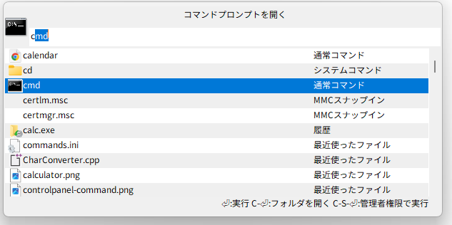
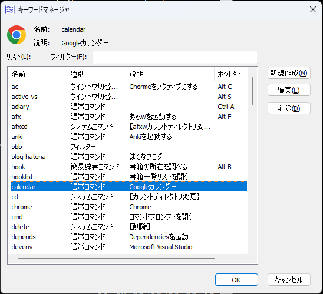
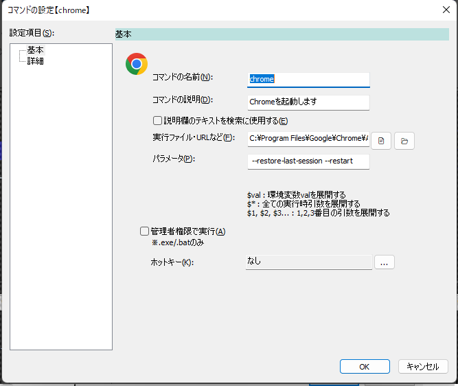
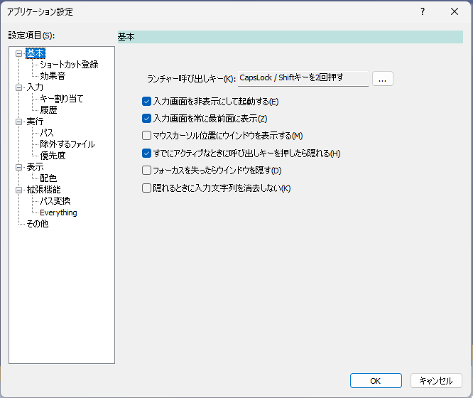

# Soyokaze

bluewind風のランチャーソフト。


## bluewindとは

bluewindのReadMeから抜粋
```
初心者から上級者まで幅広く使えるコマンドラインランチャーです。
簡単なキーワードをファイルやURLに関連付け、
キーボードからそのキーワードを打ち込むことで
アプリケーションを起動させたり、Webサイトを開いたりできます。
```

個人的にとても気に入って長年使ってきたツールで、
今でも普通に使えるけど、一次配布元サイトが消滅(&更新停止)して久しい。

## 動作環境

下記環境での動作を確認済

- Windows 11(64bit)
- Windows 10(64bit)

## インストール手順

1. zipをファイルを展開して任意のフォルダに展開する
1. 展開先フォルダにある`soyokaze.exe`を実行する
1. 設定はユーザフォルダ(たいていは C:/Users/(ユーザ名))直下の`.soyokaze`フォルダに保存される  
初回実行時に`.soyokaze`フォルダを作成する
  * レジストリを一切変更しない

## アンインストール手順

アンインストーラはないため、以下すべてを手動で行う。

1. アプリケーションの設定-ショートカット設定を表示し、すべてのショートカットを削除する
1. `soyokaze.exe`を終了する
1. インストール時に`soyokaze.exe`を置いたフォルダごと削除する
1. 設定フォルダ(C:/Users/(ユーザ名)/.soyokaze)を削除する

## ファイル構成

- soyokaze.exe
- help.html
- LICENSE

## 主な特徴

- ホットキーでウインドウの呼び出しができる。初期値はAlt-Space
- 任意のファイルやフォルダを登録してキーワードで呼び出すことができる
- 登録したキーワード(コマンド)に対してショートカットキーを設定することができる
- レジストリをいじらない
- ファイル名やURLを直接指定しての実行が可能
- パラメータにキーワードを使用することができる

## 最初から入っているキーワード

- new
  - 新規コマンド登録画面を表示する
- edit
  - 既存コマンド編集画面を表示する
- manager
  - キーワードマネージャ画面を表示する
- setting
  - アプリケーション設定画面を表示する
- exit
  - `soyokaze`を終了
- registwin
  - 直前にアクティブなウインドウをコマンドとして登録する
- maindir
  - `soyokaze.exe`のあるフォルダを表示する
- userdir
  - 設定ファイルの保存先フォルダ(C:/Users/(ユーザ名)/.soyokaze)を表示する
- reload
  - 設定ファイルの再読み込みを行う  
(テキストエディタで直接キーワード編集を行ったときにリロードするためもの)
- cd
  - カレントディレクトリを変更する
- delete
  - コマンドを削除する
- version
  - バージョン情報ダイアログを表示する
- newsnippet
  - 現在クリップボードにあるテキストを定型文として登録するための登録画面を表示する

## ライセンス

[MIT License](./LICENSE)


## 実行時に必要なライブラリ

- [Python3](https://www.python.org/) (任意)
  - 電卓機能を利用するために必要
  - なくても電卓機能が使えないだけで、アプリ自体は使える。

- [C/Migemo](https://www.kaoriya.net/software/cmigemo/) (任意)
  - ローマ字による日本語文字列検索を利用するために必要
    - 例えば、`jikoku`で`時刻`や`自国`にヒットするようになる
  - なくても、アプリ自体は使える。

## 画面など

画面のつくりはbluewindにある程度似せて作っている

### 入力画面



### キーワードマネージャ



### コマンド登録・編集画面



### 設定画面




## ビルド

### 開発環境

- VisualStudio2022
- C++のプロジェクト
- MFCを使っている

ユニットテストフレームワークとしてgoogletest(1.13.0)を用いている。

### ビルド時に必要な外部ライブラリ

- [nlohmann-json](https://github.com/nlohmann/json)
  - JSONを読むために利用している。  
ヘッダファイルベースのライブラリなので、このライブラリをビルドする必要はなく、配置するだけでよい。

### nlohmann-jsonの配置

- https://github.com/nlohmann/json からソース一式を取得する
- `Soyokaze`のソースファイル一式と同じ階層に`nlohmann-json`を配置する

- `Soyokaze`のプロジェクト設定にて、`Soyokaze.sln`と同じ階層に`json`というフォルダがあることを想定している  
以下のように置く  
↓
```
soyokaze-src/
  Soyokaze.sln
  json/
    include/
      nlohmann/
        json.hpp
```

### ビルド方法

- VisualStudioでソリューションファイル`Soyokaze.sln`を開く
  - メニューの `ファイル`→`開く`→`プロジェクト/ソリューション`

- プロジェクト設定の下記項目を変更する必要があるのでビルド環境にあわせて設定する
  - `構成プロパティ`→`全般`→`Windows SDKバージョン`
  - `構成プロパティ`→`全般`→`プラットフォームツールセット`

- ビルドを実行する
  - メニューの `ビルド`→`ソリューションのビルド`

- ビルドが完了すると下記の場所にモジュールがてきる
  - `x64`/(`Debug` or `Release` or `ReleaseStatic`)
    - 64bit版モジュールの場合

### ソリューション構成について

- Debug → デバッグ情報あり
- Release → デバッグ情報なし、最適化してる、共有DLLでMFCを使う
- ReleaseStatic → デバッグ情報なし、最適化してる、スタティックライブラリでMFCを使う。
- Release-Portable→ デバッグ情報なし、最適化してる、スタティックライブラリでMFCを使う。設定情報を`soyokaze.exe`と同じフォルダ以下に保存する
- ReleaseStatic-Portable → デバッグ情報なし、最適化してる、スタティックライブラリでMFCを使う。設定情報を`soyokaze.exe`と同じフォルダ以下に保存する
- UnitTest → ユニットテストのビルド用
  - 本体のexe(soyokaze.exe)を.libとしてビルドし、ユニットテスト側の.exeにリンクする構成

## ToDo

- 設計資料を残す
- ユニットテスト拡充

## ChangeLog

### 0.15.0

2023/12/xx

- ウインドウ整列コマンドまわりの各種修正
  - ウインドウ整列コマンドでウインドウの非表示を指定できるようにした
  - ウインドウ整列コマンドの実装を変更(操作の種別にかかわらず、WINDOWPLACEMENTを用いる方法に統合した)
  - 実装変更の都合により、前バージョンのウインドウ整列コマンドと設定の互換性がなくなった
     - 前バージョンで作成したウインドウ整列コマンドを作成しなおす必要がある
- 説明欄テキストをコマンド絞り込みに含めるオプションを追加(通常コマンドのみ)
- fileプロトコル(file://...)をローカルパス(またはUNCパス)に変換する機能を追加
- 通常コマンド/web検索コマンドのアイコン画像を変更する機能を追加
  - アイコンを変えることによりコマンドの視認性を高める目的
- bookmarkコマンドのマッチングの際に、URLも含めて絞り込みを行うようにした
  - 従来はブックマーク名のみだった
- アプリ名回りの文言修正

### 0.14.0

2023/12/18

- ウインドウ整列コマンドでウインドウの最大化/最小化を指定できるようにした
- 環境によっては正しくないアイコンを取得する問題を修正
- 細かい修正

### 0.13.0

2023/12/16

- ウインドウ整列コマンドを追加
  - 1つ以上のウインドウをあらかじめ登録しておいた位置・サイズに一括設定することができる
- ウインドウ切り替えコマンド実行の際に対象ウインドウが見つかなかった場合、メッセージを表示するようにした
- 簡易時間計算(経過時間を表示する)コマンドを追加(HH:MM-HH:MM)
  - 例: `23:30-22:43` → `47分`
- 電卓機能で、Pythonに渡したときの演算結果が整数値だったとき、16/8/2進数の結果も表示するようにした
- git-bash上のパス`/c/path/to/...`とローカルパス`C:\path\to\...`の相互変換機能を追加
- 入力文字列を非表示にするときに入力中のテキストを残す設定を追加
- `Ctrl`キーを押している間だけ半透明表示にするようにした
  - 入力画面の背後のウインドウを確認できるようにするための機能
  - 半透明設定が`非アクティブなときに半透明`のときだけ有効
- `.vmx`を開くコマンドで対象ファイルが全角パスを含む場合に候補にあがらない問題を修正
- `.vmx`を開くコマンドの表示順序をMRUの順序通りに表示するようにした

### 0.12.0

2023/11/11

- 登録しておいた定型文(スニペット)をクリップボードにコピーする機能を追加
  - 現在のクリップボードにあるテキストを登録するためのシステムコマンド(`newsnippet`)を追加
- 操作ガイド欄を追加
- ipアドレスを取得するコマンド`getip`を追加
- `0.11.0`で修正した「入力画面を非表示にして起動する`で起動したとき、起動直後に一瞬ウインドウが表示されるのを修正」を取り消して元に戻した
  - 起動直後にホットキーが効かず、入力画面を表示できない現象が発生したため

### 0.11.0

2023/09/03

- 候補欄に候補ごとのアイコンを表示する機能を追加
- アプリケーション設定に、候補欄の背景色を交互に変える設定項目を追加した
- 8進数/16進数/Unicodeエスケープシーケンスをデコードして表示する機能を追加
  - 8進数/16進数でエスケープされたものについてはUTF-8のバイトシーケンスとして扱う
  - 例
    - `\117\143\164\141\154` → Octal
    - `\x48\x65\x78` → Hex
    - `\u30ed\u30b0\u30a4\u30f3\u3057\u3066\u304f\u3060\u3055\u3044` → ログインしてください
    - `\U000030A2` → ア
- `入力画面を非表示にして起動する`で起動したとき、起動直後に一瞬ウインドウが表示されるのを修正

### 0.10.0

2023/09/02

- URIエンコードされた文字列をデコードして表示する機能を追加
  - 例: `%E3%81%93%E3%82%93%E3%81%AB%E3%81%A1%E3%81%AF` → `こんにちは`
  - UTF-8でエンコードされているものとしてデコードする
  - 実行するとデコード後の文字列をクリップボードにコピーする
- UWPアプリの取得方法を変更
  - レジストリを直接見るのではなく、AppsFolderから取得するようにした
  - あわせて、AppsFolderにあるUWPでない項目も拾うようにした
- Outlookの受信トレイ上のメールを候補として表示するようにした(試作)
  - 上限は1024(固定)
- コントロールの色を変える処理をハイコントラストモードが無効な時だけ機能するようにした
- ウインドウ位置を覚えておく設定ファイル名のファイル名を変更
  - `(コンピュータ名).posision`
- 最近使ったファイルコマンドでCtrl-Enterキー押下で実行したらフォルダを開くようにした
- Web検索コマンドを`常に検索候補として表示する`を有効な状態で新規作成した直後に候補として表示されない問題を修正
- F1キーを押したときにヘルプが表示できないのを修正
- アイコンリソースのリークを修正

### 0.9.0

2023/08/20

- UWPアプリを一覧に表示する機能を試作
- スタートメニューの項目をとれるようにした(ストアアプリは非対応)
- Web検索コマンドのマッチングの挙動がおかしかったのを修正
- 細かいバグ修正

### 0.8.0

2023/08/18

- 効果音のファイル設定欄が読み取り専用属性になっていたので、属性を外した
- Web検索コマンドを追加
- LibreOffice Calcシートのジャンプ機能を追加
- キャプションやウインドウクラス名を指定してウインドウ切り替えを行うためのコマンドを追加
   - `0.4.0`で実装したものとは別のコマンドで、あらかじめキャプションやウインドウクラス名を指定したコマンドを定義しておいたうえで、 その設定に基づいて切り替えを行うためのもの
- `rgb(r,g,b)`でカラーを表示するようにした
- `#RRGGBB` `#RGB` rgb(r,g,b)`で入力したとき、他の表記も候補に表示するようにした
- 削除して存在しなくなったコマンドに対する履歴を削除するようにした

### 0.7.0

2023/08/15

- 効果音を再生する機能を追加
- アプリケーション設定画面を表示するとき、前回表示していたページを初期表示するようにした
- 入力画面の候補リストをオーナードローで描画するようにした
- 入力画面の候補リストの背景色を行単位で交互に変えるようにした
- いくつかのリストコントロールにLVS_EX_DOUBLEBUFFERスタイルを追加
- VMWare(Player)の最近使ったVM一覧を候補に出すようにした
- 最近使ったファイル一覧の更新を別スレッドで行うようにした
- ファイル名を指定して実行コマンドに引数を与えるとヒットしないのを対策
- ファイル名を指定して実行コマンドでCtrl-Enterでフォルダを開けなかったので修正

### 0.6.0

2023/08/06

- 入力画面のレイアウトを調整
- Excelワークシート一覧をバックグラウンドで行う形に変更
- PathFindコマンドを履歴から実行したときの種別を「履歴」と表示するようにした
- 環境変数の値を表示するコマンドを実装
- ウインドウ切り替えコマンドで最小化状態から復元するときにSC_RESTOREでやるようにした
- 最近使ったファイルを表示するコマンドを実装
- 16進カラーコード(`#RRGGBB` `#RGB`)表記に対応する色を表示するコマンドを実装

### 0.5.1

2023/08/01

- コントロールパネルの初期値が`有効`になっていたので修正

### 0.5.0

2023/08/01

- コントロールパネルの項目を選択して表示する機能を追加
  - `設定`>`拡張機能`>`コントロールパネル選択機能`>`有効にする`をチェックすると有効になる
  - 初期値は無効

- C/Migemoを用いたローマ字から日本語検索を実装(要C/MigemoのDLLと辞書ファイル)
  - `設定`>`表示`>`マウスカーソル位置にウインドウを表示する`をチェックすると有効になる
  - 初期値は有効
  - この設定が`有効`で、かつ、C/Migemoのファイルが所定の場所に配置されている場合にローマ字検索が利用できる
    - 配置する場所は設定画面に記載
- キーワードマネージャウインドウにコマンド種別を表示するようにした

### 0.4.0

2023/07/31

- 入力欄を表示するときにマウスカーソル位置に表示するかどうかの設定を追加
  - `設定`>`表示`>`マウスカーソル位置にウインドウを表示する`をチェックすると有効になる
  - 初期値は無効
- アクティブなウインドウを切り替えるコマンドを追加
  - `設定`>`拡張機能`>`アクティブなウインドウの切り替え機能`>`ウインドウタイトルによる選択を有効にする`をチェックすると有効になる
  - 初期値は無効
- 入力欄にコマンド種別を表示する機能を追加
  - `設定`>`表示`>`入力欄にコマンド種別を表示する`をチェックすると有効になる
  - 初期値は有効

### 0.3.0

2023/07/31

- EdgeとChromeのブックマークを候補として表示する機能を追加した
  - ブックマークの名前でマッチングする
  - EdgeのブックマークはEdge、ChromeのブックマークはChromeで表示する
- オーナードローで描画しているリストで選択行のテキストカラーを黒で描画していたの修正(白に変更)
- コマンドのホットキー設定ダイアログでキー解除ボタンを追加
- コマンドのホットキー設定ダイアログの状態制御回りのバグ修正
- コマンド実行時にCtrl-Enterキーで実行したときにフォルダを開く機能を追加(アプリ設定から利用有無を選択できるようにした)
- キーワード絞り込み周りの仕様変更(後述)
  - これに伴い、アプリケーション設定として設けていた 前方一致 / 部分一致 / スキップマッチング を廃止

#### キーワード絞込みの仕様

- 指定したキーワードが候補の名前に部分一致するかどうかで判断を行う
- スペース区切りで複数キーワード指定された場合、個々のキーワードごとに候補の名前と部分一致比較を行い、すべてマッチするものを対象とする
- 候補の表示優先順位は 完全一致が最も優先、次に前方一致、最後に部分一致 の順
  - キーワードのいずれかが、候補と完全一致する場合、完全一致とみなす
  - 先頭のキーワードと候補が前方一致する場合、前方一致とみなす
  - 与えられたキーワードが候補に部分的に一致する場合、部分一致とみなす
- ダブルクォーテーションで囲った場合はキーワードに空白を含めることができる
- 複数のキーワードが与えられた場合に先頭キーワードと候補が完全一致する場合、後続のキーワードをパラメータ指定とみなす

### 0.2.0

2023/07/15

- フィルタダイアログのリスト表示で、背景色を交互に変えるようにした
- 通常コマンドの設定画面を複数ページ構成に変更した
- 入力画面の候補リストをListBoxからListCtrlに変更した
  - カスタムデータとオーナードロー描画
- 入力画面のコメント表示欄のデフォルト表示文字列まわりの不備を修正
- 登録コマンドでなくても、http://〜 が入力された場合に関連付けで開くようにした
- 実行時引数が指定されなかったときに、実行時引数だけを入力するための追加の入力画面を表示する機能を追加(通常コマンドのみ)
- フィルタコマンドの前段としてクリップボードの内容を使えるようにした
- あふw(afxw)で現在表示している自窓側のカレントディレクトリを取得する機能を追加(要あふw側のオートメーションサーバ登録)
- 電卓機能を追加(Pythonを利用する)
- Excelシートのジャンプ機能を実装
- 各種バグ修正など
  - アスタリスクを入力すると落ちる不具合を修正
  - ほか

### 0.1.6

2023/06/24

- アプリケーション設定を複数のページに分割
- 「ネットワークパスを無視」設定を追加
- 正規表現コマンド機能を追加
  - マッチング結果を用いてプログラムの起動やURLにアクセスなどを行うためのもの
    - 課題管理システム等でissueの識別子(例: PROJECTX-32)を入力して当該issue画面を表示する、みたいな用途を想定
      - パターンとして`^PROJECTX-\d+$`みたいな設定をしておくと、issueの識別子にマッチさせることができる、みたいな
- ホットキーとして、文字入力に使うキー(無修飾の文字キーやEnterなど)の割り当てを許可しないようにした
- コマンド編集ダイアログ上で相対パスで指定されたファイルに対してアイコンを表示できるようにした
- フィルターの編集画面の状態制御に不備があったのを修正
- 履歴機能の実装
- 「同一のフィルタコマンドの並列実行を許可する」設定を追加
  - デフォルト値は`false`
  - これがチェックされていない場合に、フィルタコマンドが実行中かを判断して、既に実行中であれば、実行中のウインドウをアクティブにする(後続のコマンド実行を行わない)ようにした
    - コマンドを複数回実行すると、実行した回数ぶんだけ同じ位置に重なってウインドウが表示されてしまう問題を回避するため
- 入力画面のコメント表示欄のデフォルト表示文字列として任意の文字列を設定できるようにした
- ポータブル版(設定情報を`soyokaze.exe`と同じフォルダ以下に保存する)の構成(`Release-Portable`,`ReleaseStatic-Portable`)を追加

### 0.1.5

2023/06/11

- キーワードマネージャからコマンドを削除すると落ちるバグを修正
  - 0.1.4で入れたもの


### 0.1.4

2023/06/11

- フィルタリングコマンド機能を実装
  - 前段のコマンドのstdoutへの出力内容から対話的に絞込みを行い、選択結果を後段のコマンドに渡して実行できる機能   
(fzfっぽいことができる)
- コマンドの優先順位を設けた
  - 一致レベル(完全一致or前方一致or部分一致orスキップマッチング)が同じ場合は、  
実行したコマンドほど優先して表示されるようにする
- カレントディレクトリ変更コマンド(`cd`)を実装
- コマンドを削除するコマンド(`delete`)を実装
- あて先を指定してメールするコマンド(`mailto:`)を実装
- コマンド登録・編集画面において、登録するファイルの拡張子が`.lnk`だった場合にリンク先に置換するためのボタンを表示するようにした
- キーワードマネージャ画面のリストのヘッダをクリックしたときに表示要素をソートできるようにした
- 入力画面が非アクティブになったらウインドウを隠す設定を追加
- Ctrl-BackSpaceキーで入力テキスト全削除、を実装

### 0.1.3

2023/06/03

- グループ機能を実装
- PATH以下にあるexeを実行したときの履歴をもとに補完する機能を実装
  - その履歴情報を保存・復元する機能を実装
- 入力画面に前回入力したときの候補が残る現象を修正
- registwinコマンド周りの動作を修正
- 初期起動時、設定画面の表示上のホットキーが表示上間違っていたのを修正

### 0.1.2

2023/05/28

- コマンドを実行するためのキー割り当て機能を実装

### 0.1.1

2023/05/21

- 入力画面のアイコンからウインドウを指定してコマンドとして登録する機能を追加
- キーワードマッチング処理回りの改善
  - 完全一致、前方一致、部分一致、スキップマッチング、の順で候補を表示するようにした
- 設定値を正しく保存できていないバグを修正
- モーダルダイアログ系の画面(キーワードマネージャー/設定画面など)を表示している間はTOPMOSTにしない

### 0.1.0

2023/05/17

- アプリ名を`Soyokaze`に変更
- バージョン情報ダイアログにライセンスへのハイパーリンクとビルド日時を表示するようにした

### 0.0.10

2023/05/16

- 入力画面のウインドウにファイルやURLをドロップしてコマンド登録できる機能を実装
- アプリ設定画面の構成をbluewindのような形に変更(左側にツリー、右に設定欄)

### 0.0.9

2023/05/11

- アクティブウインドウ登録コマンド(`registwin`)を実装
- コンテキストメニューの「表示」を「隠す」とトグルにするようにした
- 入力画面からコンテキストメニューを表示できるようにした

### 0.0.8

2023/05/09

- ショートカット登録機能を実装
  - 送る/スタートメニュー/デスクトップ/スタートアップ
- ウインドウのトグル表示機能を実装
- 細かいバグ修正

### 0.0.7

2023/05/07

- ホットキーの登録まわりのバグ修正

### 0.0.6

2023/05/07

- ソースの文字エンコーディングをUTF-8にした
- 細かいバグ修正


### 0.0.5

2023/05/07

タスクトレイメニューからのヘルプ表示が機能してなかったので修正

### 0.0.4

2023/05/07

いろいろ機能追加

### 0.0.3

2023/05/04

いろいろ機能追加

* 大文字小文字を無視した比較
* 候補欄をつける
* マッチングの際に履歴を考慮する
* 自前のキーバインド(ホットキー)処理
* カレントディレクトリの設定
* パラメータ指定実行のサポート
  * あり/なしで分岐させることができる
* アプリ共通設定を持たせる
* 環境変数展開
* フォルダを開く
* アイコン表示できるようにした

### 0.0.2

2023/04/??

* コマンド実行(プロセス起動)時の表示方法(`SW_SHOW`など)

### 0.0.1

2023/04/23

* とりあえずつくってみた


