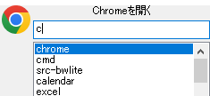

# BWLite

bluewind風のランチャーソフト。



bluewindのような使用感で、(作成者が)個人的に必要とする機能だけを実装したもの。

**B**lue**W**indの簡易版(**Lite**)的な意味で`BWLite`としている

## bluewindとは

bluewindのReadMeから抜粋
```
初心者から上級者まで幅広く使えるコマンドラインランチャーです。
簡単なキーワードをファイルやURLに関連付け、
キーボードからそのキーワードを打ち込むことで
アプリケーションを起動させたり、Webサイトを開いたりできます。
```

一次配布元サイトが消滅(&更新停止)して久しい。

個人的にとても気に入っているツールで今でも普通に使えるけど、
今どきの環境だと動作があやしいところがある。

## 動作環境

下記環境での動作を確認済

- Windows 10(64bit)

## インストール方法

1. zipをファイルを展開して任意のフォルダに展開する
1. 展開先フォルダにある`BWLite.exe`を実行する
1. 設定はユーザフォルダ(たいていは C:/Users/(ユーザ名))直下の`.bwlite`フォルダに保存される  
初回実行時に`.bwlite`フォルダを作成する
  * レジストリを一切変更しない

## アンインストール方法

1. `BWLite.exe`を終了する
1. 展開先のフォルダを削除する
1. 設定フォルダ(C:/Users/(ユーザ名)/.bwlite)を削除する


## ファイル構成

- BWLite.exe
- help.html
- LICENSE

## 主な特徴

- bluewindでいうところの常駐モードのみ
  - ホットキーでウインドウの呼び出しができる。初期値はAlt-Enter
- bluewindとは異なり、表示方法を選べない(大きい表示のみ)

- レジストリをいじらない
- ファイル名やURLを直接指定しての実行が可能
- グループ分け/連続起動/複数回起動 などはできない
- パラメータにキーワードを使用することができる


## 最初から入っているキーワード

- new
  - 新規コマンド登録画面を表示する
- edit
  - 既存コマンド編集画面を表示する
- manager
  - キーワードマネージャ画面を表示する
- setting
  - アプリケーション設定画面を表示する
- exit
  - `BWLite`を終了
- maindir
  - `BWLite.exe`のあるフォルダを表示する
- userdir
  - 設定ファイルの保存先フォルダ(C:/Users/(ユーザ名)/.bwlite)を表示する
- reload
  - 設定ファイルの再読み込みを行う  
(テキストエディタで直接キーワード編集を行ったときにリロードするためもの)
- version
  - バージョン情報ダイアログを表示する

## 差異

### オリジナルにないもの

- コマンド名に紐づけて実行するファイルを引数あり/なしで、実行する内容をわけることができる
  - 想定する使い方としては、引数なし→トップページ表示  引数あり→検索実行、みたいな

- コマンド設定時のパラメータとして「管理者として実行」を指定することができる

- 64bitモジュール

### オリジナルと比べてできないこと

個人的に不要な機能はもろもろカットしている

- スタートアップやデスクトップやスタートメニューへの登録
   - 自分でやるので不要
- 「送る」から登録できるようにする
   - 手作業で登録するで代替できるので今は実装してないが、するかも
- 入力や補完まわりの細かなカスタマイズ
- タイマー実行
- コマンドのグループ化
- アクティブウインドウの登録
- アイコンの変更(任意のアイコンの設定)
- コマンドごとのホットキー設定
- コマンドから別コマンドを参照して実行する
- コマンドの実行完了を待機する

他にもあると思うが割愛

## ライセンス

[MIT License](./LICENSE)


## ToDo

- 「送る」から登録
- マニュアル拡充
- 設計資料を残す
- ユニットテスト拡充

## ChangeLog

### 0.0.6

2023/05/07

- ソースの文字エンコーディングをUTF-8にした
- 細かいバグ修正


### 0.0.5

2023/05/07

タスクトレイメニューからのヘルプ表示が機能してなかったので修正

### 0.0.4

2023/05/07

いろいろ機能追加

### 0.0.3

2023/05/04

いろいろ機能追加

* 大文字小文字を無視した比較
* 候補欄をつける
* マッチングの際に履歴を考慮する
* 自前のキーバインド(ホットキー)処理
* カレントディレクトリの設定
* パラメータ指定実行のサポート
  * あり/なしで分岐させることができる
* アプリ共通設定を持たせる
* 環境変数展開
* フォルダを開く
* アイコン表示できるようにした

### 0.0.2

2023/04/??

* コマンド実行(プロセス起動)時の表示方法(`SW_SHOW`など)

### 0.0.1

2023/04/23

* とりあえずつくってみた


