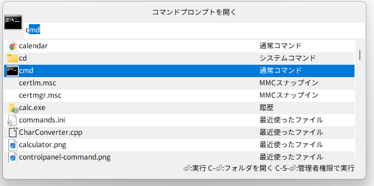
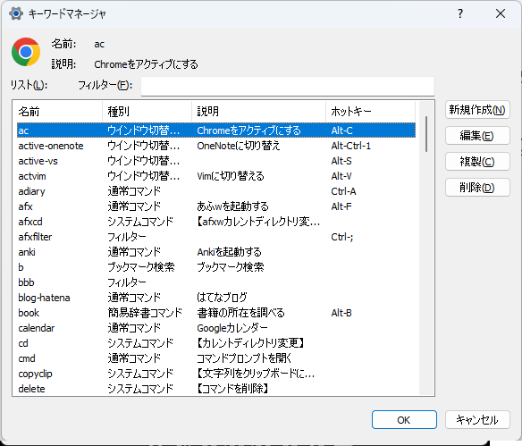
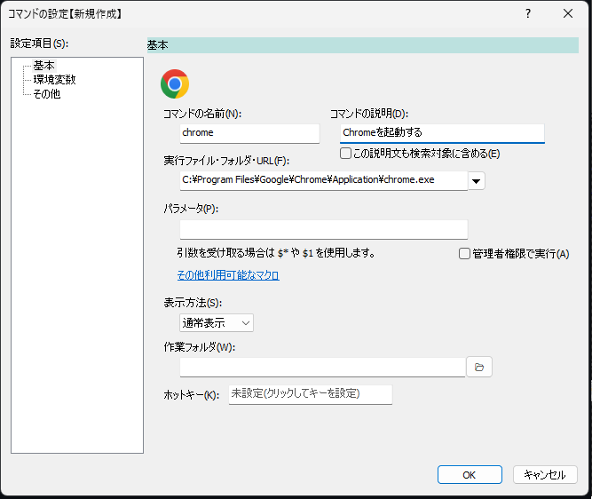
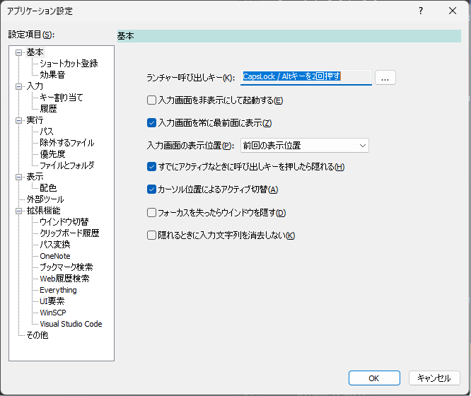

# Soyokaze

## Windows用コマンドランチャー

**Soyokaze**は、キーボードから呼び出して、アプリケーション・ファイル・フォルダー・Webページ・ウインドウなどをすばやく操作できるWindows用ランチャーです。

ホットキーで入力画面を表示し、キーワードを入力するだけで、登録したコマンドや各種検索結果を候補から実行できます。

## まず使ってみる

1. `Alt + Space`を押して入力画面を表示する
2. キーワードを入力する
3. 矢印キーまたはマウスで候補を選び、`Enter`を押す

例えば、次のような操作を入力画面から実行できます。

- `C:\Work\` : フォルダーを開く
- `https://github.com/` : URLをブラウザーで開く
- `g Soyokaze` : 登録したWeb検索を実行する
- `memo` : 登録したアプリケーションを起動する

`memo`や`g`のようなキーワードは、後述の方法で自分で登録します。ファイルパスやURLの直接実行など、登録せずに使える機能もあります。

## 基本操作

- `Alt + Space` : 入力画面を表示する（初期設定）
- `↑`/`↓` : 候補を移動する
- `Enter` : 選択中の候補を実行する
- `Tab` : 入力中のキーワードを補完する
- `Esc` : 入力を消去する。入力欄が空のときは入力画面を閉じる
- `F1` : マニュアルを開く

## 主な特徴

### アプリケーション・ファイル・URLを起動

- **ホットキーですばやく起動**
  - 初期設定は `Alt + Space`
  - 呼び出しキーは自由に変更可能
  - 入力画面をマウスカーソル位置やアクティブウインドウのモニター中央に表示可能
- **キーワードからさまざまな項目を実行**
  - アプリケーション、ファイル、フォルダー、URLを検索・実行
  - フォルダー内のファイルやサブフォルダーも検索
  - ファイルのあるフォルダーを開く、プロパティを表示するなどの操作
  - エクスプローラー以外の任意のファイラーとの連携

### 自分用のコマンドを登録

- **コマンドを自由に登録・組み合わせ**
  - よく使う操作を登録してキーワードから実行
  - 複数のコマンドをまとめて実行するグループコマンド
  - 定型文をまとめて管理・検索できる定型文グループコマンド
  - エイリアス、フィルター、正規表現、Web検索などによる柔軟なコマンド構成
  - コマンドのコピー・貼り付けによるエクスポート・インポート

### Windowsやアプリケーションを操作

- **Windowsやアプリケーションを操作**
  - ウインドウの切り替え、アクティブ化、位置・サイズ変更
  - 現在アクティブなウインドウを対象にした操作
  - ウインドウの整列
  - UI Automationによる画面上のボタンやメニュー項目の検索・実行
  - Win32メニュー項目の検索・実行
  - UWPアプリ、スタートメニュー、コントロールパネル、Windows設定の検索

### ブラウザー・Officeアプリに対応

- **ブラウザー・Officeアプリに対応**
  - ChromeやEdgeのブックマーク・閲覧履歴を検索
  - Excelのワークシートや選択範囲を検索
  - PowerPointのスライドをタイトルから検索・切り替え
  - OneNoteのページを検索・表示
  - Outlookのフォルダーを検索

### 検索と入力を便利にする機能

- **検索と入力を便利にする機能**
  - ファジー検索、Migemo検索
  - クリップボード履歴
  - 電卓、単位変換、色の確認
  - Base64、URI、エスケープシーケンスのデコード

### 拡張機能

- **拡張機能**
  - Pythonスクリプトで独自のコマンドを作成
  - プラグイン機能  

---

## 登録なしですぐ使える機能

次のような機能は、コマンドを登録していなくても入力画面から利用できます。

- ファイルパスやフォルダーの直接実行
- URLの直接実行
- 電卓、単位変換、色の確認
- クリップボード履歴
- ブラウザーのブックマーク・閲覧履歴
- Windows設定やスタートメニューの検索

機能によっては、アプリケーション設定で有効化する必要があります。

## 最初のコマンドを登録する

アプリケーションやWebページに好きなキーワードを付けて起動するには、コマンドを登録します。

1. 入力画面で`new`と入力して`Enter`を押す
2. コマンドの種類で「通常コマンド」を選択する
3. コマンドの名前に、起動時に入力するキーワードを指定する
4. 実行ファイル・URLなどに、起動するアプリケーションやURLを指定する
5. `OK`を押して登録する
6. 登録したキーワードを入力して実行する

登録したコマンドは、入力画面で`edit`を実行するか、タスクトレイのメニューから「キーワードマネージャ」を開いて編集できます。

## 動作環境

- Windows 11(64bit)
- Windows 10(64bit)

---

## インストール方法

1. [最新版をダウンロード](https://github.com/ampmmn/Soyokaze/releases/latest)
2. ダウンロードしたアーカイブを解凍して、好きなフォルダに置く
3. 展開先にある`soyokaze.exe`を実行する

起動すると入力画面が表示され、アプリケーションはタスクトレイに常駐します。

設定ファイルは自動で保存されます。

- 通常モード: `%USERPROFILE%\.soyokaze`
- ポータブルモード: 実行ファイルと同じフォルダに`profile`フォルダを作成した場合は、そのフォルダ

シャットダウン、再起動、ログオフ、ごみ箱を空にする操作などのシステムコマンドもあります。誤操作を防ぐため、不要なコマンドはキーワードマネージャーから無効化してください。

## アンインストール方法

アンインストーラはないため、以下の手順で手動削除をする。

1. ショートカット設定をすべて削除  
`アプリケーションの設定`>`基本`>`ショートカット登録`>`作成したすべてのショートカットを削除する`
2. `soyokaze.exe`を終了する
3. インストールしたフォルダを削除
4. 設定フォルダ（`C:/Users/(ユーザ名)/.soyokaze`）を削除

## 画面イメージ

### 入力画面

キーワードを入力して、候補の実行やファイル・URLの直接起動を行う画面です。

### キーワードマネージャ

登録済みコマンドの追加・編集・削除を行う画面です。

### コマンド登録・編集画面

アプリケーション、ファイル、フォルダー、URLなどをコマンドとして登録する画面です。

### 設定画面

ホットキー、検索対象、表示方法など、アプリケーション全体の動作を変更する画面です。

## 詳しい使い方・マニュアル

- [マニュアル](https://ampmmn.github.io/Soyokaze/)
- [変更履歴](./CHANGELOG.md)

## 開発・貢献ガイド

- バグ報告・機能要望などあったら[Issue](https://github.com/ampmmn/Soyokaze/issues)へ

- 手元の環境でビルドする方法はこちら
  - [ビルド方法](./HowToBuild.md)

## ライセンス

[MIT License](./LICENSE)

## 連絡先

- [X(Twitter)](https://x.com/ymgw)
- htmnymgw@gmail.com

