<style>

#TOC {
  position : sticky;
  overflow-y : scroll;
  float: left;
  top:15px;
  width: 31.0%;
  height:95vh;
  text-align: left;
}
.column-right{
  float: right;
  width: 62.0%;
  text-align: left;
}
</style>

<div class="column-right">

# Soyokaze マニュアル

## 概要

Soyokazeは`bluewind`というコマンドラインランチャーの代替として使えるよう作成しているツール  
bluewindの使用感を維持しつつ、現行のWindows環境でも動作するコマンドラインランチャーを実現することを目的としている。


## 動作環境

Windows環境で動作する。以下の環境で動作確認済

- Windows11 64bit
- Windows10 64bit

### 実行時に必要なもの

- [Python3](https://www.python.org/) (任意)
  - [電卓機能](#電卓機能)を利用するために必要(利用しない場合は不要)

- [C/Migemo](https://www.kaoriya.net/software/cmigemo/) (任意)
  - ローマ字のまま日本語キーワードの絞り込み(Migemo検索)を利用するために必要
  - Migemo検索を利用しない場合は不要

## セットアップ

### インストール

1. zipをファイルを展開して任意のフォルダに展開する
1. 展開先フォルダにある`soyokaze.exe`を実行する
1. 設定はユーザフォルダ(たいていは C:/Users/(ユーザ名))直下の`.soyokaze`フォルダに保存される  
初回実行時に`.soyokaze`フォルダを作成する
  * レジストリを使用しない

### アンインストール

アンインストーラはないため、以下すべてを手動で行う。

1. タスクトレイ上のコンテキストメニュー-`アプリケーションの設定`-`基本`-`ショートカット設定`を表示し、`作成したショートカットをすべてを削除する`を押下する
1. `soyokaze.exe`を終了する
1. インストール時に`soyokaze.exe`を置いたフォルダを削除する
1. 設定フォルダ(C:/Users/(ユーザ名)/.soyokaze)を削除する

### バージョンアップ

1. 本アプリを実行している場合は終了する
1. 実行ファイルを置いたフォルダ内のファイルをすべて上書きする

アプリケーションの設定情報の保存先については[設定ファイルの保存先](#設定ファイルの保存先)を参照のこと

## 基本的な使い方

- `soyokaze.exe`を実行するとアプリが起動し[入力画面](#入力画面) が表示される  

- アプリが起動している状態でランチャー呼び出しキー(デフォルト設定は`Alt-Space`)を押下すると、入力画面の表示／非表示が切り替わる
- 入力画面にキーワードを入力してEnterキーを押下すると、登録したコマンドを実行することができる
- 初回起動時はコマンドが登録されていない状態なので、[次セクションに記載する方法](#コマンドの登録方法)によりコマンドを登録する必要がある
  - コマンドの登録がすんだら、あとはランチャー呼び出しキーで入力画面を呼び出して、キーワードを入力してコマンドを実行する
- [コマンドとして登録していなくても実行できる機能](#コマンドとして登録していなくても実行できる機能)もある
- アプリを終了する場合は、入力画面から[exit](#exit)コマンドを実行するか、[タスクトレイ](#タスクトレイ)から`終了`を選択する

## コマンドの登録方法

本アプリでは以下の方法でコマンドを登録することができる

- [`new`コマンドで登録する](#newコマンドで登録する)
- [`registwin`コマンドで登録する](#registwinコマンドで登録する)
- [対象ウインドウをDrag&Dropする](#対象ウインドウをdragdropする)
- [コンテキストメニューの`送る`>`コマンドとして登録する`](#コンテキストメニューの送るコマンドとして登録する)

各方法の詳細について後述する。

### newコマンドで登録する

入力画面から`new`コマンドを実行すると、[コマンドの種類を選択](#コマンドの種類)する画面が表示される。  
↓  


コマンド種別を選択し、`OK`ボタンを押下すると、選択した種別に応じたコマンド編集画面が表示される。  
↓※ 通常コマンドのコマンド編集画面  
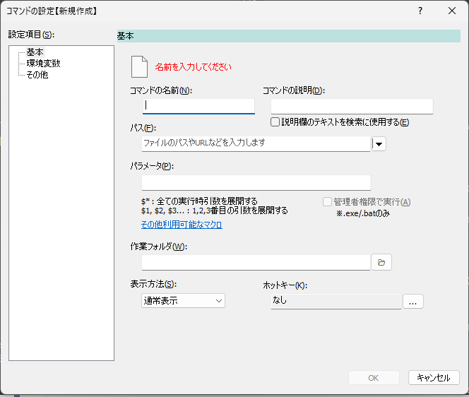  

コマンド編集画面で新規登録キーワードや紐づけるプログラムへのパスなどの情報を入力し、OKを押すと、コマンドとして登録される。

### registwinコマンドで登録する

入力画面から`registwin`コマンドを実行すると、直前にアクティブになっていたウインドウの実行プロセスを登録する画面が表示される。  
↓  
  

###  対象ウインドウをDrag&Dropする

入力画面のアイコン欄をドラッグして、登録したいウインドウにドロップすると、そのウインドウの実行プロセスを登録する画面が表示される。  
↓  
  

### コンテキストメニューの`送る`>`コマンドとして登録する`

アプリケーション設定の[基本＞ショートカット登録](#基本ショートカット登録) から`「送る」から登録できるようにする`をチェックしている場合、エクスプローラの`送る`に登録用のメニュー項目が表示される。

登録したいファイルをエクスプローラ上で右クリックして、`送る`>`コマンドとして登録する`を選択すると、そのファイルを登録するためのコマンド編集画面が表示される  
↓  
  

## コマンドの種類

ここでは、ランチャーアプリで作成可能なコマンドについて説明する。

現在、下記18種類のコマンドを作成することができる。

- [通常コマンド](#通常コマンドの登録編集)
- [定型文コマンド](#定型文の登録編集)
- [定型文グループコマンド](#定型文グループの登録編集)
- [Web検索コマンド](#web検索コマンドの登録編集)
- [ブックマーク検索コマンド](#ブックマーク検索コマンドの登録編集)
- [ブラウザ履歴コマンド](#ブラウザ履歴コマンドの登録編集)
- [グループコマンド](#グループコマンドの登録編集)
- [DirectoryIndexコマンド](#directoryindexコマンドの登録編集)
- [正規表現コマンド](#正規表現コマンドの登録編集)
- [フィルタコマンド](#フィルタコマンドの登録編集)
- [ウインドウ切替コマンド](#ウインドウ切替コマンドの登録編集)
- [ウインドウ整列コマンド](#ウインドウ整列コマンドの登録編集)
- [簡易辞書コマンド](#簡易辞書コマンドの登録編集)
- [Everything検索コマンド](#everything検索コマンドの登録編集)
- [フォルダ更新検知コマンド](#フォルダ更新検知コマンドの登録編集)
- [音量調節コマンド](#音量調節コマンドの登録編集)
- [取り外しコマンド](#試作取り外しコマンドの登録編集)
- [振り分けコマンド](#振り分けコマンドの登録編集)


## 画面の説明

### 入力画面

##### 概要

ランチャーアプリを実行すると表示される画面。  
この画面でキーワードを入力し、Enterキーを押下すると、キーワードに関連付けた各種操作を実行できる。  
また、Tabキーを押すと、入力中のキーワードを補完することができる。

##### 画面

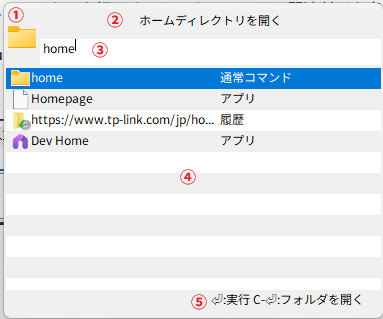

##### 画面の説明

- 1.アイコン表示欄
  - 選択している候補に関連付けられたアイコンを表示する
- 2.コメント表示欄
  - 選択している候補の説明を表示する
  - ここをドラッグしてウインドウ表示位置を変えることができる
- 3.入力欄
  - ここにキーワード(やパラメータ)を入力する。
  - `Ctrl`+`Backspace`で入力中のキーワードを単語単位で削除する
  - `Tab`キーを押下するとキーワードを補完する
  - `Esc`キーを押下すると、入力中のキーワードを消去する。テキストがなければ入力画面を非表示にする。
- 4.候補リスト
  - 入力欄に入力した文字に該当する候補の一覧を表示する
  - 矢印キー(↑↓）やマウスクリックで候補をすることができる
  - 入力欄に文字が入力されていると表示される

この画面がでているときに`F1`キーを押下すると、マニュアル(このファイル)を開く。

### キーワードマネージャ

##### 概要

本アプリに登録したコマンドの管理(追加/編集/削除)をするための画面。

下記のいずれかの操作を行うと、キーワードマネージャーを表示することができる。

- 入力画面で`edit`コマンドを実行する
- 入力画面で空欄のままEnterキーを押下する
- タスクトレイのアイコンを右クリックし、`キーワードマネージャ`を選択する

##### 画面


##### 画面の説明

- 「リスト」には登録済のコマンド一覧が表示される
- 画面上部にリスト上で選択中の情報（コマンドの名前、説明）が表示される
- 「新規作成」で新しいコマンドを登録する画面を表示する
- 「編集」で現在選択中のコマンドを編集する
- 「複製」で現在選択中のコマンドを複製する  
(選択中のコマンドの設定内容をもとに、別のコマンドを作ることができる)
- 「削除」で現在選択中のコマンドを削除する
- 「フィルター」に文字列を入力すると、入力した文字列でリストの表示項目を絞り込む
  - 空白区切りで複数ワードを指定できる(AND検索)

### コマンドの新規作成

##### 概要

作成するコマンドの種類を選択するための画面。  
コマンドの種類を選択して、OKボタンを押下すると、選択したコマンドの新規作成画面を表示する。

各コマンドの説明については [コマンドの種類](#コマンドの種類) を参照のこと

##### 画面


### アプリケーション設定

##### 概要

アプリケーションの動作に関する設定を行うための画面。

下記のいずれかの操作を行うと、アプリケーション設定を表示することができる。

- 入力画面で`setting`コマンドを実行する
- タスクトレイのアイコンを右クリックし、`アプリケーションの設定`を選択する

#### 基本

##### 概要

ランチャーの基本動作にかかわる設定をする画面  
主に入力画面を表示する際の動作の設定を行う。

##### 画面


- `ランチャー呼び出しキー`
  - 入力画面を表示するためのホットキーを設定することができる
- `入力画面を非表示にして起動する`
  - チェックすると、起動直後に入力画面を表示しない
- `入力画面を最前面に表示`
  - 入力画面を表示するとき、入力画面を他のウインドウより前面に表示するようにする
- `マウスカーソルの位置にウインドウを表示する`
  - チェックした場合、入力画面を表示するタイミングでのマウスカーソル位置に入力画面を表示する
  - チェックしない場合、前回と同じ位置に入力画面を表示する
- `すでにアクティブなときに呼び出しキーを押したら隠れる`
  - チェックすると、ランチャー呼び出しキーを押すたびに入力画面の表示/非表示が切り替わる
- `フォーカスを失ったらウインドウを隠す`
  - チェックすると、入力画面がフォーカスを失ったときに、入力画面を非表示にする
- `隠れるときに入力文字列を消去しない`
  - チェックすると、コマンドを実行せずに入力画面を非表示にする際に入力文字列を消去しない
    - 入力画面を次回再表示した際に、前回入力していた内容が維持される

#### 基本＞ショートカット登録

##### 概要

各種ショートカット登録をするための画面  
いずれもチェックすると登録され、チェックを外すと登録が解除される

##### 画面


- `「送る」から登録できるようにする`
  - チェックすると、本アプリにコマンドを登録するためのメニューが、エクスプローラのコンテキストメニューの「送る」に追加される


- `スタートメニューに登録する`
  - チェックすると、本アプリを起動するためのメニューがスタートメニューに登録される

- `デスクトップに登録する`
  - チェックすると、本アプリを起動するためのショートカットがデスクトップに配置される

- `スタートアップに登録する`
  - チェックすると、Windowsにログオン(サインイン)した後に自動で本アプリを起動する

- `作成したショートカットをすべて削除する`
  - 上記で作成したショートカットをすべて削除する

#### 基本＞効果音

##### 概要

画面操作時に効果音を鳴らす設定をするための画面  
もし、音を鳴らせる環境で作業しているのであれば、気分が上がる効果音を設定すると、作業効率がアップするかもしれない。

mp3ファイルのみ指定可能(他の音声ファイルには非対応)

##### 画面


- `入力欄への文字入力`
  - 入力欄に文字を入力したときに再生するmp3ファイルを指定する。空欄の場合は何も再生しない。
- `候補欄の選択項目変更`
  - 候補欄の選択項目を変更したときに再生するmp3ファイルを指定する。空欄の場合は何も再生しない。
- `コマンド実行`
  - コマンドを実行するときに再生するmp3ファイルを指定する。空欄の場合は何も再生しない。

#### 入力

##### 概要

入力画面のキーワード入力回りの動作に影響する設定を行うための画面

##### 画面


- `入力画面を表示するときにIMEをオフにする`
  - チェックすると、入力画面を表示したタイミングでIMEをオフにする

- `ネットワークパスを無視する`
  - チェックすると、`\\(コンピュータ名)`で始まるパスを本アプリでは開かないようにする
    - 環境によっては、ネットワークパスの情報を参照したときに数十秒ほど固まることがあるため

- `C/Migemoによるローマ字検索を有効にする`
  - [C/Migemo](https://www.kaoriya.net/software/cmigemo/) という外部ライブラリを用いて、ローマ字でのキーワード絞り込みをできるようにする
    - たとえば、`jikoku`というキーワードで`時刻`や`自国`という文言にマッチするようになる
    - 配布元(上記リンク先)からライブラリを入手し、配置する必要がある
  - 下記のような構成になるように配置する。
```
アプリ配置フォルダ/
    soyokaze.exe
    dict/
      utf-8/    ※ dictフォルダ内にあるutf-8の方の辞書を参照する
    migemo.dll
    sandshook.dll
```

#### 入力＞キー割り当て

##### 概要

入力画面の操作に関するキーを設定する画面  
独自のキーバインドで上下左右の移動や決定操作を行うアプリケーションがある。(例: Emacsの`Ctrl-N` `Ctr-P` `Ctrl-M`など）。  
それらのアプリの使用感に寄せるための設定

##### 画面


- `上へ`
  - 候補欄の選択項目を一つ上へ移動するキーを割り当てる
- `下へ`
  - 候補欄の選択項目を一つ下へ移動するキーを割り当てる
- `決定`
  - 入力画面での入力内容を確定させるキーを割り当てる
- `補完`
  - 入力画面での入力内容を補完するキーを割り当てる
- `コンテキストメニュー表示`
  - 選択している候補のコンテキストメニューを表示するキーを割り当てる
- `入力欄のテキストをコピー`
  - 入力欄に入力された文字列をクリップボードにコピーする  
コピーした後、入力欄は非表示になる
- `リセット`
  - 上記のキー割り当てをすべて解除する

#### 入力＞履歴


- `履歴機能を使う`
  - [履歴](#履歴)機能の有無を設定できる
- `履歴件数`
  - 履歴として登録する件数の上限を設定する
- `履歴の削除`
  - ボタンをクリックすると全ての履歴をクリアする

#### 実行

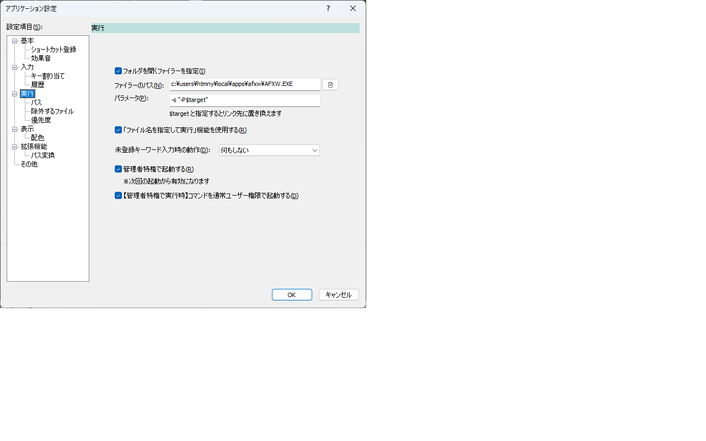

- `Ctrl-Enterキーで実行した場合にフォルダを表示する`
  - チェックすると、実行するコマンドに関連付けられたファイルをファイラーで表示する
    - 通常コマンドのみ有効

- `フォルダを開くファイラーを指定`
  - チェックすると、エクスプローラ以外のファイラーを使うことができる
- `ファイラーのパス`
  - 起動する外部ファイラーの実行ファイルのパスを指定する
- `パラメータ`
  - `ファイラーのパス`で指定したファイラーを起動するときのパラメータを指定する
  - `$target`が実際に開かれる対象(ファイルやフォルダ)のパスに置き換えられる

- `「ファイル名を指定して実行」機能を使用する`
  - チェックすると、 [`ファイル名を指定して実行`](#ファイル名を指定して実行) コマンドを有効にする。

- `未登録キーワード入力時の動作`  
コマンドとして登録されていない（かつ、[コマンドとして登録していなくても実行できる機能](#コマンドとして登録していなくても実行できる機能)や[拡張機能](#拡張機能について)としても作用しない）キーワードを入力したときの動作を指定する  
以下の3つから選択できる。
  - 何もしない
  - クリップボードにコピー
  - キーワードをコマンド登録

#### 実行＞パス

[`ファイル名を指定して実行`](#ファイル名を指定して実行) コマンドにおける、実行ファイルを検索するフォルダを追加で指定することができる。  
検索の優先順位としては環境変数PATHで設定されたフォルダ、次に追加のフォルダ、の順で検索を行う。  
リストの上にある項目が優先される。


- `環境変数PATHで設定されたディレクトリ`
  - システムの環境設定で指定されたディレクトリが表示される
    - このリストは参照専用

- `追加のディレクトリ`
  - システム設定で指定されたもの以外に検索したいディレクトリを登録する

- `追加`
  - クリックすると、ディレクトリ選択ダイアログが表示される。選択したディレクトリが`追加のディレクトリ`に追加される
- `編集`
  - クリックすると、`追加のディレクトリ`リスト上の選択項目のパスを変更することができる
- `削除`
  - クリックすると、`追加のディレクトリ`リスト上の選択項目を削除することができる
- `上へ`
  - クリックすると、`追加のディレクトリ`リスト上の選択項目を一つ上に移動する
- `下へ`
  - クリックすると、`追加のディレクトリ`リスト上の選択項目を一つ下に移動する

#### 実行＞除外するファイル

[`ファイル名を指定して実行`](#ファイル名を指定して実行) コマンドにおいて、対象外とするファイルを指定することができる。  


- `除外するファイル`
  - ここで登録したファイルが候補としてマッチした場合でも、候補に表示しないようにする。

- `追加`
  - クリックすると、ファイル選択ダイアログが表示される。選択したファイルが`除外するファイル`に追加される
- `編集`
  - クリックすると、`追加のディレクトリ`リスト上の選択項目のパスを変更することができる
- `削除`
  - クリックすると、`追加のディレクトリ`リスト上の選択項目を削除することができる

#### 実行＞優先度

コマンドの優先度を設定することにより、候補欄に表示されるコマンドの順序を制御するための画面。

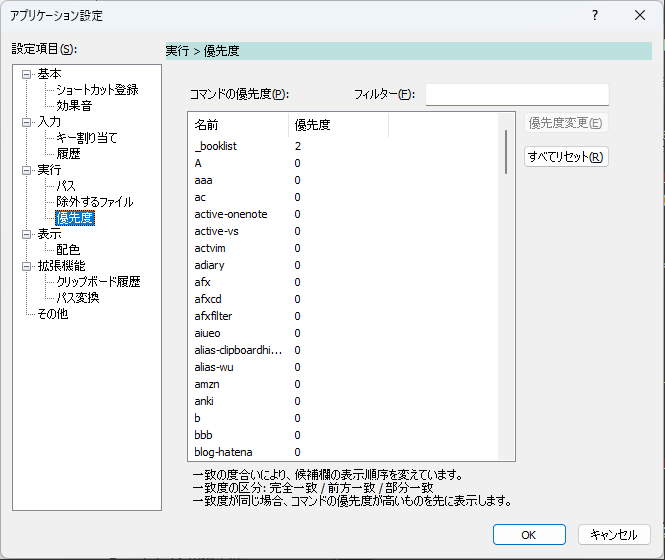

- `コマンドの優先度`
  - コマンドごとの優先度が表示されたリスト
  - 優先度の数値が高いものほど先に表示される。
- `優先度変更`
  - `コマンドの優先度`リストで選択した項目の優先度を変更する
- `すべてリセット`
  - `コマンドの優先度`リスト上に表示されたすべての項目の優先度を0にする

##### 例

上記の画面では、`book`というコマンドの優先度のみ10が設定されている。  
入力欄に「b」と打った場合に、bではじまる(前方一致する)コマンドが`bbb` `blog-hatena` `book` の3つがあるが、  
bookが最も優先度が高いため、候補欄にはbookコマンドが先に表示される。

##### 制限事項

- 利用者が明示的に[登録したコマンド](#コマンドの登録方法)に対してのみ、コマンドの優先度を設定することができる
  - 下記の各機能に由来するコマンドに対して優先度を設定することはできない
    - [コマンドとして登録していなくても実行できる機能](#コマンドとして登録していなくても実行できる機能)
    - [拡張機能](#拡張機能について)

#### 表示

入力画面の外観にかかわる設定を行う。

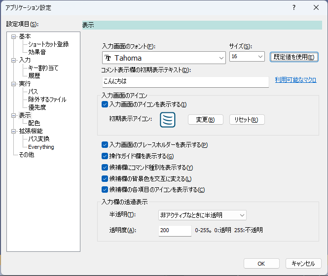

- `入力画面のフォント`
  - 入力画面のフォントを指定する
  - 初期値は`Tahoma`フォント

- `コメント表示欄の初期表示テキスト`
  - 入力画面を表示した直後のコメント欄のテキストを設定する
  - テキストに[マクロ](#マクロ機能)を使うことができる  

- `入力画面のアイコンを表示する`
  - 入力画面上のアイコン表示欄を表示する
- `入力画面のプレースホルダーを表示する`
  - 入力欄に何も文字を入力していない状態のときにテキストを表示する  

- `操作ガイド欄を表示する`
  - チェックすると、コメント表示欄の下に操作ガイド欄を表示する  

- `候補欄にコマンド種別を表示する`
  - チェックすると、コマンドの種別を候補リストに表示する  

- `候補欄の背景色を交互に変える`
  - チェックすると、候補欄の奇数行と偶数行の背景色を変えて表示を行う  

- `候補欄の各項目のアイコンを表示する`
  - チェックすると、候補欄の項目ごとにアイコンを表示する
  - 左: アイコンを表示する場合  右:表示しない場合  

- `入力欄の透過表示`
  - `半透明`  
入力画面を半透明にするタイミングの設定。以下の3つから選択する。
    - `非アクティブなときに半透明`  
入力画面がフォーカスを失ったときに半透明表示にする
    - `いつでも半透明`  
フォーカスの有無にかかわらず常に入力画面を半透明表示にする
    - `半透明にしない`  
フォーカスの有無にかかわらず常に入力画面を半透明表示にしない
  - `透明度`
    - 入力画面を透過表示するときの透明度を0～255の範囲で指定する
    - 0は完全に透明
      - 255は完全に不透明

#### 表示＞配色


- `システムの色設定を使用する`
  - チェックすると、Windowsのシステム設定の配色でウインドウを描画する
  - チェックしない場合は、アプリで独自設定した色を使用する

- `システムの色設定に戻す`
  - 色設定を初期値に戻す


- `ウインドウ`
  - `テキスト`  
ウインドウのコメント欄、ガイド欄の文字色を設定する
  - `背景`  
ウインドウの背景色を設定する
- `入力欄`
  - `テキスト`  
入力欄の文字色を設定する
  - `背景`  
入力欄の背景色を設定する
- `候補欄`
  - `テキスト`  
候補欄の文字色を設定する
  - `背景`  
候補欄の背景色を設定する
  - `背景(交互)`  
`候補欄の背景色を交互に変える`をチェックしたときの候補欄の偶数行目の背景色を設定する
  - `選択テキスト`  
候補欄の選択行の文字色を設定する
  - `選択背景`  
候補欄の選択行の背景色を設定する

#### 拡張機能

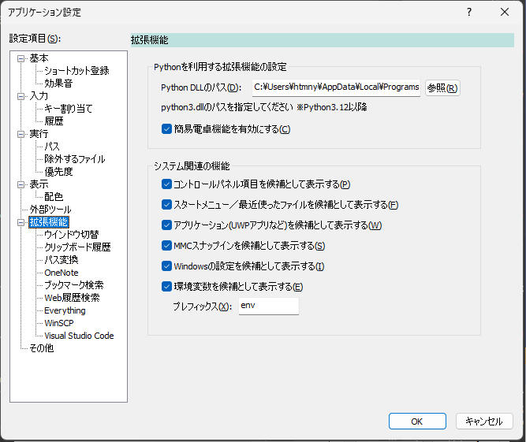

- `簡易電卓機能`>`有効にする`
  - チェックすると、入力画面に入力したテキストを数式として評価して、その計算結果を表示する  

  - `Enter`キーを押すと、計算結果をクリップボードにコピーする
  - [Python3](https://www.python.org/)が必要
- `簡易電卓機能`>`Python DLLのパス`
  - PCにインストールした`Python3`の本体DLLへのパスを指定する

- `アクティブなウインドウの切り替え機能`
  - `ウインドウタイトルによる選択を有効にする`  
画面に表示されているウインドウのタイトルを候補として表示し、それを実行したら該当するウインドウをアクティブにする  

  - `ExcelやLibreOffice Calcのシート名による選択を有効にする`  
入力画面を表示した時点で開いているExcel / LibreOffice Calcのシート名の一覧を候補として検索し、それを実行したら該当するシートをアクティブにする
    - 機能を利用するためにはExcel(デスクトップ版) または LibreOfficeがインストールされている必要がある
  - `PowerPointのスライドタイトルによる選択を有効にする`  
入力画面を表示した時点でアクティブなPowerPointプレゼンテーションのスライドタイトルを候補として検索し、それを実行したら該当するシートをアクティブにする
    - 機能を利用するためにはPowerPoint(デスクトップ版)がインストールされている必要がある
  - `【試作】Outlookの受信トレイにあるメール選択を有効にする`  
入力画面を表示した時点で開いているOutlook(デスクトップ版)の受信トレイフォルダにあるメールの件名を候補として表示し、それを実行したら該当するメールを選択する
    - 機能を利用するためにはOutlook(デスクトップ版) がインストールされている必要がある

- `システム関連の機能`
  - `コントロールパネル項目を候補として表示する`
    - チェックすると、コントロールパネル項目を候補として表示し、それを実行したら、該当するコントロールパネル項目を開く  

  - `スタートメニュー／最近使ったファイルを候補として表示する`
    - チェックすると、ファイルを候補として表示・実行する
      - スタートメニューに登録されたプログラム
      - Windowsの`最近使ったファイル`に登録されたファイル
  - `アプリケーション(UWPアプリなど)を候補として表示する`
    - チェックすると、実行環境にインストールされているアプリケーション(UWPアプリを含む)を候補として表示・実行する
  - `MMCスナップインを候補として表示する`
    - チェックすると、実行環境にインストールされているMMCスナップインを候補として表示・実行する

#### 拡張機能＞パス変換


- `git-bashパスをローカルパス表記に変換する`
  - チェックすると、[git-bashパス変換](#git-bashパス変換)を有効にする
- `file://...をローカルパス表記に変換する`
  - チェックすると、[fileプロトコルをローカルパスに変換](#fileプロトコルをローカルパスに変換)を有効にする

#### 拡張機能＞Everything


- `Everything SDKが提供するAPIを利用して検索を行う`  
チェックすると、[Everyting検索コマンド](#everything検索コマンドの登録編集)の実行時に、Everything SDKの利用を試みる  
この機能を利用する場合、検索結果は候補欄に直接表示される  

- `ウインドウメッセージ経由で検索を行う`  
チェックすると、[Everyting検索コマンド](#everything検索コマンドの登録編集)の実行時に、ウインドウメッセージ経由でEverythingの検索ウインドウにクエリを渡す  
入力欄に入力したキーワードがEverything側にリアルタイムに反映される  


- `Everythingが起動していなかった場合に起動する`  
コマンドの機能が発動するときにEverythingが起動していなかったら起動を試みる
  - `Everything.exe`のパス  
 Everythingの起動を試みる際に起動する実行ファイル(`Everyting.exe` )のパスを指定する

#### その他


- `ログ出力レベル`
  - ログファイルへの出力対象とするログ種別を選択することができる
  - 下のものほど情報量が多くなる

|選択肢|説明|
|--|----|
|なし|ログを一切出力しない|
|エラー|エラーログのみ出力する|
|警告|エラーと警告ログを出力する|
|通常|エラーと警告と通常ログを出力する|
|デバッグ|デバッグ用出力も含めたすべてのログを出力する|


- `連続で作業していたら警告する`
  - チェックすると、`警告を表示するまでの時間`で設定した時刻を超えて連続稼働(スクリーンロックを挟まずにPCを起動)した場合に警告メッセージを表示する
- `警告を表示するまでの時間`
  - 警告を表示するまでの時間を分数で指定する(デフォルトは90分)

-----------

### 通常コマンドの登録・編集

#### 通常コマンド 基本設定

##### コマンドの概要

通常コマンドはファイルやURLを関連付けられたプログラムで表示するためのコマンドである。  
よく使うプログラムやファイル、URLに対して任意のキーワードを設定し、そのキーワードを使って簡単に呼び出すことができる。

##### 設定画面


- `コマンドの名前`
  - 入力画面からコマンドを実行するためのキーワード
- `コマンドの説明`
  - 入力画面でのキーワード入力時にコメント表示欄に記載される文字列。
- `コメント表示欄のテキストを検索に使用する`
  - チェックすると、`コマンドの説明`に入力したテキストもコマンドの絞り込みに使用する
    - 例えば上の図の場合、「起動」と入力した場合にも、コマンドが候補にあがるようになる
- `実行ファイル・URLなど`
  - 実行ファイル(`*.exe`)を指定すると、その実行ファイルが実行される
  - URL(`http://...` `https://...`)を指定すると、ブラウザでそのURLを表示する
  - その他の拡張子のファイルを指定した場合、拡張子に関連付けられたプログラムでそのファイルを開く
- `パラメータ`
  - 実行ファイル(.exe)を指定したときに、実行ファイルに渡すパラメータを指定する
  - `$*` : 入力欄でコマンド名の後にスペース区切りで入力した全ての文字列に置換する
  - `$1`/`$2`/`$3` ... : 入力欄でコマンド名の後にスペース区切りで入力した1番目/2番目/3番目...の文字列に置換する
  - そのほかに[マクロ](#マクロ機能)を利用することが可能
- `引数が表示されなかったときに入力欄を続けて表示する`  
パラメータ欄に`$*`や`$1`を使っている場合にのみ表示される。  
入力欄にパラメータが指定されずにコマンドが実行された場合に、入力を促す画面を追加で表示する。  
↓  


- `作業フォルダ`
  - 実行するときのカレントディレクトリを指定する
- `表示方法`
  - 通常表示/最大表示/最小表示 を選ぶことができる
  - 起動するプログラムによっては指定が効かないこともある
- `管理者権限で実行`
  - チェックすると、管理者権限でプロセスを起動する
  - `.exe`、`.bat`のときのみ選択可能
- `ホットキー`
  - [コマンドを呼び出すキー](#キー割り当て)を設定できる。設定したキーを押下すると、コマンドを実行できる。  


- 左上のアイコン欄
  - アイコン欄を右クリックすると、コンテキストメニューが表示される。  

  - `アイコンを変更する`
    - 選択すると、ファイルを選択するダイアログが表示される。画像ファイルを選択すると、その画像をアイコンとして使用することができる。
    - PNG/JPG/GIF/BMP形式のファイルが利用可能
  - `アイコンを初期状態に戻す`
    - 選択すると、変更したアイコンを元に戻すことができる

#### 通常コマンド 詳細設定

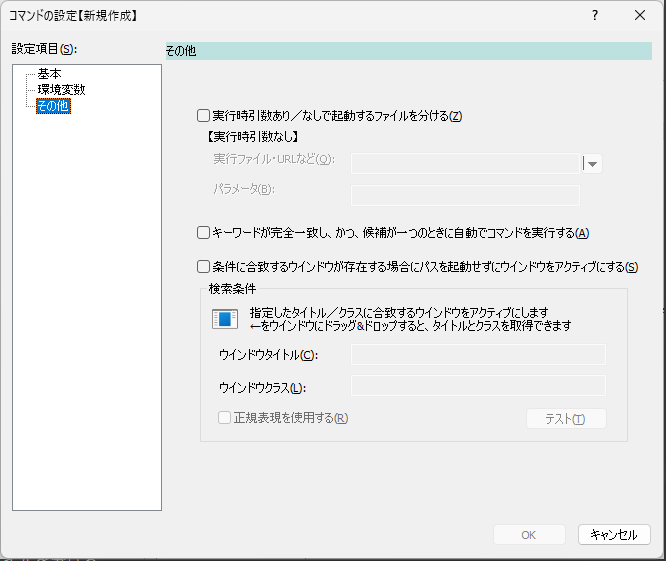

- `実行時引数あり/なしで起動するファイルを分ける`
  - 入力欄で、コマンド名の後に文字列を入力した場合とそうでない場合とで、実行するファイルを分けるときにチェックする
  - 【実行時引数なし】直下に、コマンド名のみを入力した場合に実行するファイル(やパラメータ)を指定する
  - 想定する使い方
    - パラメータがある場合→検索、ない場合→検索サイトのトップページを表示

##### 実行時の動作

|押下キー|動作|
|--|--|
|`Enter`|ファイルを実行する or ディレクトリを開く|
|`Ctrl-Enter`|パス(ファイルが存在するディレクトリ)を開く|
|`Shift-Ctrl-Enter`|管理者権限で実行する|

-----------

### 定型文の登録・編集

##### コマンドの概要

あらかじめ登録しておいた定型文をクリップボードにコピーするためのコマンド  
よく使う言い回し(定型文)に名前を付けて、その名前で定型文を呼び出すことができる。

##### 設定画面


- `コマンドの名前`
  - 入力画面から定型文コマンドを実行するためのキーワード  
コマンドを実行すると、定型文がクリップボードにコピーされる。
- `説明`
  - 入力画面でのキーワード入力時にコメント表示欄に記載される文字列。
- `テキスト`
  - 定型文を指定する。
  - 定型文のテキストとして、[マクロ](#マクロ機能)を利用することが可能
- `ホットキー`
  - [コマンドを呼び出すキー](#キー割り当て)を設定できる。設定したキーを押下すると、定型文をクリップボードにコピーできる。

##### 実行時の動作

|押下キー|動作|
|--|--|
|`Enter`|設定されたテキストをクリップボードにコピーする|

-----------

### 定型文グループの登録・編集

##### コマンドの概要

定型文のグループを定義するためのコマンド  
入力欄にグループ名を登録すると、そのグループに登録した定型文の一覧が候補として選択される。
候補を選択すると、その定型文がクリップボードにコピーされる。
あらかじめ登録しておいた定型文をクリップボードにコピーするためのコマンド  

よく使う言い回し(定型文)に名前を付けて、その名前で定型文を呼び出すことができる。


##### 設定画面


- `グループの名前`
  - 定型文グループに属する定型文一覧を候補一覧を表示するためのキーワード  
表示された候補を選択し、実行すると、該当する定型文の内容がクリップボードにコピーされる。
- `説明`
  - 入力画面でのキーワード入力時にコメント表示欄に記載される文字列。
- `定型文の一覧`
  - グループに属する定型文の一覧が表示される
- `追加`
  - グループに定型文を追加する。  
[定型文編集画面](#定型文の編集画面)が表示される
- `編集`
  - `定型文の一覧`上のリスト上で選択した定型文の内容を編集する。  
[定型文編集画面](#定型文の編集画面)が表示される
- `削除`
  - グループにある既存の定型文の内容を削除する。
- `上へ移動`
  - クリックすると、`定型文の一覧`で選択した項目を一つ上に移動する。
- `下へ移動`
  - クリックすると、`定型文の一覧`で選択した項目を一つ下に移動する。
- `ホットキー`
  - [コマンドを呼び出すキー](#キー割り当て)を設定できる。設定したキーを押下すると、[入力画面](#入力画面)が表示され、グループの定型文の一覧が表示された状態になる

##### 定型文の編集画面


- `名前`
  - 定型文の名前を設定する。ここで指定した名前が候補欄に表示される。
- `説明`
  - 該当する定型文が候補欄で選択された状態のときにコメント表示欄に表示される文字列
- `テキスト`
  - 定型文としてのクリップボードにコピーする内容を入力する

##### 実行時の動作

|押下キー|動作|
|--|--|
|`Enter`|設定された定型文をクリップボードにコピーする|

-----------


### Web検索コマンドの登録・編集

##### コマンドの概要

Web検索を行うためのコマンド。  
例えばGoogle検索やTwitter検索など、よく使う検索に名前を付けて、その名前で検索サイトを使い分けることができる。  

##### 設定画面

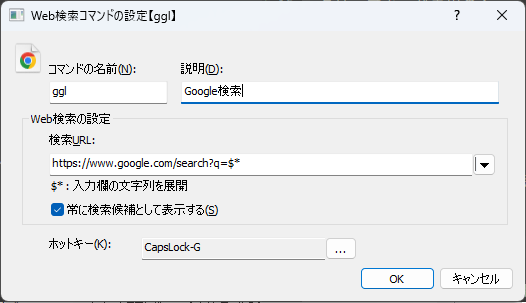

- `コマンドの名前`
  - 入力画面からWeb検索コマンドを実行するためのキーワード
- `説明`
  - コメント表示欄に記載される文字列。
- `検索URL`
  - 検索するためのURLを指定する。  
`$*`を含めると、その部分が検索キーワードに置換される。
  - 例えばGoogle検索を行う場合は、`https://www.google.com/search?q=$*`と指定すればよい
- `常に検索候補として表示する`
  - チェックすると、コマンド名を入力しなくても、検索ワードを入れるだけで候補として表示されるようになる  

  - この場合[弱一致](#一致度の区分)扱いとなる  
  - 検索URLに`$*`を入力したときだけ表示される  
- `ホットキー`
  - コマンドを呼び出すキーバインドを設定できる。  
設定したキーを押下すると、入力欄が表示され、コマンド名が入力された(キーワードで絞り込みができる）状態になる
  - 他のコマンドにおけるホットキーはコマンド実行として作用するが、このコマンドに関しては短縮入力みたいな位置づけ
- 左上のアイコン欄  
アイコン欄を右クリックすると、コンテキストメニューが表示される。  

  - `アイコンを変更する`
    - 選択すると、ファイルを選択するダイアログが表示される。画像ファイルを選択すると、その画像をアイコンとして使用することができる。
    - PNG/JPG/GIF/BMP形式のファイルが利用可能
    - 検索サイトごとにアイコンを変えると視認性が高まるのでおすすめ
  - `アイコンを初期状態に戻す`
    - 選択すると、変更したアイコンを元に戻すことができる

##### 実行時の動作

|押下キー|動作|
|--|--|
|`Enter`|ブラウザで検索を実行する|

-----------

### ブックマーク検索コマンドの登録・編集

##### コマンドの概要

Webブラウザのブックマークを検索するためのコマンド。  
検索ワードを含むタイトルやURLのブックマークを候補として表示できる。  
該当する候補を選択して実行すると、ブックマークをブラウザで開く。

Edge/Chromeに対応している。  

なお、`javascript:`で始まるブックマーク(ブックマークレット)については候補から除外する。

###### 例

`c++`というワードを含むブックマークを表示する


##### 設定画面


- `コマンドの名前`
  - ブックマーク検索コマンドを実行するためのキーワード
- `説明`
  - コメント表示欄に記載される文字列。
- `Chromeのブックマークを候補として表示する`  
チェックすると、Chromeのブックマークを検索対象とする
- `Edgeのブックマークを候補として表示する`  
チェックすると、Edgeのブックマークを検索対象とする
  - `URL文字列を候補の絞り込みに使う`  
チェックすると、URL文字列(とブックマーク名)を候補の絞り込みに使う。チェックしない場合はブックマーク名のみで絞り込みする
- `ホットキー`
  - コマンドを呼び出すキーバインドを設定できる。  
設定したキーを押下すると、入力欄が表示され、コマンド名が入力された(キーワードで絞り込みができる）状態になる
  - 他のコマンドにおけるホットキーはコマンド実行として作用するが、このコマンドに関しては短縮入力みたいな位置づけ

##### 実行時の動作

|押下キー|動作|
|--|--|
|`Enter`|ブックマークをブラウザで開く|
|`Shift-Enter`|URLをクリップボードにコピーする|

-----------

### ブラウザ履歴コマンドの登録・編集

##### コマンドの概要

Webブラウザの閲覧履歴を検索するためのコマンド。  
検索ワードを含むタイトルやURLの履歴を候補として表示できる。  
該当する項目を選択して実行すると、履歴のページをブラウザで開く。

Edge/Chromeに対応している。  


##### 設定画面


- `コマンドの名前`
  - ブラウザ履歴コマンドを実行するためのキーワード
- `説明`
  - コメント表示欄に記載される文字列。
- `追加キーワード`
  - キーワードを指定すると、そのキーワードを含めて履歴検索を行う
  - 目的を限定した履歴検索をしたいようなケースで使う(特定ドメインに対する履歴検索とか)
- `Chromeの履歴を候補として表示する`  
チェックすると、Chromeの閲覧履歴から入力キーワードに該当するものを候補として表示する
- `Edgeの履歴を候補として表示する`  
チェックすると、Edgeの閲覧履歴から入力キーワードに該当するものを候補として表示する
- `クエリのタイムアウト`  
履歴を探すためのQuery処理の際、指定した時間が経過したら処理を打ち切る。  
打ち切るまでに見つかった候補を表示する。  
PCの性能によっては、途中で打ち切らないと、入力時のレスポンスが重くなる現象が見られたため。
- `候補件数`  
候補の上限件数を設定する。多くするほどQuery処理に時間がかかる。
- `Migemoを検索を利用する`  
絞り込みの際にMigemo検索を使うかどうかを指定する。Migemo検索は(使わない場合と比べて)時間がかかるので、非力なPCだと十分な結果が得られない可能性がある。
- `URL文字列を候補の絞り込みに使う`  
チェックすると、URL文字列も考慮した絞り込みを行う。チェックしない場合は履歴のページタイトルのみで絞り込みを行う。

- `ホットキー`
  - コマンドを呼び出すキーバインドを設定できる。  
設定したキーを押下すると、入力欄が表示され、コマンド名が入力された(キーワードで絞り込みができる）状態になる
  - 他のコマンドにおけるホットキーはコマンド実行として作用するが、このコマンドに関しては短縮入力みたいな位置づけ

##### 実行時の動作

|押下キー|動作|
|--|--|
|`Enter`|該当するページをブラウザで開く|
|`Shift-Enter`|URLをクリップボードにコピーする|


-----------

### グループコマンドの登録・編集

##### コマンドの概要

本アプリに登録済のコマンドを複数まとめて実行するためのコマンド  
決まった順序で実行する複数の操作を呼び出す用途で使うことができる。

##### 設定画面


- 上の図の場合、`xxx`→`vim`→`twitter`という順にコマンドを順次実行する、という意味
- 完了するまで待つにチェックすると、そのコマンドが完了するのを待つ


- `グループの名前`
  - 入力画面からグループコマンドを実行するためのキーワード
- `説明`
  - コメント表示欄に記載される文字列。

- `グループとして実行するコマンド`
  - グループに含まれるコマンドの一覧が表示される

- `追加`
  - 一覧にコマンドを追加する
- `削除`
  - 一覧からコマンドを削除する
- `上へ移動`
  - 一覧で選択した項目を一つ上に移動する
- `下へ移動`
  - 一覧で選択した項目を一つ下に移動する

- `完了するまで待つ`
  - チェックすると、そのコマンドの実行が完了するまで次のコマンドを実行しない
  - チェックしない場合、コマンドを実行したあと、完了を待たずに次のコマンドを実行する

- `全てのコマンドに同じパラメータを渡す`
  - コマンド実行時に、入力欄にパラメータを指定した場合、そのパラメータをグループ内の各コマンドに渡す

- `繰り返し実行する`
  - 指定した回数分だけグループ内のコマンドを繰り返し実行する

- `実行前に確認ダイアログを出す`
  - グループ実行時に確認するかどうかのダイアログを表示する

- `ホットキー`
  - [コマンドを呼び出すキー](#キー割り当て)を設定できる。設定したキーを押下するとコマンドを実行できるようになる。

##### 実行時の動作

|押下キー|動作|
|--|--|
|`Enter`|登録された内容を実行する|

-----------

### DirectoryIndexコマンドの登録・編集

(試作)

##### コマンドの概要

Directory Index(Webサーバーのインデックスページ)上のディレクトリやファイルを表示するコマンド  
ランチャーのUI上からディレクトリやファイルをインクリメンタルに絞り込んで、階層をたどることができる

###### 例 

{ width=50% }  
↓  
{ width=50% }


##### 設定画面


- `コマンドの名前`
  - 入力画面からコマンドを実行するためのキーワード
- `コマンドの説明`
  - コメント表示欄に記載される文字列。

- `起点URL`
  - コマンドを実行したときに起点となるURLを指定する  
ここで指定したURLから得られたハイパーリンクの一覧を候補として表示する

- `サーバー認証`  
`起点URL`でアクセスするページが認証を必要とする場合の認証情報を指定する
  - `ユーザー名`  
認証情報(ユーザ名)を指定する
  - `パスワード`  
認証情報(パスワード)を指定する
- `プロキシ`  
`起点URL`でアクセスするためにプロキシを経由する必要がある場合にプロキシの設定を行う
  -`プロキシの利用方法`  
以下の3つを選択できる
    - `システム設定を使う`  
インターネットオプションで設定したプロキシ設定を用いる
    - `プロキシを指定する`  
プロキシサーバを明示的に指定する。
    - `プロキシを使わない`  
プロキシを経由せず、`起点URL`に直接をアクセスする

  - `プロキシサーバ`  
`プロキシを指定する`を選択した場合の、プロキシサーバのホスト名とポート番号を指定する  
ホスト名とポート番号をコロン(:)で区切って指定する
  - `ユーザ名`  
指定したプロキシサーバが認証を必要とする場合のユーザ名を指定する
  - `パスワード`  
指定したプロキシサーバが認証を必要とする場合のパスワードを指定する
- `ホットキー`
  - [コマンドを呼び出すキー](#キー割り当て)を設定できる。設定したキーを押下するとコマンドを実行できるようになる。

##### 実行時の動作

|押下キー|動作|
|--|--|
|`Enter`|選択した候補のリンク先へ遷移する|
|`Shift-Enter`|選択した候補のリンク先をブラウザで開く|
|`Ctrl-Enter`|選択した候補のリンク先URLをクリップボードにコピーする|

-----------

### 正規表現コマンドの登録・編集

##### コマンドの概要

指定した正規表現パターンに合致する場合に、その内容に応じてコマンドを実行するためのコマンド

他のコマンド種類と異なり、登録した名前(キーワード)でマッチングを行うのではなく、`パターン`で指定した正規表現によるマッチングを行う。  
正規表現にマッチしたときにキャプチャしたものを`$1``$2`...で参照し、起動するコマンドに渡すことができる。

- 活用例
  - Webベースの課題追跡システムや障害管理システムを使ってたとして、そのIssueの識別子を正規表現パターンとして登録しておく → その識別子を含むテキストをランチャーに入力して、当該Issue画面を開く
    - メールやテキストファイルに書かれたIssus識別子をコピペするだけでそのIssue画面を呼び出せる

##### 設定画面


- `コマンドの名前`
  - コマンドを識別するための名前。
  - 正規表現コマンドは`パターン`に基づいてマッチングするため、コマンドの名前がマッチングに使用されることはない
- `パターン`
  - コマンドを実行するための正規表現パターンを定義する
- `コマンドの説明`
  - コメント表示欄に記載される文字列。
- `実行ファイル・URLなど`
  - 実行ファイル(`*.exe`)を指定すると、その実行ファイルが実行される
  - URL(`http://...` `https://...`)を指定すると、ブラウザでそのURLを表示する
  - その他のファイルを指定した場合、拡張子に関連付けられたプログラムでそのファイルを開く
- `パラメータ`
  - 実行ファイル(.exe)を指定したときに、実行ファイルに渡すパラメータを指定する
  - `$1`/`$2`/`$3` ... : 正規表現でキャプチャされた文字列に置換する
  - そのほかに[マクロ](#マクロ機能)を利用することが可能
- `作業フォルダ`
  - 実行するときのカレントディレクトリを指定する

- `表示方法`
  - 通常表示/最大表示/最小表示 を選ぶことができる
  - 起動するプログラムによっては指定が効かないこともある

- `管理者権限で実行`
  - チェックすると、管理者権限でプロセスを起動する
  - `.exe`、`.bat`のときのみ選択可能

- 左上のアイコン欄  
アイコン欄を右クリックすると、コンテキストメニューが表示される。  

  - `アイコンを変更する`
    - 選択すると、ファイルを選択するダイアログが表示される。画像ファイルを選択すると、その画像をアイコンとして使用することができる。
    - PNG/JPG/GIF/BMP形式のファイルが利用可能
  - `アイコンを初期状態に戻す`
    - 選択すると、変更したアイコンを元に戻すことができる

##### 実行時の動作

|押下キー|動作|
|--|--|
|`Enter`|コマンドで設定したファイルを実行する|

-----------

### フィルタコマンドの登録・編集

##### コマンドの概要

ファジーファインダー的なことをするためのコマンド。以下のようなことを行う。

前段の処理を実行する  
↓  
前段の処理が標準出力に出力した内容を行単位に分けて候補とする  
↓  
候補の一覧を候補欄に表示する(利用者は絞り込み・選択を行う)  
↓  
選択した結果をもとに後段の処理を実行する


登録したコマンド名を入力欄に入力すると、外部プログラムの実行を行い、得られた出力を候補欄に表示する


コマンド名(上の例だと`folderselect`)をタイプした時点で、前段の処理を実行し、候補の一覧を生成・表示する

##### 設定画面


- `コマンドの名前`
  - 入力画面からコマンドを実行するためのキーワード
- `コマンドの説明`
  - コメント表示欄に記載される文字列。

- `前段の処理`
  - `候補の生成方法`
    - 絞り込み対象候補の生成方法を選択する。  
以下の2つから選択できる
      - [プログラムを実行する](#候補の生成方法---プログラムを実行する)  
任意のプログラムを実行し、そのプログラムの標準出力の内容を行単位で区切ったものを候補とする
      - `クリップボードの内容を使用する`  
コマンド実行時のクリップボードの内容を行単位で区切ったものを候補とする
      - [候補を定義する](#候補の生成方法---候補を定義する)  
候補とするテキストを直接定義する
  - `表示文字列の内容を置換する`  
チェックすると、候補欄に表示する文字列をカスタマイズすることができる(正規表現置換)  
なお、ここで置換したテキストは候補欄の表示のみに用いられる。候補の絞り込みや後段の処理には影響しない。
    - `検索パターン`  
正規表現の検索パターンを指定する  
    - `置換する内容`  
置換後の文字列を指定する  
    - 例: `\`以降の文字列だけを表示したい場合  
検索パターン: `^.*\\(.*)$`  
置換する内容: `$1`

- `後段の処理`
  - `実行する処理`  
候補を選択した後に実行する処理の実行方法を選択する  
以下の3つから選ぶことができる
    - [他のコマンドを実行する](#実行する処理---他のコマンドを実行する)
    - [プログラムを実行する](#実行する処理---プログラムを実行する)
    - [クリップボードにコピーする](#実行する処理---クリップボードにコピーする)

- `ホットキー`
  - コマンドを呼び出すキーバインドを設定できる。設定したキーを押下するとコマンドを実行できるようになる。

###### 候補の生成方法 - プログラムを実行する


- `実行ファイル`
  - 実行するプログラムのパスを指定する
- `パラメータ`
  - 実行するプログラムに渡す引数を指定する
- `作業フォルダ`
  - 実行するプログラムのカレントディレクトリを指定する
- `文字コード`
  - 実行したプログラムが標準出力に出力したバイト列を、本アプリが文字列として解釈するときの文字コードを指定する  
`UTF-8`または`ShiftJIS`を選択可能
- `一度生成した候補一覧を次回も再利用する`  
次回以降のコマンド実行時にプログラムを実行せずに前回の結果を再利用するかどうかを指定する。  
  - チェックした場合、候補をひとたび生成した後は再生成をしない  
アプリ終了まで継続する
  - チェックしなかった場合、候補の生成(プログラム実行)を毎回行う

###### 候補の生成方法 - 候補を定義する


- `候補の一覧`
  - 候補として表示する文字列を記述する。  
上図の場合、`A` `B` `C` という3つの候補が表示される

###### 実行する処理 - 他のコマンドを実行する

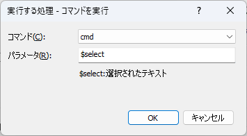

- `コマンド`
  - 実行するコマンドを選択する
- `パラメータ`
  - コマンドに渡すパラメータを指定する  
`$select`というキーワードを指定すると、選択した候補のテキストに置換される

###### 実行する処理 - プログラムを実行する

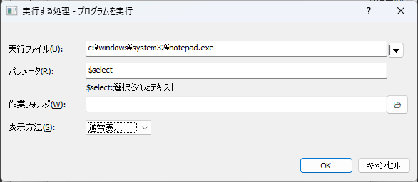

- `実行ファイル`
  - 実行するプログラムのパスを指定する
- `パラメータ`
  - プログラムに渡すパラメータを指定する  
`$select`というキーワードを指定すると、選択した候補のテキストに置換される
- `作業フォルダ`
  - 実行するときのカレントディレクトリを指定する
- `表示方法`
  - 通常表示/最大表示/最小表示 を選ぶことができる
  - 起動するプログラムによっては指定が効かないこともある

###### 実行する処理 - クリップボードにコピーする


- `パラメータ`
  - クリップボードにコピーするテキストの書式を指定する  
`$select`というキーワードを指定すると、選択した候補のテキストに置換される

##### おことわり

コマンドの設定次第で、候補の数が多くなる可能性がある。  
その場合において、大量のデータを高速に絞り込むことを意識した実装などは全くしてないので、大量データを扱うならしかるべきツールを使うのが吉  
(このコマンドはインクリメンタルな絞り込みをする手段をお手軽に提供するためのものなので..)

#### 実行時の動作

|押下キー|動作|
|--|--------|
|`Enter`|選択した候補を使って、コマンド設定で指定した後段の処理を実行する|

-----------

### ウインドウ切替コマンドの登録・編集

任意のウインドウをアクティブにする(前面に出す)ためのコマンド。  
検索条件をあらかじめ設定しておき、それに対してキーワードやホットキーを設定することができる。  

よく使うアプリのウインドウを登録しておけば、そのアプリに素早く切り替えることができる。

タイトルとウインドウクラス名でウインドウを識別する。  
対象とするウインドウのタイトルとウインドウクラス名を手入力するのは難しいので、画面上のアイコンを対象ウインドウにドラッグするのがおすすめ。


なお、まぎらわしいが、[ウインドウ切り替え](#ウインドウ切り替え)とは別物。

##### 設定画面


- `コマンドの名前`
  - 入力画面からコマンドを実行するためのキーワード
- `コマンドの説明`
  - コメント表示欄に記載される文字列。
- `ウインドウタイトル`
  - 検索対象とするウインドウのタイトルを指定する。  
空欄にした場合は`ウインドウクラス`のみで検索を行う
- `ウインドウクラス`
  - 検索対象とするウインドウクラスを指定する。  
空欄にした場合は`ウインドウタイトル`のみで検索を行う
  - `ウインドウタイトル`と`ウインドウクラス`のどちらかを指定する必要がある
- `正規表現`
  - チェックした場合、`ウインドウタイトル`と`ウインドウクラス`に入力した文字列を正規表現として扱う
  - チェックしない場合、`ウインドウタイトル`と`ウインドウクラス`に入力した文字列の完全一致で探す
- `テスト`
  - `ウインドウタイトル` `ウインドウクラス` `正規表現` に入力した内容に基づいてウインドウを探す。  
該当するウインドウが見つかった場合はタスクバー上にあるアイコンが点滅する。
- `ホットキー`
  - コマンドを呼び出すキーバインドを設定できる。設定したキーを押下するとコマンドを実行できるようになる。

##### 実行時の動作

|押下キー|動作|
|--|--|
|`Enter`|ウインドウを切り替える|
|`Ctrl-Enter`|ウインドウを切り替えて最大化する|

##### 例

前述の画面の設定でコマンドを作っておくと、下記の操作のいずれかでGVimのウインドウに切り替えることができる。

- キーワード`actvim`を実行する
- (入力画面を表示した状態で)`Alt-V`押下

Windows標準のウインドウ切り替えのキー操作である`Alt-Tab`の場合、その時々のウインドウの表示状態によりキーを操作する回数が変わる、ウインドウの数が増えると目的のものを探すのに時間がかかる、という問題がある。  
このコマンドを使うと、定数時間で切り替えることができるのがメリット

-----------

### ウインドウ整列コマンドの登録・編集

ウインドウの位置とサイズを指定しておいて、一括設定するためのコマンド。  
普段よく使うアプリの「いつもの配置」を登録しておけば、それをすぐに再現することができる。

任意のウインドウに対し、位置・サイズ指定、最大化、最小化、非表示を設定することができる。  
非表示にすることもできるので、バックグラウンドで実行する必要がある一方で表示しておきたくないウインドウを隠す、という用途で使うこともできる。

##### 設定画面


- `コマンドの名前`
  - 入力画面からコマンドを実行するためのキーワード
- `コマンドの説明`
  - コメント表示欄に記載される文字列。
- `整列するウインドウの一覧`
  - 整列する対象とするウインドウの一覧を表示する  
対象を追加・編集・削除したい場合は、右側にあるボタンから行う
- `追加`
  - クリックすると、検索対象とするウインドウを[登録するための画面](#整列対象とするウインドウを登録する)を表示する。
- `編集`
  - クリックすると、`整列するウインドウの一覧`で選択した項目の[登録内容を変更するための画面](#整列対象とするウインドウを登録する)を表示する。
- `追加`
  - クリックすると、`整列するウインドウの一覧`で選択した項目を削除する。
- `上へ`
  - クリックすると、`整列するウインドウの一覧`で選択した項目を一つ上に移動する。
- `下へ`
  - クリックすると、`整列するウインドウの一覧`で選択した項目を一つ下に移動する。
- `条件に合致するウインドウが見つからなかった場合に通知する`
  - チェックすると、コマンド実行時に登録したウインドウが見つからなかった場合にその旨を知らせるメッセージをポップアップ表示する。
- `アクティブなウインドウを変更しない`
  - チェックすると、コマンド実行前にアクティブだったウインドウが、コマンド実行後もアクティブなままになる。
  - チェックしない場合は、一覧の最も下にあるウインドウがアクティブになる。
- `ホットキー`
  - コマンドを呼び出すキーバインドを設定できる。設定したキーを押下するとコマンドを実行できるようになる。

##### 例

電卓とペイントをあらかじめ決めた位置に並べる

{ witdh=160px }

##### 実行時の動作

|押下キー|動作|
|--|--|
|`Enter`|ウインドウの整列を実行する|

#### 整列対象とするウインドウを登録する

[ウインドウ整列コマンド](#ウインドウ整列コマンドの登録編集)に登録するためのウインドウの情報を入力するための画面。  

タイトルとウインドウクラス名でウインドウを識別する。  
対象とするウインドウのタイトルとウインドウクラス名を手入力するのは難しいので、画面上のアイコンを対象ウインドウにドラッグするのがおすすめ。

##### 設定画面


- `検索条件`  
整列対象とするウインドウの`ウインドウタイトル`と`ウインドウクラス`を入力する。  
画面左上にあるアイコンを整列対象としたいウインドウにドラッグすると、そのウインドウの`ウインドウタイトル`と`ウインドウクラス`を取得することができる。
  - `ウインドウタイトル`
    - 検索対象とするウインドウのタイトルを指定する。  
  空欄にした場合は`ウインドウクラス`のみで検索を行う
  - `ウインドウクラス`
    - 検索対象とするウインドウクラスを指定する。  
  空欄にした場合は`ウインドウタイトル`のみで検索を行う
    - `ウインドウタイトル`と`ウインドウクラス`のどちらかを指定する必要がある
  - `正規表現`
    - チェックした場合、`ウインドウタイトル`と`ウインドウクラス`に入力した文字列を正規表現として扱う
    - チェックしない場合、`ウインドウタイトル`と`ウインドウクラス`に入力した文字列の完全一致で探す
- `整列設定`  
整列対象とするウインドウの整列動作を入力する。  
`現在の状態を取得`ボタンを押下すると、`検索条件`欄に指定した条件に合致する状態(最大化 or 最小化 or 位置とサイズ)を取得する。
  - `動作`  
以下のいずれかを選択する
    - `位置・サイズを変更` : ウインドウを指定した位置・サイズに移動&リサイズする
    - `最大化` : ウインドウを最大化する
    - `最小化` : ウインドウを最小化する
    - `非表示` : ウインドウを非表示にする
      - 非表示にした場合、一般的な操作で表示状態に戻すことはできないので注意すること
  - `位置(X,Y)`
    - (`位置・サイズを変更`時)ウインドウの位置を指定する。
  - `サイズ(幅,高さ)`
    - (`位置・サイズを変更`時)ウインドウのサイズを指定する。
  - `現在の状態を取得`
    - `検索条件`欄に指定した条件に合致するウインドウの状態(最大化 or 最小化 or 位置とサイズ)を取得する。
  - `複数のウインドウが該当するときはすべてに対して適用する`
    - チェックすると、`検索条件`欄に指定した条件に合致するウインドウが複数あった場合に、すべてのウインドウに対して適用する

-----------

### 簡易辞書コマンドの登録・編集

##### コマンドの概要

Excelワークブックファイル(`*.xlsx,*.xls`)の任意の範囲のデータを簡易的な辞書データ(キーと値のペアの集合)として利用するコマンド。  
Excelで定義した辞書データをインクリメンタルに検索することができる。  

Excelをデータソースにできるので、データのメンテナンスをExcelでお手軽にできるのがメリット

Excelを利用するため、実行環境にExcelがインストールされている必要がある。


- イメージ  
日本の上場企業の会社名をキー、証券コードを値にする  


- 動画  
「せいてつ」というキーワードで会社名での絞り込みを行い、証券コードをクリップボードにコピーする例  


##### 用途・活用例

- お使いの環境(組織)にて使われる、何らかの対応表の相互変換
  - Excelで台帳管理されているものがあれば、それをそのままデータソースとして活用できる可能性がある
    - あるいはPowerQueryを使って、加工したうえで使うとか...
  - 製品開発の現場における、製品の正式名称(外向け)と開発名称(内向け)の相互変換とか
- ([定型文グループコマンド](#定型文グループの登録編集)と被るが)定型文をExcelで管理して、定型文として呼び出すような使い方ができる
  - 定型文に対して任意の名前を付けて、名前で定型文を呼び出す、みたいな
- その他、一般的な変換
  - 例: 郵便番号と地名、MACアドレスとベンダー、企業名と企業コード


##### 設定画面


- `コマンド名`
  - 入力画面からコマンドを実行するためのキーワード
- `コマンドの説明`
  - 何のためのコマンドかを記載しておくための説明欄
- `データの取得元`
  - `Excelファイル`
    - 辞書データとして利用したいExcelワークブックファイルのパスを指定する
  - `シート名`
    - 辞書データとして利用したいデータを含むシート名を指定する
  - `キーのデータ範囲`
    - 辞書データの「キー」として利用したいデータの範囲を指定する
  - `キー範囲取得`
    - クリックすると、現在Excelで表示・選択している範囲の情報を、`Excelファイル`、`シート名`、`キーのデータ範囲`に反映する
  - `値のデータ範囲`
    - 辞書データの「値」として利用したいデータの範囲を指定する
  - `値範囲取得`
    - クリックすると、現在Excelで表示・選択している範囲の情報を、`Excelファイル`、`シート名`、`値のデータ範囲`に反映する
  - `値2のデータ範囲`
    - 辞書データの「値2」として利用したいデータの範囲を指定する
    - `値2`は補助用の領域。設定は任意。
  - `値範囲取得`
    - クリックすると、現在Excelで表示・選択している範囲の情報を、`Excelファイル`、`シート名`、`値のデータ範囲`に反映する
  - `一行目をヘッダ行として扱う`
    - チェックすると、選択範囲の先頭行をヘッダとみなし、辞書データに含めない
  - `更新時に通知を行う`
    - チェックすると、`Excelファイル`で指定したファイルが更新されたときに、トースト通知する
      - ファイルサーバ上で他の人と共有しているExcelファイルを使っている場合に、他者によるファイル更新に気づくことができる
      - ただし、ファイルがURL経由である場合は更新検知できない
  - `取得内容確認`
    - クリックすると、`Excelファイル`/`シート名`/`キーのデータ範囲`/`値のデータ範囲`の内容に基づいて辞書データを読み込み、プレビュー欄に表示する

- `候補の表示・マッチング`
  - `説明欄の書式`
    - 候補を選択したときに説明欄に表示するテキストの書式を設定する
  - `候補欄の書式`
    - 候補欄に表示するテキストの書式を設定する
  - `コマンド名を入力しなくても候補を表示する`
    - チェックすると、コマンド名を入力しなくても、入力ワードにマッチする値を候補欄に表示する
      - この場合[弱一致](#一致度の区分)扱いとなる
  - `値でのマッチングも行う`
    - チェックすると、キーと値を逆転したマッチングを有効にする(値でマッチングし、キーを結果とする）

- `選択後の処理`  
  - `実行する処理`  
選択後に実行する処理の実行方法を選択する  
以下の3つから選ぶことができる
    - `他のコマンドを実行する`
    - `他のプログラムを実行する`
    - `クリップボードにコピーする`
  - `パラメータ`  
    - 実行する処理に渡すパラメータを指定することができる  
以下の変数を使用できる。  
      - `$key` : 選択されたキー
      - `$value` : 選択された値
      - `$value2` : 選択された値2
  - `マクロを展開する`
    - コマンド実行時に[マクロ](#マクロ機能)を展開する

なお、逆引き検索でヒットした場合、`$key`と`$value`も逆になる

- `ホットキー`  
  - コマンドを呼び出すキーバインドを設定できる。  
設定したキーを押下すると、入力欄が表示され、コマンド名が入力された(キーワードで絞り込みができる）状態になる
  - 他のコマンドにおけるホットキーはコマンド実行として作用するが、このコマンドに関しては短縮入力みたいな位置づけ

##### 簡易辞書コマンド 設定の手引き

1. Excelアプリケーションを起動し、辞書として利用したいワークシートを選択しておく  

1. Excel側でキーとして使うセル範囲を選択する。次に、本アプリ側でキー範囲取得ボタンを押す  

1. Excel側で値として使うセル範囲を選択する。次に、本アプリ側で値範囲取得ボタンを押す  

1. `取得内容確認`ボタンを押下し、取得されるキーと値の内容を確認する  

1. キーと値の内容に問題なければ、`選択後の処理`の設定をして、`OK`ボタンを押下してコマンドを作成する

##### 動作の説明

- アプリ起動後にバックグラウンドで辞書データの読み込みを行う
  - 読み込みが完了するまでは候補に表示されない
- データソースとなるExcelファイルが更新された場合、自動で再読み込みを行う

##### 制限事項

- クエリのタイムアウトを100msecとしている
  - 設定したデータの規模によっては検索に時間がかかる可能性があり、操作性に影響する可能性があるため
- 表示する候補の上限は20件
  - これも操作性への影響を考慮して件数を絞っている
  - 最終的にはキーワード入力で1件に絞り込むので途中の候補としては20件もあれば足りるでしょう、という考え

##### 実行時の動作

|押下キー|動作|
|--|----|
|`Enter`|コマンド設定画面で指定したアクションを実行する<br>(コピー or 他のコマンド実行 or プログラム実行)|
|`Shift-Enter`|キーをコピー|
|`Ctrl-Enter`|値をコピー|

-----------

### Everything検索コマンドの登録・編集

##### コマンドの概要

条件を限定したEverything検索を行うためのコマンド。

検索対象フォルダや、大文字小文字の区別、検索対象をファイルかフォルダに限定した検索などが可能

ファイル名やフォルダ名のパターンだけ指定して、その他の条件を指定しないようなEverything検索であればEverythingのウインドウから直接検索すればよいが、
何か条件を指定する場合に条件をEverythingに毎回入力するのは手間なので、そのあたりを省力化することを目的としている。

##### 設定画面


- `コマンドの名前`
  - コマンドを実行するためのキーワード。このコマンドを入力した後に検索文字列を入力すると、入力した内容に従ってEverything検索を行う。
- `コマンドの説明`
  - コメント表示欄に記載される文字列。
- `検索対象フォルダ`
  - 検索対象としたいフォルダのパス
  - 指定しない場合はフォルダを限定せずに検索を行う
- `正規表現`
  - チェックすると、Everything検索で正規表現を有効にした検索を行う
- `大文字小文字を区別する`
  - チェックすると、Everything検索で大文字小文字を区別した検索を行う
- `検索対象`
  - ファイルとフォルダを検索対象に含めるかを選択する。以下の3つが選択できる。  
`ファイルとフォルダ` `ファイルのみ` `フォルダのみ`
- `その他のオプション`
  - 上記以外のオプションを指定したい場合はここで指定できる。
- `ホットキー`  
  - コマンドを呼び出すキーバインドを設定できる。  
設定したキーを押下すると、入力欄が表示され、コマンド名が入力された(キーワードで絞り込みができる）状態になる
  - 他のコマンドにおけるホットキーはコマンド実行として作用するが、このコマンドに関しては短縮入力みたいな位置づけ
- プレビュー欄
  - 上記の設定項目の結果、どのようなオプションでEverything検索をするかを確認することができる

##### 動作の説明

- Everything SDKを利用する場合としない(ウインドウメッセージ経由で検索を行う)場合で動作が異なる
  - いずれにせよ、機能を利用するためには、Everythingが起動している必要がある

- SDKを利用する場合、Everything連携(Everythingが提供するSDKの機能を利用)して、検索結果を取得し、候補として表示する
  - Everything(非Lite版)が必要

- SDKを利用しない(ウインドウメッセージ経由で検索を行う)場合、ランチャーに入力したキーワードがEverythingの検索ウインドウ側にインクリメンタルに入力される
  - Everything Liteを使っている環境向けの機能

##### 実行時の動作(SDKを使う場合)

|押下キー|動作|
|--|----|
|`Enter`|選択したファイルを実行する(関連付けで開く)|
|`Shift-Enter`|パスをコピー|
|`Ctrl-Enter`|フォルダを開く|

##### 実行時の動作(SDKを使わない場合)

|押下キー|動作|
|--|----|
|`Enter`|Everythingの検索ウインドウをアクティブにする|

-----------

### フォルダ更新検知コマンドの登録・編集

##### コマンドの概要

任意のフォルダを監視し、フォルダ内のファイルの変更を検知したときに通知してくれるコマンド。

ファイルサーバ上にあるフォルダに何らかの変更があったときに、それを知ることができる。

- 更新通知のイメージ  
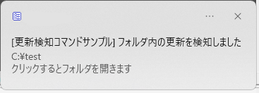

##### 設定画面


- `コマンドの名前`
  - 入力画面からコマンドを実行するためのキーワード
- `コマンドの説明`
  - コメント表示欄に記載される文字列。
- `フォルダのパス`
  - 更新を検知したいフォルダのパス
- `通知時のメッセージ`
  - 更新検知通知に表示する文言を指定する
- `更新検知の間隔`
  - 指定した秒数が経過するまで、更新を検知しても次の通知を行わない  
共有フォルダ上のファイルを誰かが直接編集作業をしていることにより頻繁に通知が来るのを避けるための設定
- `コマンドを無効化する`
  - チェックすると更新検知を行わない  
一時的に無効化したいがコマンドは残しておきたい、というときのための設定

##### 動作の説明

- アプリ起動中の状態しか見ない(前回実行時の状態を保持することはしていない)ため、アプリを終了している間のフォルダ更新を検知することはできない

- 監視対象パスがローカルパスかネットワークパスかで実装方法を分けている
  - ローカルパスの場合は`ReadDirectoryChangesW` APIを用いて対象フォルダの更新を検知する
  - ネットワークパスの場合は独自の処理で検知する
  - 手元で試した感じ、`ReadDirectoryChangesW`はネットワークパスの場合に安定して検知できなかっため
  - ツール作成者本人が想定する用途としてはファイルサーバ上の特定フォルダの更新検知であり、ネットワークパスで使えないと意味ないので・・

- [スタートメニューに登録](#基本ショートカット登録)してある場合は、トーストをクリックすると、監視対象フォルダを開くことができる

##### 実行時の動作

|押下キー|動作|
|--|--|
|`Enter`|更新検知対象のパスを開く|

-----------

### 音量調節コマンドの登録・編集

##### コマンドの概要

サウンドデバイスの音量やミュート状態を変更するためのコマンド。  
下記の操作が可能

- 音量を0～100の範囲で設定する(絶対値指定)
- 音量を増減させる(相対値指定)
- ミュート状態の変更
  - ミュートにする
  - ミュート解除する
  - トグルする

コマンド実行時点でシステムで選択されているサウンドデバイスに対して適用する。  
(複数のサウンドデバイスがある状況で任意のデバイスに対して...という機能はない)

##### 設定画面


- `コマンドの名前`
  - 入力画面からコマンドを実行するためのキーワード
- `コマンドの説明`
  - コメント表示欄に記載される文字列。
- `音量を変更する`
  - チェックすると、`音量`欄に指定した数値で音量を変更する
- `音量`
  - 音量変更を行う場合の音量レベルを数値で指定する。  
0～100の範囲で指定する。0は最小音量、100は最大音量  
  - 数値の前に`+` `-`を付与すると、現在の音量に対する増減指定となる。
- `ミュート状態`  
ミュートの状態を指定する。下記4つのいずれかを選択する。
  - `変更しない`
  - `ミュート解除する`
  - `ミュートにする`
  - `トグル` (反転)
- `ホットキー`
  - コマンドを呼び出すキーバインドを設定できる。設定したキーを押下するとコマンドを実行できるようになる。

##### 実行時の動作

|押下キー|動作|
|--|--|
|`Enter`|設定した内容に基づき音量調節を実行する|

-----------

### 【試作】取り外しコマンドの登録・編集

##### コマンドの概要

CD/DVD等ディスクドライブのトレイを開いたり、USBメモリのようなリムーバブルドライブの取り外しを行うためのコマンド

コマンド作成時点であらかじめ対象とするドライブ(`A:`～`Z:`)を設定しておき、
コマンド実行時点においての当該ドライブに対して、取り外し操作を試みる。

##### 設定画面


- `コマンドの名前`
  - 入力画面からコマンドを実行するためのキーワード
- `コマンドの説明`
  - コメント表示欄に記載される文字列。
- `ドライブ`
  - 取り外し対象とするドライブレターを選択する
  - 選択すると、現在の実行環境におけるドライブの種別を右側に表示する
- `ホットキー`
  - コマンドを呼び出すキーバインドを設定できる。設定したキーを押下するとコマンドを実行できるようになる。

##### 実行時の動作

|押下キー|動作|
|--|--|
|`Enter`|設定した内容に基づき取り外し操作を行う|

-----------

### 振り分けコマンドの登録・編集

##### コマンドの概要

コマンドを実行したときの`Enter`キーの押下状態(修飾キーの組み合わせ)に応じて、異なるコマンドを実行できるようにする

このコマンドを使うと、`Enter`キーのみを押してコマンドを実行した場合と、`Shift-Enter`キーや`Ctrl-Enter`キーを押した場合で異なるコマンドを実行させることができる


[フィルタコマンド](#フィルタコマンドの登録編集) と組み合わせて使用することを想定している。  
一つのフィルタコマンドに対して、キーの押し方によって異なるアクションを割り当てることができる。

##### 設定画面


- `コマンドの名前`
  - 入力画面からコマンドを実行するためのキーワード
- `コマンドの説明`
  - コメント表示欄に記載される文字列。
- `キー別割り当てコマンド`
  - `Enter`や`Shift-Enter`など、キー操作ごとに割り当てるコマンドの一覧が表示されるリスト
- `追加`
  - キーとコマンドの関連付けを追加するボタン
- `削除`
  - 既存のキーとコマンドの関連付けを削除するためのボタン

##### 実行時の動作

割り当てたキーとコマンドの関連付けに従う


##### メモ

- コマンド実行時に与えられた後続パラメータをすべて後段のコマンドにそのまま渡す
- コマンド種別によっては、ShiftキーやCtrlキーを組み合わせて実行した場合に異なる動作をするものがあるが、
振り分けコマンド経由で起動された後段のコマンドはすべて、修飾キーが押されていない状態として実行される
- コマンド実行時のキー押下状態をみて振り分けるためのコマンドであるため、ホットキーを設定することはできない

-----------

### システムコマンドの編集

一部の[システムコマンド](#システムコマンド一覧)は機能を無効化することができる。  
無効化すると、入力欄にコマンド名を入力しても候補として表示されなくなる。


- `コマンドの名前`
  - コマンドの名前を変更することができる
- `コマンドの説明`
  - コマンドの機能を説明するテキスト。読み取り専用。
- `コマンドを有効にする`
  - チェックを外すと、当該コマンドが候補欄に表示されなくなる(実行もできない)
- `実行前に確認する`
  - チェックすると、コマンド実行前に確認ダイアログを表示する。
  - 誤って実行されるのを防止するための機能

-----------

### アプリ表示用ホットキー

ランチャーアプリの入力ウインドウを呼び出すためのキー設定画面


- `ホットキーを設定する`  
修飾キー(`Alt` `Ctrl` `Shift` `Win`) + 任意のキーを同時押しすることによりアプリを表示する
  - `修飾キー`  
修飾キーを選択するためのもの。
  - 例: `Ctrl`のみチェックし、キーとして`A`を選択した場合  
Ctrl+A
  - `キー`  
文字を選択する
- `修飾キーの組み合わせ入力`  
修飾キー(`Alt` `Ctrl` `Shift` `Win`)を二つ組み合わせ入力することによりアプリを表示する方式  
同じキーを2回押す、あるいは、異なるキーを同時押しすることでアプリを起動することができる  
例: `Ctrl`キーの2回押し、あるいは、`Ctrl`+`Alt`キーの同時押し
  - `一つ目の入力`  
一つ目に入力する修飾キーを選択する
  - `二つ目の入力`  
二つ目に入力する修飾キーを選択する

-----------

### キー割り当て

コマンドに対するキー割り当てを行うための画面。  
割り当てたキーを押すとコマンドを実行することができる。


- `ホットキーを設定する`  
コマンドに対してキー割り当てを行う場合はチェックする

- 種別
  - 以下の3つのいずれかを選択する。  
`アクティブ時のみ有効` or `アクティブ時のみ有効(SandS)`  or `常駐時いつでも有効`
  - 種別の説明は[ホットキーの種別について](#ホットキーの種別について)を参照
- `修飾キー`
  - 修飾キーを選択するためのもの。
  - 例: `Ctrl`のみチェックし、キーとして`A`を選択した場合 → Ctrl+A
  - 種別として`アクティブ時のみ有効(SandS)`を選択した場合は以下の5つのいずれかを選択することができる。  
`Space` `CapsLock` `変換` `無変換` `かな`
- `キー`
  - 修飾キーと組み合わせる文字を選択する

##### ホットキーの種別について

- ホットキーの種別として以下の3つを選択できる
  1. `アクティブ時のみ有効`
  1. `アクティブ時のみ有効(SandS)`
  1. `常駐時いつでも有効`

- `アクティブ時のみ有効`と`アクティブ時のみ有効(SandS)`は入力画面が表示されているときだけ機能する。
一方、`常駐時いつでも有効`は入力画面が表示されていないときでも機能する。

- `アクティブ時のみ有効(SandS)`の`SandS`は「Space and Shift」の略で、単体でキーを押したときは文字キー(→Space)として機能し、  
他のキーと同時押ししたときは修飾キー(→Shift)として機能する、という概念のこと
  - ランチャー呼び出しキーの修飾キーと`SandS`の修飾キーを同じキーとして設定することにより、スムーズにコマンドを呼び出すことができる
    - 例:  
ランチャー呼び出しのホットキーを`CapsLock`にして、コマンドのホットキーを`CapsLock`+`J`に設定していたとすると、以下のような動きになる  

    - つまり、他アプリとのキー割り当ての干渉をあまり気にすることなく、グローバルホットキー的な機能が実現できる

###### ホットキーの種別の比較

それぞれ実現している仕組みが異なる。  
`常駐時いつでも有効`はシステムのホットキーに登録するため、登録したキーを使って、いつでも呼び出せる一方で、ほかのアプリ内においてそのキーを使うことができなくなる

|種別|メリット|デメリット|
|--|----|----|
|`アクティブ時のみ有効`|他アプリに干渉しない<br>他アプリへの干渉を気にする必要がないのでキー選択の幅が広い|まずアクティブにする(入力画面を表示する)必要がある|
|`アクティブ時のみ有効(SandS)`|SandSの修飾キーを[ランチャー呼び出しキー](#基本)の修飾キーと合わせることにより、スムーズな運指が実現できる|まずアクティブにする(入力画面を表示する)必要がある|
|`常駐時いつでも有効`|いつでも呼び出せる|登録したキーを他アプリで使えなくなってしまう<br>他アプリに干渉することをふまえて割り当てるキーを慎重に選択する必要がある|

##### SandSに関する制限事項

- SandSの修飾キーとして選択したキーを押しっぱなしにした場合、普通の文字入力としてキーリピートする。
  - `Shift` `Ctrl` `Alt` `Win`などのような純粋な修飾キーのような動きにはならない
- SandSを実現するためにキーフックを利用している。キーフックの仕組みを用いた別のソフトが同時に動いている場合、競合してうまく動作しない場合がある

## タスクトレイ

本アプリを起動すると、タスクトレイにアイコンが表示される  
↓  


アイコンを右クリックすると、メニューが表示される  
↓  
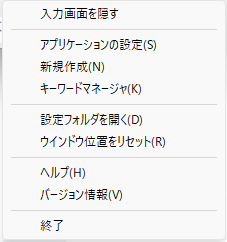

- `表示`/`隠す`
  - 入力画面を表示する/非表示にする
- `新規作成`
  - コマンド登録画面を表示する
- `キーワードマネージャ`
  - キーワードマネージャを表示する
- `設定フォルダを開く`
  - 本アプリのユーザ設定が保存されたフォルダをひらく
- `ウインドウ位置をリセット`
  - 入力画面の位置・サイズを初期状態に戻す
    - マルチモニタ環境にて別モニターで表示したまま、モニターの構成が変化して表示できなくなったときの復旧用
- `ヘルプ`
  - このファイルを開く
- `バージョン情報`
  - バージョン情報を表示する

なお、入力画面のコメント表示欄を右クリックした場合にも、上記のメニューが表示される

## 各種機能の説明

-----------

### コマンドとして登録していなくても実行できる機能

コマンドをあらかじめ登録しておいたものを使うのが本アプリの[基本的な使い方](#基本的な使い方)であるが、
コマンドとして登録していなくても使える機能がある。

- [URLを開く](#urlを開く)
- [メールを送る](#メールを送る)
- [環境変数の値を見る](#環境変数の値を見る)
- [ファイル名を指定して実行](#ファイル名を指定して実行)
- [履歴](#履歴)
- [16進カラーコード](#進カラーコード)
- [VMware Workstation PlayerのMRU](#vmware-workstation-playerのmru)
- [URIデコード](#uriデコード)
- [Base64デコード](#base64デコード)
- [8進数/16進数/Unicodeエスケープシーケンス](#進数16進数unicodeエスケープシーケンス)
- [IPアドレス](#ipアドレス)
- [簡易時間計算](#簡易時間計算)
- [単位変換](#単位変換)

#### URLを開く

`http:/...`または`https://...`で始まるURLを入力欄に直接入力して実行すると、通常使うブラウザでURLを開くことができる。

#### メールを送る

`mailto:`の後にメールアドレスを入力欄に入力して実行すると、そのメールアドレスをあて先として標準のメーラーが起動する。

#### 環境変数の値を見る

`%環境変数名%`の形式で入力欄に入力すると、その環境変数の値をコメント表示欄に表示する。
また、実行すると、環境変数の値をクリップボードにコピーする。


#### ファイル名を指定して実行

入力欄に入力したキーワードが、環境変数`PATH`に含まれるフォルダや[アプリで独自に追加したフォルダ](#実行パス)内の`.exe`ファイルと一致する場合は、
その実行ファイルを起動する。

例えば、`notepad`と入力すると、その環境のPATHのどこかに`notepad.exe`がある場合、それを実行することができる。
(一般的には`C:\WINDOWS\system32\notepad.exe`にヒットするはず)


#### 履歴

コマンドとして登録していないURL、プログラム実行、実行時引数を伴うコマンド実行は履歴として登録される。
履歴として登録されたものは、次回以降のキーワード入力の際に部分一致で候補にあがるようになる。


#### 16進カラーコード

`#RRGGBB` `#RGB` `rgb(r,g,b)`の形式で入力欄に入力すると、そのカラーコードに対応する色をアイコン欄に表示する。
選択するとクリップボードに内容をコピーする。


#### VMware Workstation PlayerのMRU

VMware Workstation Playerの起動直後の画面の一覧に表示される仮想マシンの表示名を候補として表示する。  
実行すると、拡張子`.vmx`に関連付けられたアプリケーションでファイルを実行する。  
(VMware Workstation Playerが仮想マシンを起動するはず)

#### URIデコード

URIエンコード形式の文字列をデコードして表示する。
(UTF-8でエンコードされているものとして解釈する)  
コマンドを実行するとデコード後の文字列をクリップボードにコピーする。

例: `%E3%81%93%E3%82%93%E3%81%AB%E3%81%A1%E3%81%AF` → `こんにちは`

#### Base64デコード

Base64形式の文字列をデコードして表示する。
コマンドを実行するとデコード後の文字列をクリップボードにコピーする。

例: `44GT44KT44Gr44Gh44Gv77yB` → `こんにちは！`

このコマンドはデコード後のデータをUTF-8形式の文字列として解釈する。このコマンドはバイナリデータを想定したものではない。  
デコード後データがバイナリデータだった場合、文字化けした文字が結果として表示されたり、空文字が表示されるような挙動になる。

なお、誤発動を防止するため、入力キーワードが16文字未満の場合には変換を行わない。

#### 8進数/16進数/Unicodeエスケープシーケンス

8進数/16進数/Unicodeエスケープシーケンスで記述された文字列をデコードして表示する。
(8進数/16進数でエスケープされたものについてはUTF-8のバイトシーケンスとして解釈する)  
コマンドを実行するとデコード後の文字列をクリップボードにコピーする。

- 例
  - `\117\143\164\141\154` → Octal
  - `\x48\x65\x78` → Hex
  - `\u30ed\u30b0\u30a4\u30f3\u3057\u3066\u304f\u3060\u3055\u3044` → ログインしてください
  - `\U000030A2` → ア


#### IPアドレス

`getip`コマンドを入力すると、実行環境で利用可能なネットワークアダプタのIPアドレスの一覧を表示する。  
コマンドを実行するとIPアドレスをクリップボードにコピーする。

#### 簡易時間計算

`HH:MM-HH:MM`の型式で入力すると、時間間隔を分単位で表示する。  
コマンドを実行すると時間をクリップボードにコピーする。

例: `13:43-12:50` → `53分`

#### 単位変換

以下の単位変換を実装している。

- mm → インチ
  - `xxx mm`と入力すると、`xxx`で入力した数値をインチ単位に変換した結果を表示する
- インチ → mm
  - `xxx inch`と入力すると、`xxx`で入力した数値をミリメートル単位に変換した結果を表示する

-----------

### 拡張機能について

前セクションに記載した機能のほかに、下記の機能もある。  
これらの機能を利用しない場合は、アプリケーション設定の[`拡張機能`](#拡張機能)から無効にすることができる。

#### 電卓機能

入力欄に数式を入れると、計算結果をコメント欄に表示する。  
Enterキーを押下すると、計算結果をクリップボードにコピーできる。

利用するにはPythonが必要。  
Pythonを使っているので、演算子もPythonのものを使うことができる。  


その他、Python標準関数のうち、計算結果が文字列/数値になるものと、[math](https://docs.python.org/ja/3/library/math.html)モジュールの関数を使用することができる。

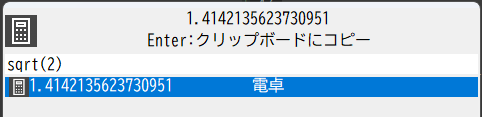

#### Excel/Libre Office Calcシート表示

入力画面を表示した時点で開いているExcel(デスクトップ版)とLibreOffice Caclのシート名一覧を候補に表示する。  
該当する項目を入力画面から実行すると、対応するワークシートのウインドウをアクティブにする。


`Ctrl-Enter`キーを押して実行すると、最大化表示する。

#### PowerPoint スライド表示

入力画面を表示した時点でアクティブなPowerPointプレゼンーションのスライドタイトル一覧を候補に表示する。  
該当する項目を入力画面から実行すると、対応するスライドのアクティブにする。


#### Outlookメール表示(試作)

入力画面を表示した時点でOutlook(デスクトップ版)を起動している場合に、受信トレイにあるメール(スレッド)の一覧を候補に表示する。  
該当する項目を入力画面から実行すると、対応するメールスレッドの最新のメールを別ウインドウで表示する。

すべてのメールを拾うと動作が重くなりそうなので、受信トレイに限定し、上限を1024固定としている。  
(新しいものから抽出、1024スレッドを超えた分は見ない)
未処理のアイテムのみをInboxに置いて、処理済のメールを別フォルダに移動する運用している人を想定した機能

#### ウインドウ切り替え

入力画面を表示した時点で表示しているウインドウタイトルの一覧を候補に表示する。  
該当する項目を入力画面から実行すると、対応するウインドウをアクティブにする。

`Ctrl-Enter`キーを押して実行すると、最大化表示する。

既出の[ウインドウ切替コマンド](#ウインドウ切替コマンドの登録編集)とは別物。  
`ウインドウ切り替え`は入力欄のキーワードに合致するタイトルを持つウインドウを候補として表示するもので、  
コマンドとして登録していなくても候補欄に表示されるが、ホットキーから呼び出したりすることはできない。

##### ウインドウに一時的な名前を付ける

コンテキストメニューから`ウインドウに一時的な名前を付ける`を選択すると、ウインドウに対して一時的な名前を付与することができる。


名前を付けると、付与した名前でウインドウを切り替えることができる。


なお、付与した名前とウインドウの紐づけは本アプリを終了するか、ウインドウが破棄されると失われる。

###### 想定用途

同じアプリのウインドウを異なる目的で複数表示しているような状況において、ウインドウごとにわかりやすい名前をつけて、その名前で呼び出せるようにする、みたいなものを想定   
例えば、複数のテキストエディタをコード表示用/メモとり用で分けている、のような・・

#### コントロールパネル表示

コントロールパネルの表示名を候補として表示する。  
(例: `電源オプション` `インターネットオプション`)


該当する項目を入力画面から実行すると、対応するコントロールパネル項目を開くことができる。

※ あとからインストールしたプログラムによって追加される項目は表示できない場合がある  
(例: ハードウェアベンダのユーティリティやJavaのコントロールパネルなど)


#### スタートメニューに登録された項目

スタートメニューに登録されたプログラムを候補として表示し、実行することができる。

#### 最近使ったファイル

システムの`最近使ったファイル`に登録されたファイル名を候補として表示する。実行すると、ファイルを開くことができる。
(拡張子に関連付けたアプリケーションで開く)

例: 


#### UWPアプリ

システムにインストールされたUWPを候補として表示し、実行することができる。

例: 映画アプリ


#### MMCスナップイン

MMC(Microsoft管理コンソール)の要素を候補として表示し、実行することができる。  
入力欄にMMCスナップインのアプリケーションタイトルを入力すると、該当するMMCスナップインを実行することができる。

例: ディスクの管理


#### git-bashパス変換

入力欄にgit-bash上のパス表記でファイルパスを入力すると、対応するWindowsローカルパスに変換するコマンドを表示する


コマンドを実行すると、Windowsローカルパスをクリップボードにコピーする

また、入力欄にWindowsローカルパス表記でファイルパスを入力すると、対応するgit-bash上のパス表記に変換するコマンドを表示する


#### fileプロトコルをローカルパスに変換

`file://...`で始まるパスをローカルパスやUNC形式のパスに変換し、変換したパスに対して下記の操作を行うことができる。

##### 実行時の動作

|押下キー|動作|
|--|--|
|`Enter`|変換後のパスをクリップボードにコピー|
|`Shift-Enter`|開く(ファイルを実行する)|
|`Ctrl-Enter`|パスを開く(パスが存在するフォルダをファイラーで開く)|

##### fileプロトコルの例

`file:///C:/Windows/WindowsUpdate.log` → `C:\Windows\WindowsUpdate.log`

-----------

### その他の機能

#### ログ出力レベル

ログファイルに出力するメッセージのレベルを選択する。

ログファイルは[設定ファイルの保存先](#設定ファイルの保存先)フォルダ内に`<アプリ名>.log`というファイル名で出力する。  
アプリケーション設定の[その他](#その他)で出力対象とするログレベルを設定することができる。

#### 【試作】連続稼働を警告する

休憩を挟まずに連続して作業を続けていた場合に、その旨をトースト通知する機能。  
休憩を促す目的。  
スクリーンロックを休憩(離席)とみなす。

アプリケーション設定の[その他](#その他)で有効化することにより利用できる。  

## マクロ機能

コマンドのパラメータとしてマクロを使用することができる。  
マクロを使うと、クリップボード/時刻/環境変数の値など、その時々や環境に応じて変化する動的な値に置き換えることができる。  
マクロは`${macroName arg1 arg2 ...}` のような書式で指定する。  
引数がないマクロの場合は`$macroName`という書式も可能

-----------

### 利用可能なマクロ一覧

- [app](#appマクロ)
- [basename](#basenameマクロ)
- [clipboard](#clipboardマクロ)
- [date](#dateマクロ)
- [env](#envマクロ)
- [random](#randomマクロ)
- [afxw](#afxwマクロ)
- [powerstatus](#powerstatusマクロ)

#### appマクロ

アプリケーション名やアプリケーションのバージョン、ビルド日時を得る  

##### 記法

以下のいずれかを指定できる。

- `${app}`
  - アプリ名を得る
- `${app name}`
  - アプリ名を得る
- `${app version}`
  - バージョン番号を得る
- `${app builddate}`
  - ビルド日を得る
- `${app buildtime}`
  - ビルド時刻を得る

##### 例

```
# アプリ名を得る
${app}   → Soyokaze
${app name}   → Soyokaze
# バージョン番号を得る
${app version}   → 0.30.0
# ビルド日を得る
${app builddate}   → 2024/11/08
# ビルド時刻を得る
${app builddate}   → 01:23:45
```

#### basenameマクロ

引数で与えたパスからファイル名を除去する

##### 記法

`${basename パス文字列}`の形式で指定する。

##### 例

```
# ディレクトリパスを得る
${basename c:\dir\a.txt }   → c:\dir

```

#### clipboardマクロ

クリップボードに入っている値に置き換えることができる。  

##### 記法

`${clipboard}`の形式で指定する。

#### dateマクロ

現在の日付・時刻に置き換えることができる。

日付・時刻に置き換える際の書式を指定したり、現在時刻に対して任意のオフセット(時間差分)を指定できる。

##### 記法

`${date [format [offset]]}`の形式で指定する。

`format`で日付の書式を指定できる。

書式を指定しない場合は、時分秒(`%H:%M:%S`)を表示する

`offset`でオフセットを指定する。

オフセットを指定しない場合は現在時刻を表示する。

##### 日付の書式

strftimeの書式をそのまま指定する。

|コード|意味|例|
|--|----|----|
|`%a`|ロケールでの曜日|火|
|`%A`|ロケールでの曜日(完全)|火曜日|
|`%b`|ロケールでの月|11|
|`%B`|ロケールでの月(完全)|11月|
|`%c`|ロケールでの日付と時刻|2024/11/19 12:34:45|
|`%C`|西暦上二桁|20|
|`%d`|月の日付(1-31)|19|
|`%D`|%m/%d/%y|11/19/24|
|`%e`|月の日付、右寄せ二桁| 9|
|`%e`|月の日付、右寄せ二桁| 9|
|`%F`|%Y-%m-%d|2024-11-19|
|`%g`|西暦の年の下二桁|24|
|`%G`|西暦の年|2024|
|`%h`|`%b`と同じ|11|
|`%H`|24 時間形式の時(00-23)|14|
|`%I`|12 時間形式の時(01-12)|2|
|`%j`|年の通算日 (001 - 366)|324|
|`%m`|月 (01 - 12)|11|
|`%M`|分 (00 - 59)|25|
|`%n`|改行文字|-|
|`%p`|ロケールでの午前/午後表記|午前|
|`%r`|ロケールでのAM/PM形式の時刻|xxx|
|`%R`|`%H:%M`と同じ|14:09|
|`%S`|秒(00 - 59)|48|
|`%t`|タブ文字|-|
|`%T`|`%H:%M:%S`と同じ|14:10:59|
|`%u`|曜日を表す数値(1 - 7、月曜日が 1)|2|
|`%U`|年の週数(0-53)。週の初日は日曜|46|
|`%V`|年の週数(1-53)。週の初日は日曜|46|
|`%w`|曜日を表す数値(0 - 6、日曜日が 0)|2|
|`%W`|年の週数(00-53)、週の初日は月曜|46|
|`%x`|ロケールでの日付表現|2024/11/19|
|`%X`|ロケールでの時刻表現|14:43:56|
|`%y`|西暦下二桁(00 - 99)|24|
|`%Y`|西暦四桁(00 - 99)|2024|
|`%z`|時差。UTCからのオフセット|+0900|
|`%Z`|ロケールでのタイム ゾーン名称|東京(標準時)|
|`%%`|パーセント記号|%|


##### オフセット

以下の形式で指定する。

```
[S](+ or -)(オフセット値)(Y or M or D or h or m or s)
```

- 先頭に`S`を指定した場合、その週の日曜日をベースにオフセット計算をする
- 符号`+`を指定すると、ベース時刻に対して`オフセット値`ぶんの時間を進める  
逆に、符号`-`を指定すると、時間を戻す

- 単位
  - `Y`:年
  - `M`:月
  - `D`:日
  - `h`:時
  - `m`:分
  - `s`:秒

- `+1d` → 1日後
- `-5h` → 5時間前
- `+30s` → 30秒後
- `+3M` → 3カ月後
- `-1Y` → 1年前

##### 例

```
# マクロ実行日時が 2024/11/18(月) 12:34:45 だったとする

${date}
  → 12:34:45

${date "%Y/%m/%d" +1D}
  → 2024/11/19 (翌日の年月日)

${date "%Y/%m/%d" S+1D}
  → 2024/11/18 (日曜日11/17の1日後の年月日)
```

##### 制限

- オフセットで日付を計算する際にうるう年を考慮していない(手抜き)
- オフセットの複数単位の同時指定には対応していない(例: 1.5日`+1d+12h`)

#### envマクロ

環境変数の値に置き換えることができる。  

##### 記法

`${env 環境変数名}`の形式で指定する。

##### 例

```
# ユーザのホームディレクトリのパスを取得する
${env USERPROFILE}
 → C:\Users\username

# ユーザ名を取得する
${env USERNAME}
 → username
```

#### randomマクロ

乱数を生成する系の処理を行うためのマクロ。  
現在はuuidの生成のみをサポートする。

##### 記法

`${random 種類}`の形式で指定する。

##### 例

```
# UUIDを生成する
${random uuid}
  → 36128e01-947e-4bd2-864c-16a234c32a8d
```

#### afxwマクロ

外部ファイラとして[あふw](http://akt.d.dooo.jp/akt_afxw.html)を利用している場合に、あふw側で表示しているカレントディレクトリを取得することができる。  
このマクロを使う場合、あふ側の設定でオートメーションサーバ登録しておく必要がある。

##### 記法

`${afxw currentdir}`と記述する。

#### powerstatusマクロ

【試作】  
電源状態に関する情報を取得し表示することができる。

##### 記法

`${powerstatus format}`の形式で記述する。

`format`部分に表示する情報を表す指定子のいずれかを記述する。

|指定子|意味|
|--|-----|
|`%l`|バッテリー残量を表すパーセント(`0-100%`)、バッテリー駆動でない場合は`(不明)`|
|`%a`|AC電源に接続されているかの状態 `オンライン`、`オフライン`、`不明`のいずれか|

## システムコマンド一覧

システムコマンドとは、本アプリに最初から登録済のキーワード

削除はできないが、一部のコマンドについては無効化することができる。  
無効化すると、[入力画面](#入力画面)でキーワードを入力しても候補として表示されず実行もできなくなる。  

[キーワードマネージャ](#キーワードマネージャ)から設定することができる。

-----------

### cd

実行中のランチャーアプリプロセスのカレントディレクトリを変更する

-----------

### copyclip

コマンド名の後に指定した文字列をクリップボードにコピーする

-----------

### displayoff

モニター(ディスプレイ)の電源を切る。  
マルチモニター環境の場合、すべての電源を切る。

-----------

### edit

既存コマンドの編集画面またはキーワードマネージャ画面を表示する  
後続パラメータにコマンド名を表示を指定した場合、そのコマンドの編集画面を表示する。  
後続パラメータとして何も指定しなかった場合はキーワードマネージャ画面を表示する。

##### 例

- `edit hoge` → `hoge`コマンドの設定画面を表示する
- `edit` → キーワードマネージャ画面を表示する


-----------

### emptyrecyclebin

ごみ箱を空にする。  
コマンド設定にて、空にする前の確認の有無を設定することができる。(初期状態は確認なし)

-----------

### exit

本アプリを終了する。

-----------

### maindir

本アプリの実行ファイルが置かれているフォルダをファイラーで表示する。

-----------

###  manager

キーワードマネージャ画面を表示する。

-----------

### new

新規コマンド登録画面を表示する。

-----------

### newsnippet

現在クリップボードにあるテキストを定型文として登録するための登録画面を表示する。

-----------

### registwin

直前にアクティブなウインドウをコマンドとして登録する。


-----------

### reload

設定ファイルの再読み込みを行う。  
(テキストエディタで直接キーワード編集を行ったときにリロードするためもの)

当アプリの初期のバージョンではコマンド編集のためのUIを実装していなかったため、その頃の名残として存在しているものであるが、現在は使う必要はない。

-----------

### restart

アプリの再起動を行う。

初期状態では無効になっている。キーワードマネージャのコマンド設定画面から有効にすると使用できる。

-----------

### setting

アプリケーション設定画面を表示する。

-----------

### userdir

設定ファイルの保存先フォルダを表示する

設定ファイルの保存先については [設定ファイルの保存先](#設定ファイルの保存先) を参照のこと

-----------

### version

バージョン情報ダイアログを表示する

## 候補欄のコマンド表示順序について

候補欄のコマンド表示順序はコマンドの一致度によって決まる。

入力欄に入力されたキーワードとコマンド名とで比較し、その一致度によりの名前に部分一致するかどうかで判断を行
- スペース区切りで複数キーワード指定された場合、個々のキーワードごとに候補の名前と部分一致比較を行い、すべてマッチするものを対象とする

### 一致度の区分

一致の度合いに応じて、候補の表示順序を変えている。一致度の区分として以下の4種類がある。  
先に挙げたほうが優先順位が高い(先に表示する)

一致度が同じ場合はコマンドの[優先度](#実行優先度)に従う。

##### 完全一致

キーワードのいずれかが、候補と完全一致する

##### 前方一致

先頭のキーワードと候補が前方一致する

##### 部分一致

与えられたキーワードが候補に部分的に一致する

##### 弱一致

他の区分の候補がない場合に表示対象とする、特殊な区分  
[Web検索コマンド](#web検索コマンドの登録編集)や[簡易辞書コマンド](#簡易辞書コマンドの登録編集)などにおいて、コマンド名がなくても候補として表示するものを`弱一致`としている。

## 設定ファイルの保存先

アプリ初回起動時に ユーザフォルダ直下(通常は `C:\Users\<ユーザ名>`)に`.soyokaze`フォルダを作成し、このフォルダ内に設定ファイル一式を保存する。


-----------

### ポータブル版

exeと同じフォルダ階層に`profile`というフォルダが存在する場合、ポータブル版として動作する。  
この場合、設定ファイル一式を`profile`フォルダ内に作成する。

## コマンドラインオプション

- /ChangeDir=_ディレクトリ_
  - カレントディレクトリを指定したディレクトリに変更する

- /Runcommand=_コマンド名_ または -c _コマンド名_
  - 指定したコマンドを実行する(複数指定可能)
  - 例: `/Runcommand=chrome` または `-c chrome`

- /Hide
  - 起動中(かつ表示中)の入力画面を非表示にする
  - bluewindにはこのオプションの対となる`/Activate`というのがあったが、`/Activate`はとくに実装していない
    - というのも、そもそも何も指定せずにアプリを実行すると`/Activate`相当の動作になるので

- _ファイルパス_
  - そのファイルを登録する(コマンド登録画面を表示する)

- /Paste
 - 後続のパラメータを入力欄に入力した状態で起動する
    - 例 : `/Paste c:\`  
→入力欄に `c:\`という文字列が入力される

- /SelStart=
  - カーソル位置を指定する。
    -  例 : `/SelStart=2`
  - `/Paste`や`/SelLength`と組み合わせ使う
- /SelLength=
  - 選択範囲の長さを指定する。
    -  例 : `/SelLength=2`
  - `/Paste`や`/SelStart`と組み合わせ使う
  - 負の値を指定すると、先頭方向に向かって選択する
  - `/SelStart`なし、かつ、`/SelLength`が負の値の場合、テキスト末尾からの選択を行う
    - 例: `/Paste home /SelLength=-3` → "ome"部分が選択される


なお、上記のコマンドラインオプションによる実行は、事前に本アプリが起動している状態で行う必要がある  
(起動していない状態で実行した場合、単にアプリが起動するだけ)

## 取り扱い種別、ライセンス

フリーソフト

- 本体のライセンス : [MIT License](./LICENSE)

- 利用ライブラリのライセンスについては [利用ライブラリ](#利用ライブラリ) に記載の各リンク先を参照のこと

## ソースコード

[https://github.com/ampmmn/Soyokaze](https://github.com/ampmmn/Soyokaze/)

## 利用ライブラリ

- [nlohmann-json](https://github.com/nlohmann/json)
  - jsonファイルをパースするために使用している

- [spdlog](https://github.com/gabime/spdlog)
  - 実行時ログを出力するためのライブラリとして使用している

- [tidy-html5](https://github.com/htacg/tidy-html5)
  - DirectoryIndexコマンド内において、取得したHTMLを解析するためのライブラリとして使用している

- [c/migemo](https://github.com/koron/cmigemo)
  - 日本語をローマ字検索するためのライブラリとして使用している

- [yet-another-migemo-dict](https://github.com/oguna/yet-another-migemo-dict)
  - 同梱しているMigemo辞書を生成するために使用している
  - アプリ実行時に利用しているものではない

- [Python3](https://www.python.org/)
  - 簡易電卓機能を実現するために使用している

- [SQLite3](https://www.sqlite.org/)
  - Windows標準搭載の`winsqlite3.dll`を利用

- [Everything SDK](https://www.voidtools.com/support/everything/sdk/)
  - `Everything`が公開しているSDKのソースコードをそのままランチャー本体に組み込んでいる

- [UPX](https://github.com/upx/upx)
  - リリースページに置いているバイナリを圧縮するために利用
  - アプリ実行時に利用しているものではない

## 連絡先

htmnymgw@gmail.com

</div>

