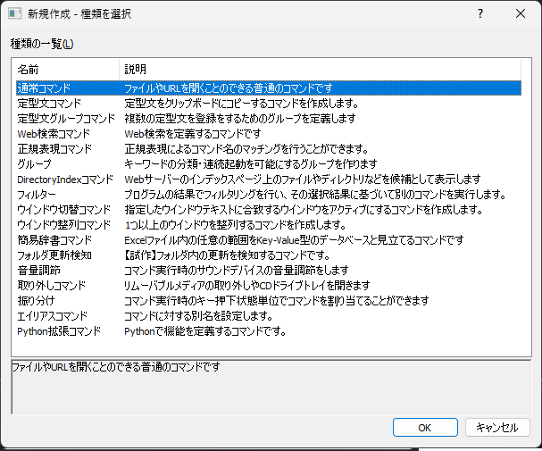
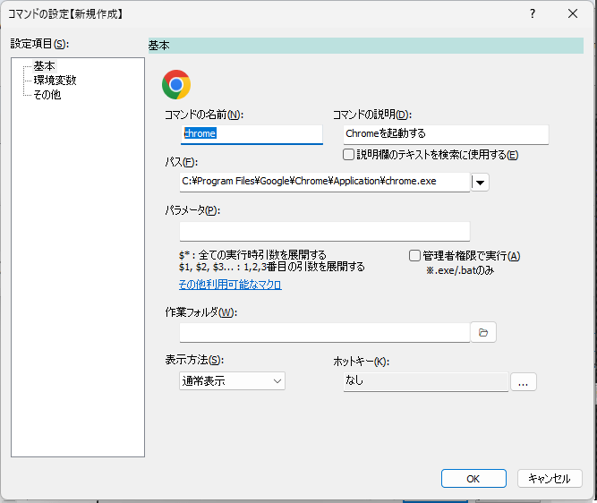
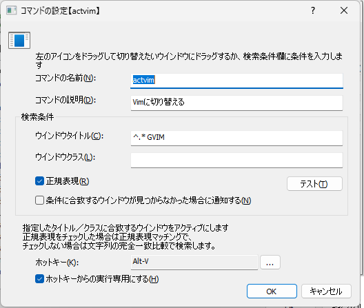
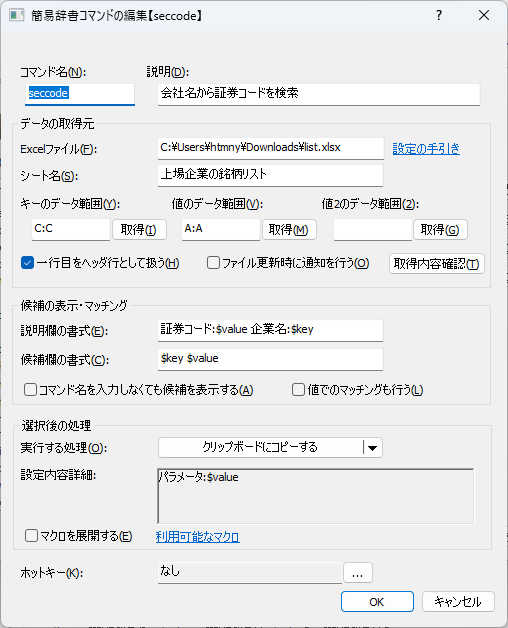
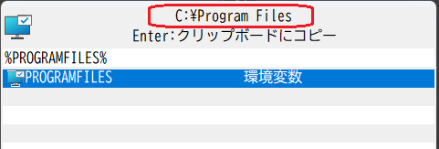
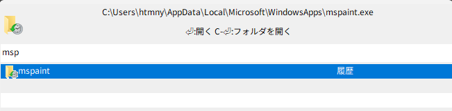

<style>

#TOC {
  position : sticky;
  overflow-y : scroll;
  float: left;
  top:15px;
  width: 31.0%;
  height:95vh;
  text-align: left;
}
.column-right{
  float: right;
  width: 62.0%;
  text-align: left;
}
</style>

<div class="column-right">

# Soyokaze マニュアル

## 概要

Soyokazeは`bluewind`というコマンドラインランチャーの代替として使えるよう作成しているツール  
bluewindの使用感を維持しつつ、現行のWindows環境でも動作するコマンドラインランチャーを実現することを目的としている。


## 動作環境

Windows環境で動作する。以下の環境で動作確認済

- Windows11 64bit
- Windows10 64bit

### 実行時に必要なもの

- [Python3](https://www.python.org/) (任意)
  - [電卓機能](#電卓機能)を利用するために必要(利用しない場合は不要)

- [C/Migemo](https://www.kaoriya.net/software/cmigemo/) (任意)
  - ローマ字のまま日本語キーワードの絞り込み(Migemo検索)を利用するために必要
  - Migemo検索を利用しない場合は不要

## セットアップ

### インストール

1. zipをファイルを展開して任意のフォルダに展開する
1. 展開先フォルダにある`soyokaze.exe`を実行する
1. 設定はユーザフォルダ(たいていは C:/Users/(ユーザ名))直下の`.soyokaze`フォルダに保存される  
初回実行時に`.soyokaze`フォルダを作成する
  * レジストリを使用しない

### アンインストール

アンインストーラはないため、以下すべてを手動で行う。

1. タスクトレイ上のコンテキストメニュー-`アプリケーションの設定`-`基本`-`ショートカット設定`を表示し、`作成したショートカットをすべてを削除する`を押下する
1. `soyokaze.exe`を終了する
1. インストール時に`soyokaze.exe`を置いたフォルダを削除する
1. 設定フォルダ(C:/Users/(ユーザ名)/.soyokaze)を削除する

### バージョンアップ

1. 本アプリを実行している場合は終了する
1. 実行ファイルを置いたフォルダ内のファイルをすべて上書きする

アプリケーションの設定情報の保存先については[設定ファイルの保存先](#設定ファイルの保存先)を参照のこと

#### 注意

- 0.14.0で作成したウインドウ整列コマンドの設定情報を0.15.0以降のバージョンに移行することはできない
  - 整列対象ウインドウの再登録が必要

## 基本的な使い方

- `soyokaze.exe`を実行すると[入力画面](#入力画面) が表示される  

- アプリが起動している状態でホットキー(デフォルト設定は`Alt-Space`)を押下すると、入力画面の表示／非表示が切り替わる
- 入力画面にキーワードを入力してEnterキーを押下すると、登録したコマンドを実行することができる
- 初回起動時はコマンドが登録されていない状態なので、[次セクションに記載する方法](#コマンドの登録方法)によりコマンドを登録する
  - コマンドの登録がすんだら、あとはホットキーから入力画面を呼び出して、キーワードを入力してコマンドを実行する
- [コマンドとして登録していなくても実行できる機能](#コマンドとして登録していなくても実行できる機能)もある
- アプリを終了する場合は、入力画面から[exit](#exit)コマンドを実行するか、[タスクトレイ](#タスクトレイ)から`終了`を選択する

## コマンドの登録方法

本アプリでは以下の方法でコマンドを登録することができる

- [`new`コマンドで登録する](#newコマンドで登録する)
- [`registwin`コマンドで登録する](#registwinコマンドで登録する)
- [対象ウインドウをDrag&Dropする](#対象ウインドウをdragdropする)
- [コンテキストメニューの`送る`>`コマンドとして登録する`](#コンテキストメニューの送るコマンドとして登録する)

各方法の詳細について後述する。

### newコマンドで登録する

入力画面から`new`コマンドを実行すると、[コマンドの種類を選択](#コマンドの種類)する画面が表示される。  
↓  


コマンド種別を選択し、`OK`ボタンを押下すると、選択した種別に応じたコマンド編集画面が表示される。  
↓※ 通常コマンドのコマンド編集画面  
  

コマンド編集画面で新規登録キーワードや紐づけるプログラムへのパスなどの情報を入力し、OKを押すと、コマンドとして登録される。

### registwinコマンドで登録する

入力画面から`registwin`コマンドを実行すると、直前にアクティブになっていたウインドウの実行プロセスを登録する画面が表示される。  
↓  
  

###  対象ウインドウをDrag&Dropする

入力画面のアイコン欄をドラッグして、登録したいウインドウにドロップすると、そのウインドウの実行プロセスを登録する画面が表示される。  
↓  
  

### コンテキストメニューの`送る`>`コマンドとして登録する`

アプリケーション設定の[基本＞ショートカット登録](#基本ショートカット登録) から`「送る」から登録できるようにする`をチェックしている場合、エクスプローラの`送る`に登録用のメニュー項目が表示される。

登録したいファイルをエクスプローラ上で右クリックして、`送る`>`コマンドとして登録する`を選択すると、そのファイルを登録するためのコマンド編集画面が表示される  
↓  
  

## コマンドの種類

ここでは、ランチャーアプリで作成可能なコマンドについて説明する。

現在、下記10種類のコマンドを作成することができる。

- [通常コマンド](#通常コマンドの登録編集)
- [スニペットコマンド(定型文コマンド)](#定型文の登録編集)
- [Web検索コマンド](#web検索コマンドの登録編集)
- [グループコマンド](#グループコマンドの登録編集)
- [正規表現コマンド](#正規表現コマンドの登録編集)
- [フィルタコマンド](#フィルタコマンドの登録編集)
- [ウインドウ切替コマンド](#ウインドウ切替コマンドの登録編集)
- [ウインドウ整列コマンド](#ウインドウ整列コマンドの登録編集)
- [簡易辞書コマンド](#簡易辞書コマンドの登録編集)
- [フォルダ更新検知コマンド](#フォルダ更新検知コマンドの登録編集)


## 画面の説明

### 入力画面

##### 概要

ランチャーアプリを実行すると表示される画面。  
この画面からキーワードを入力してEnterキーを押下することにより、キーワードに関連付けた各種操作を実行することができる。  
Tabキーを押すと、入力中のキーワードを補完することができる。

##### 画面


##### 画面の説明

- 1.アイコン表示欄
  - 選択している候補に関連付けられたアイコンを表示する
- 2.コメント表示欄
  - 選択している候補の説明を表示する
  - ここをドラッグしてウインドウ表示位置を変えることができる
- 3.入力欄
  - ここにキーワード(やパラメータ)を入力する。
  - `Ctrl`+`Backspace`で入力中のキーワードを全削除できる
  - `Tab`キーを押下するとキーワードを補完する
  - `Esc`キーを押下すると、入力中のキーワードを消去する。テキストがなければ入力画面を非表示にする。
- 4.候補リスト
  - 入力欄に入力した文字に該当する候補の一覧を表示する
  - 矢印キー(↑↓）やマウスクリックで候補をすることができる

この画面がでているときに`F1`キーを押下すると、マニュアル(このファイル)を開く。

### キーワードマネージャ

##### 概要

本アプリに登録したコマンドの管理(追加/編集/削除)をするための画面。

下記のいずれかの操作でキーワードマネージャーを表示することができる。

- 入力画面で`edit`コマンドを実行する
- 入力画面で空欄のままEnterキーを押下する
- タスクトレイのアイコンを右クリックし、`キーワードマネージャ`を選択する

##### 画面


##### 画面の説明

- 「リスト」には登録済のコマンド一覧が表示される
- 画面上部にリスト上で選択中の情報（コマンドの名前、説明）が表示される
- 「新規作成」で新しいコマンドを登録する画面を表示する
- 「編集」で現在選択中のコマンドを編集する
- 「削除」で現在選択中のコマンドを削除する
- 「フィルター」に文字列を入力すると、入力した文字列でリストの表示項目を絞り込む
  - 空白区切りで複数ワードを指定できる(AND検索)

### コマンドの新規作成

##### 概要

作成するコマンドの種類を選択するための画面。  
コマンドの種類を選択して、OKボタンを押下すると、選択したコマンドの新規作成画面を表示する。

各コマンドの説明については [コマンドの種類](#コマンドの種類) を参照のこと

##### 画面


### アプリケーション設定

##### 概要

アプリケーションの動作に関する設定を行うための画面。

下記のいずれかの操作でアプリケーション設定を表示することができる。

- 入力画面で`setting`コマンドを実行する
- タスクトレイのアイコンを右クリックし、`アプリケーションの設定`を選択する

#### 基本

##### 概要

ランチャーの基本動作にかかわる設定をする画面  
主に入力画面を表示する際の動作の設定を行う。

##### 画面


- `ランチャー呼び出しキー`
  - 入力画面を表示するためのホットキーを設定することができる
- `すでにアクティブなときに呼び出しキーを押したら隠れる`
  - チェックすると、ホットキーを押すたびに入力画面の表示/非表示が切り替わる
- `隠れるときに入力文字列を消去しない`
  - チェックすると、コマンドを実行せずに入力画面を非表示にする際に入力文字列を消去しない
    - 入力画面を次回再表示した際に、前回入力していた内容が維持される
- `入力画面を非表示にして起動する`
  - チェックすると、起動直後に入力画面を表示しない

#### 基本＞ショートカット登録

##### 概要

各種ショートカット登録をするための画面  
いずれもチェックすると登録され、チェックを外すと登録が解除される

##### 画面


- `「送る」から登録できるようにする`
  - チェックすると、本アプリにコマンドを登録するためのメニューが、エクスプローラのコンテキストメニューの「送る」に追加される


- `スタートメニューに登録する`
  - チェックすると、本アプリを起動するためのメニューがスタートメニューに登録される

- `デスクトップに登録する`
  - チェックすると、本アプリを起動するためのショートカットがデスクトップに配置される

 - `スタートアップに登録する`
  - チェックすると、Windowsにログオン(サインイン)した後に自動で本アプリを起動する

- `作成したショートカットをすべて削除する`
  - 上記で作成したショートカットをすべて削除する

#### 基本＞効果音

##### 概要

画面操作時に効果音を鳴らす設定をするための画面  
もし、音を鳴らせる環境で作業しているのであれば、気分が上がる効果音を設定すると、作業効率がアップするかもしれない。

mp3ファイルのみ指定可能(他の音声ファイルには非対応)

##### 画面


- `入力欄への文字入力`
  - 入力欄に文字を入力したときに再生するmp3ファイルを指定する。空欄の場合は何も再生しない。
- `候補欄の選択項目変更`
  - 候補欄の選択項目を変更したときに再生するmp3ファイルを指定する。空欄の場合は何も再生しない。
- `コマンド実行`
  - コマンドを実行するときに再生するmp3ファイルを指定する。空欄の場合は何も再生しない。

#### 入力

##### 概要

入力画面のキーワード入力回りの動作に影響する設定を行うための画面

##### 画面


- `入力画面を表示するときにIMEをオフにする`
  - チェックすると、入力画面を表示したタイミングでIMEをオフにする

- `ネットワークパスを無視する`
  - チェックすると、`\\(コンピュータ名)`で始まるパスを本アプリでは開かないようにする
    - 環境によっては、ネットワークパスの情報を参照したときに数十秒ほど固まることがあるため

- `C/Migemoによるローマ字検索を有効にする`
  - [C/Migemo](https://www.kaoriya.net/software/cmigemo/) という外部ライブラリを用いて、ローマ字でのキーワード絞り込みをできるようにする
    - たとえば、`jikoku`というキーワードで`時刻`や`自国`という文言にマッチするようになる
    - 配布元(上記リンク先)からライブラリを入手し、配置する必要がある
  - 下記のような構成になるように配置する。
```
アプリ配置ディレクトリ/
    soyokaze.exe
    dict/
      utf-8/    ※ dictディレクトリ内にあるutf-8の方の辞書を参照する
    migemo.dll
```

#### 入力＞キー割り当て

##### 概要

入力画面の操作に関するキーを設定する画面  
一般的には矢印キー/Enterキーなどを使用することが多いが、一部のアプリケーションではキーバインドとして`Ctrl-N` `Ctr-P` `Ctrl-M`などを使用するものがある。それに合わせたい場合、ここの設定を変更することにより、それらのアプリの使用感に寄せることができる(かもしれない)

##### 画面


- `上へ`
  - 候補欄の選択項目を一つ上へ移動するキーを割り当てる
- `下へ`
  - 候補欄の選択項目を一つ下へ移動するキーを割り当てる
- `決定`
  - 入力画面での入力内容を確定させるキーを割り当てる
- `補完`
  - 入力画面での入力内容を補完するキーを割り当てる
- `リセット`
  - 上記のキー割り当てをすべて解除する

#### 入力＞履歴


- `履歴機能を使う`
  - [履歴](#履歴)機能の有無を設定できる
- `履歴件数`
  - 履歴として登録する件数の上限を設定する
- `履歴の削除`
  - ボタンをクリックすると全ての履歴をクリアする

#### 実行


- `Ctrl-Enterキーで実行した場合にフォルダを表示する`
  - チェックすると、実行するコマンドに関連付けられたファイルをファイラーで表示する
    - 通常コマンドのみ有効

- `フォルダを開くファイラーを指定`
  - チェックすると、エクスプローラ以外のファイラーを使うことができる
- `ファイラーのパス`
  - 起動する外部ファイラーの実行ファイルのパスを指定する
- `パラメータ`
  - `ファイラーのパス`で指定したファイラーを起動するときのパラメータを指定する
  - `$target`が実際に開かれる対象(ファイルやディレクトリ)のパスに置き換えられる

- `「ファイル名を指定して実行」機能を使用する`
  - チェックすると、 [`ファイル名を指定して実行`](#ファイル名を指定して実行) コマンドを有効にする。

- `同一のフィルタコマンドの同時実行を許可する`
  - フィルタコマンドを実行したときに表示されるフィルタ画面が複数表示されるのを抑制する

#### 実行＞パス

[`ファイル名を指定して実行`](#ファイル名を指定して実行) コマンドにおける、実行ファイルを検索するディレクトリを追加で指定することができる。  
検索の優先順位としては環境変数PATHで設定されたディレクトリ、次に追加のディレクトリ、の順で検索を行う。  
リストの上にある項目が優先される。


- `環境変数PATHで設定されたディレクトリ`
  - システムの環境設定で指定されたディレクトリが表示される
    - このリストは参照専用

- `追加のディレクトリ`
  - システム設定で指定されたもの以外に検索したいディレクトリを登録する

- `追加`
  - クリックすると、ディレクトリ選択ダイアログが表示される。選択したディレクトリが`追加のディレクトリ`に追加される
- `編集`
  - クリックすると、`追加のディレクトリ`リスト上の選択項目のパスを変更することができる
- `削除`
  - クリックすると、`追加のディレクトリ`リスト上の選択項目を削除することができる
- `上へ`
  - クリックすると、`追加のディレクトリ`リスト上の選択項目を一つ上に移動する
- `下へ`
  - クリックすると、`追加のディレクトリ`リスト上の選択項目を一つ下に移動する

#### 実行＞除外するファイル

[`ファイル名を指定して実行`](#ファイル名を指定して実行) コマンドにおいて、対象外とするファイルを指定することができる。  


- `除外するファイル`
  - ここで登録したファイルが候補としてマッチした場合でも、候補に表示しないようにする。

- `追加`
  - クリックすると、ファイル選択ダイアログが表示される。選択したファイルが`除外するファイル`に追加される
- `編集`
  - クリックすると、`追加のディレクトリ`リスト上の選択項目のパスを変更することができる
- `削除`
  - クリックすると、`追加のディレクトリ`リスト上の選択項目を削除することができる

#### 表示


- `入力画面のフォント`
  - 入力画面のフォントを指定する
  - 初期値は`Tahoma`フォント

- `コメント表示欄の初期表示テキスト`
  - 入力画面を表示した直後のコメント欄のテキストを設定する
  - テキストに[マクロ](#マクロ機能)を使うことができる  


- `入力画面を最前面に表示`
  - 入力画面を表示するとき、入力画面を他のウインドウより前面に表示するようにする
- `フォーカスを失ったらウインドウを隠す`
  - チェックすると、入力画面がフォーカスを失ったときに、入力画面を非表示にする

- `半透明`  
入力画面を半透明にするタイミングの設定。以下の3つから選択する。
  - `非アクティブなときに半透明`  
入力画面がフォーカスを失ったときに半透明表示にする
  - `いつでも半透明`  
フォーカスの有無にかかわらず常に入力画面を半透明表示にする
  - `半透明にしない`  
フォーカスの有無にかかわらず常に入力画面を半透明表示にしない
- `透明度`
  - 入力画面を透過表示するときの透明度を0～255の範囲で指定する
    - 0は完全に透明
    - 255は完全に不透明

- `マウスカーソルの位置にウインドウを表示する`
  - チェックした場合、入力画面を表示するタイミングでのマウスカーソル位置に入力画面を表示する
  - チェックしない場合、前回と同じ位置に入力画面を表示する

- `入力欄にコマンド種別を表示する`
  - チェックすると、コマンドの種別を候補リストに表示する  


- `候補欄の背景色を交互に変える`
  - チェックすると、候補欄の奇数行と偶数行の背景色を変えて表示を行う  


- `候補欄の各項目のアイコンを表示する`
  - チェックすると、候補欄の項目ごとにアイコンを表示する
  - 左: アイコンを表示する場合  右:表示しない場合  


- `操作ガイド欄を表示する`
  - チェックすると、コメント表示欄の下に操作ガイド欄を表示する  


#### 拡張機能


- `簡易電卓機能`>`有効にする`
  - チェックすると、入力画面に入力したテキストを数式として評価して、その計算結果を表示する  

  - `Enter`キーを押すと、計算結果をクリップボードにコピーする
  - [Python3](https://www.python.org/)が必要
- `簡易電卓機能`>`Python DLLのパス`
  - PCにインストールした`Python3`の本体DLLへのパスを指定する

- `アクティブなウインドウの切り替え機能`
  - `ウインドウタイトルによる選択を有効にする`  
画面に表示されているウインドウのタイトルを候補として表示し、それを実行したら該当するウインドウをアクティブにする  

  - `ExcelやLibreOffice Calcのシート名による選択を有効にする`  
入力画面を表示した時点で開いているExcel / LibreOffice Calcのシート名の一覧を候補として検索し、それを実行したら該当するシートをアクティブにする
    - 機能を利用するためにはExcel(デスクトップ版) または LibreOfficeがインストールされている必要がある
  - `PowerPointのスライドタイトルによる選択を有効にする`  
入力画面を表示した時点でアクティブなPowerPointプレゼンテーションのスライドタイトルを候補として検索し、それを実行したら該当するシートをアクティブにする
    - 機能を利用するためにはPowerPoint(デスクトップ版)がインストールされている必要がある
  - `【試作】Outlookの受信トレイにあるメール選択を有効にする`  
入力画面を表示した時点で開いているOutlook(デスクトップ版)の受信トレイフォルダにあるメールの件名を候補として表示し、それを実行したら該当するメールを選択する
    - 機能を利用するためにはOutlook(デスクトップ版) がインストールされている必要がある

- `システム関連の機能`
  - `コントロールパネル項目を候補として表示する`
    - チェックすると、コントロールパネル項目を候補として表示し、それを実行したら、該当するコントロールパネル項目を開く  

  - `スタートメニュー／最近使ったファイルを候補として表示する`
    - チェックすると、ファイルを候補として表示・実行する
      - スタートメニューに登録されたプログラム
      - Windowsの`最近使ったファイル`に登録されたファイル
  - `アプリケーション(UWPアプリなど)を候補として表示する`
    - チェックすると、実行環境にインストールされているアプリケーション(UWPアプリを含む)を候補として表示・実行する

#### 拡張機能＞ブラウザ関連


- `Webブラウザのブックマーク選択機能`
  - `Edge/Chromeのブックマークを候補として表示する`  
チェックすると、[ブックマーク表示](#ブックマーク表示)機能を有効にする。  
EdgeとChromeにそれぞれ登録しているブックマークの一覧を候補として表示し、それを実行したら、該当するブックマークのURLをブラウザで開く  

  - `URL文字列を候補の絞り込みに使う`  
チェックすると、URL文字列(とブックマーク名)を候補の絞り込みに使う。チェックしない場合はブックマーク名のみで絞り込みする

- `Webブラウザの履歴選択機能`  

  - `Chromeの履歴を候補として表示する`  
チェックすると、Chromeの閲覧履歴から入力キーワードに該当するものを候補として表示する
  - `Edgeの履歴を候補として表示する`  
チェックすると、Edgeの閲覧履歴から入力キーワードに該当するものを候補として表示する
  - `クエリのタイムアウト`  
履歴を探すためのQuery処理の際、指定した時間が経過したら処理を打ち切る。  
打ち切るまでに見つかった候補を表示する。  
PCの性能によっては、途中で打ち切らないと、入力時のレスポンスが重くなる現象が見られたため。
  - `候補件数`  
候補の上限件数を設定する。多くするほどQuery処理に時間がかかる。
  - `Migemoを検索を利用する`  
絞り込みの際にMigemo検索を使うかどうかを指定する。Migemo検索は(使わない場合と比べて)時間がかかるので、非力なPCだと十分な結果が得られない可能性がある。
  - `URL文字列を候補の絞り込みに使う`  
チェックすると、URL文字列も考慮した絞り込みを行う。チェックしない場合は履歴のページタイトルのみで絞り込みを行う。

#### 拡張機能＞パス変換


- `git-bashパスをローカルパス表記に変換する`
  - チェックすると、[git-bashパス変換](#git-bashパス変換)を有効にする
- `file://...をローカルパス表記に変換する`
  - チェックすると、[fileプロトコルをローカルパスに変換](#fileプロトコルをローカルパスに変換)を有効にする

#### その他


- `ログ出力レベル`
  - ログファイルへの出力対象とするログ種別を選択することができる
  - 下のものほど情報量が多くなる

|選択肢|説明|
|--|----|
|なし|ログを一切出力しない|
|エラー|エラーログのみ出力する|
|警告|エラーと警告ログを出力する|
|通常|エラーと警告と通常ログを出力する|
|デバッグ|デバッグ用出力も含めたすべてのログを出力する|


- `連続で作業していたら警告する`
  - チェックすると、`警告を表示するまでの時間`で設定した時刻を超えて連続稼働(スクリーンロックを挟まずにPCを起動)した場合に警告メッセージを表示する
- `警告を表示するまでの時間`
  - 警告を表示するまでの時間を分数で指定する(デフォルトは90分)

### 通常コマンドの登録・編集

#### 通常コマンド 基本設定

##### 概要

通常コマンドとはファイルやURLなどを関連付けられたプログラムで表示するためのコマンド。  
よく使うもの(プログラム/ファイル/URL)に対して任意のキーワードを設定して、そのキーワードから呼び出すことができる。

##### 画面



- `コマンドの名前`
  - 入力画面からコマンドを実行するためのキーワード
- `コマンドの説明`
  - 入力画面でのキーワード入力時にコメント表示欄に記載される文字列。
- `説明欄のテキストを検索に使用する`
  - チェックすると、`コマンドの説明`に入力したテキストもコマンドの絞り込みに使用する
    - 例えば上の図の場合、「起動」と入力した場合にも、コマンドが候補にあがるようになる
- `実行ファイル・URLなど`
  - 実行ファイル(`*.exe`)を指定すると、その実行ファイルが実行される
  - URL(`http://...` `https://...`)を指定すると、ブラウザでそのURLを表示する
  - その他の拡張子のファイルを指定した場合、拡張子に関連付けられたプログラムでそのファイルを開く
- `パラメータ`
  - 実行ファイル(.exe)を指定したときに、実行ファイルに渡すパラメータを指定する
  - `$*` : 入力欄でコマンド名の後にスペース区切りで入力した全ての文字列に置換する
  - `$1`/`$2`/`$3` ... : 入力欄でコマンド名の後にスペース区切りで入力した1番目/2番目/3番目...の文字列に置換する
  - そのほかに[マクロ](#マクロ機能)を利用することが可能
- `引数が表示されなかったときに入力欄を続けて表示する`  
パラメータ欄に`$*`や`$1`を使っている場合にのみ表示される。  
入力欄にパラメータが指定されずにコマンドが実行された場合に、入力を促す画面を追加で表示する。  
↓  


- `管理者権限で実行`
  - チェックすると、管理者権限でプロセスを起動する
  - `.exe`、`.bat`のときのみ選択可能

- `ホットキー`
  - [コマンドを呼び出すキー](#キー割り当て)を設定できる。設定したキーを押下すると、コマンドを実行できる。  


- 左上のアイコン欄
  - アイコン欄を右クリックすると、コンテキストメニューが表示される。  

  - `アイコンを変更する`
    - 選択すると、ファイルを選択するダイアログが表示される。画像ファイルを選択すると、その画像をアイコンとして使用することができる。
    - PNG/JPG/GIF/BMP形式のファイルが利用可能
  - `アイコンを初期状態に戻す`
    - 選択すると、変更したアイコンを元に戻すことができる

#### 通常コマンド 詳細設定


- `実行時引数あり/なしで起動するファイルを分ける`
  - 入力欄で、コマンド名の後に文字列を入力した場合とそうでない場合とで、実行するファイルを分けるときにチェックする
  - 【実行時引数なし】直下に、コマンド名のみを入力した場合に実行するファイル(やパラメータ)を指定する
  - 想定する使い方
    - パラメータがある場合→検索、ない場合→検索サイトのトップページを表示

- `作業フォルダ`
  - 実行するときのカレントディレクトリを指定する

- `表示方法`
  - 通常表示/最大表示/最小表示 を選ぶことができる
  - 起動するプログラムによっては指定が効かないこともある

##### 実行時の動作

|押下キー|動作|
|--|--|
|`Enter`|ファイルを実行する or ディレクトリを開く|
|`Ctrl-Enter`|パス(ファイルが存在するディレクトリ)を開く|
|`Shift-Ctrl-Enter`|管理者権限で実行する|

### 定型文の登録・編集

##### 概要

あらかじめ登録しておいた定型文をクリップボードにコピーするためのコマンド  
よく使う言い回し(定型文)に名前を付けて、その名前で定型文を呼び出すことができる。

##### 画面


- `コマンドの名前`
  - 入力画面からスニペットコマンドを実行するためのキーワード  
コマンドを実行すると、定型文がクリップボードにコピーされる。
- `説明`
  - 入力画面でのキーワード入力時にコメント表示欄に記載される文字列。
- `テキスト`
  - 定型文を指定する。
  - 定型文のテキストとして、[マクロ](#マクロ機能)を利用することが可能
- `ホットキー`
  - [コマンドを呼び出すキー](#キー割り当て)を設定できる。設定したキーを押下すると、定型文をクリップボードにコピーできる。

##### 実行時の動作

|押下キー|動作|
|--|--|
|`Enter`|設定されたテキストをクリップボードにコピーする|

### Web検索コマンドの登録・編集

##### 概要

Web検索を行うためのコマンド。  
例えばGoogle検索やTwitter検索など、よく使う検索に名前を付けて、その名前で検索サイトを使い分けることができる。  

##### 画面


- `コマンドの名前`
  - 入力画面からWeb検索コマンドを実行するためのキーワード
- `説明`
  - コメント表示欄に記載される文字列。
- `検索URL`
  - 検索するためのURLを指定する。  
`$*`を含めると、その部分が検索キーワードに置換される。
  - 例えばGoogle検索を行う場合は、`https://www.google.com/search?q=$*`と指定すればよい
- `常に検索候補として表示する`
  - チェックすると、コマンド名を入力しなくても、検索ワードを入れるだけで候補として表示されるようになる

  - 検索URLに`$*`を入力したときだけ表示される  
- 左上のアイコン欄  
アイコン欄を右クリックすると、コンテキストメニューが表示される。  

  - `アイコンを変更する`
    - 選択すると、ファイルを選択するダイアログが表示される。画像ファイルを選択すると、その画像をアイコンとして使用することができる。
    - PNG/JPG/GIF/BMP形式のファイルが利用可能
    - 検索サイトごとにアイコンを変えると視認性が高まるのでおすすめ
  - `アイコンを初期状態に戻す`
    - 選択すると、変更したアイコンを元に戻すことができる

##### 実行時の動作

|押下キー|動作|
|--|--|
|`Enter`|ブラウザで検索を実行する|


### グループコマンドの登録・編集

##### 概要

本アプリに登録済のコマンドを複数まとめて実行するためのコマンド  
決まった順序で実行する複数の操作を呼び出す用途で使うことができる。

##### 画面


- 上の図の場合、`xxx`→`vim`→`twitter`という順にコマンドを順次実行する、という意味
- 完了するまで待つにチェックすると、そのコマンドが完了するのを待つ


- `グループの名前`
  - 入力画面からグループコマンドを実行するためのキーワード
- `説明`
  - コメント表示欄に記載される文字列。

- `グループとして実行するコマンド`
  - グループに含まれるコマンドの一覧が表示される

- `追加`
  - 一覧にコマンドを追加する
- `削除`
  - 一覧からコマンドを削除する
- `上へ移動`
  - 一覧で選択した項目を一つ上に移動する
- `下へ移動`
  - 一覧で選択した項目を一つ下に移動する

- `完了するまで待つ`
  - チェックすると、そのコマンドの実行が完了するまで次のコマンドを実行しない
  - チェックしない場合、コマンドを実行したあと、完了を待たずに次のコマンドを実行する

- `全てのコマンドに同じパラメータを渡す`
  - コマンド実行時に、入力欄にパラメータを指定した場合、そのパラメータをグループ内の各コマンドに渡す

- `繰り返し実行する`
  - 指定した回数分だけグループ内のコマンドを繰り返し実行する

- `実行前に確認ダイアログを出す`
  - グループ実行時に確認するかどうかのダイアログを表示する

- `ホットキー`
  - [コマンドを呼び出すキー](#キー割り当て)を設定できる。設定したキーを押下するとコマンドを実行できるようになる。

##### 実行時の動作

|押下キー|動作|
|--|--|
|`Enter`|登録された内容を実行する|


### 正規表現コマンドの登録・編集

##### 概要

指定した正規表現パターンに合致する場合に、その内容に応じてコマンドを実行するためのコマンド

他のコマンド種類と異なり、登録した名前(キーワード)でマッチングを行うのではなく、`パターン`で指定した正規表現によるマッチングを行う。  
正規表現にマッチしたときにキャプチャしたものを`$1``$2`...で参照し、起動するコマンドに渡すことができる。

- 活用例
  - Webベースの課題追跡システムや障害管理システムを使ってたとして、そのIssueの識別子を正規表現パターンとして登録しておく → その識別子を含むテキストをランチャーに入力して、当該Issue画面を開く
    - メールやテキストファイルに書かれたIssus識別子をコピペするだけでそのIssue画面を呼び出せる

##### 画面


- `コマンドの名前`
  - コマンドを識別するための名前。
  - 正規表現コマンドは`パターン`に基づいてマッチングするため、コマンドの名前がマッチングに使用されることはない
- `パターン`
  - コマンドを実行するための正規表現パターンを定義する
- `コマンドの説明`
  - コメント表示欄に記載される文字列。
- `実行ファイル・URLなど`
  - 実行ファイル(`*.exe`)を指定すると、その実行ファイルが実行される
  - URL(`http://...` `https://...`)を指定すると、ブラウザでそのURLを表示する
  - その他のファイルを指定した場合、拡張子に関連付けられたプログラムでそのファイルを開く
- `パラメータ`
  - 実行ファイル(.exe)を指定したときに、実行ファイルに渡すパラメータを指定する
  - `$1`/`$2`/`$3` ... : 正規表現でキャプチャされた文字列に置換する
  - そのほかに[マクロ](#マクロ機能)を利用することが可能
- `作業フォルダ`
  - 実行するときのカレントディレクトリを指定する

- `表示方法`
  - 通常表示/最大表示/最小表示 を選ぶことができる
  - 起動するプログラムによっては指定が効かないこともある

- `管理者権限で実行`
  - チェックすると、管理者権限でプロセスを起動する
  - `.exe`、`.bat`のときのみ選択可能

- 左上のアイコン欄  
アイコン欄を右クリックすると、コンテキストメニューが表示される。  

  - `アイコンを変更する`
    - 選択すると、ファイルを選択するダイアログが表示される。画像ファイルを選択すると、その画像をアイコンとして使用することができる。
    - PNG/JPG/GIF/BMP形式のファイルが利用可能
  - `アイコンを初期状態に戻す`
    - 選択すると、変更したアイコンを元に戻すことができる

##### 実行時の動作

|押下キー|動作|
|--|--|
|`Enter`|コマンドで設定したファイルを実行する|

### フィルタコマンドの登録・編集

##### 概要

前段で実行したプログラムが標準出力に出力した内容をもとに、  
それを絞り込むための専用の入力画面を表示し、  
選択した結果をもとに後段のプログラムを実行するためのコマンド。


わかる人向けに書くと、`fzf`や`peco`風なことをやるためのもの。

##### 画面


- `コマンドの名前`
  - 入力画面からコマンドを実行するためのキーワード
- `コマンドの説明`
  - コメント表示欄に記載される文字列。

- `前段の処理`
  - `実行する処理`
    - 絞り込み対象候補の生成方法を選択する。  
以下の2つから選択できる
      - `プログラムを実行する`  
任意のプログラムを実行し、そのプログラムの標準出力の内容をもとに絞り込みを行う
      - `クリップボードの内容を使う`  
コマンド実行時のクリップボードの内容をもとに絞り込みを行う
  - `実行ファイル`
    - `プログラムを実行する`を選択した場合に実行するプログラムを指定する
  - `パラメータ`
    - `プログラムを実行する`を選択した場合に実行するプログラムに渡す引数を指定する
  - `作業フォルダ`
    - `プログラムを実行する`を選択した場合に実行するプログラムのカレントディレクトリを指定する
  - `表示方法`
    - `プログラムを実行する`を選択した場合に実行するプログラムの表示方法を指定する  
`通常表示`/`最大表示`/`最小表示`/`非表示` を選ぶことができる  
起動するプログラムによっては指定が効かないこともある

- `後段の処理`
  - `実行する処理`  
絞り込み後に実行する処理の実行方法を選択する  
以下の3つから選ぶことができる
    - `他のコマンドを実行する`
    - `他のプログラムを実行する`
    - `クリップボードにコピーする`

- `ホットキー`
  - コマンドを呼び出すキーバインドを設定できる。設定したキーを押下するとコマンドを実行できるようになる。

##### おことわり

大量のデータを高速に絞り込むことを意識した実装などは全くしてないので、大量データを扱うならしかるべきツールを使うのが吉  
(このコマンドはインクリメンタルな絞り込みをする手段をお手軽に提供するためのものなので..)

#### 実行時の動作

|押下キー|動作|
|--|--|
|`Enter`|ファイルを実行する or ディレクトリを開く|


### ウインドウ切替コマンドの登録・編集

任意のウインドウをアクティブにする(前面に出す)ためのコマンド。  
検索条件をあらかじめ設定しておき、それに対してキーワードやホットキーを設定することができる。  

よく使うアプリのウインドウを登録しておけば、そのアプリに素早く切り替えることができる。

タイトルとウインドウクラス名でウインドウを識別する。  
対象とするウインドウのタイトルとウインドウクラス名を手入力するのは難しいので、画面上のアイコンを対象ウインドウにドラッグするのがおすすめ。


なお、まぎらわしいが、[ウインドウ切り替え](#ウインドウ切り替え)とは別物。

##### 画面



- `コマンドの名前`
  - 入力画面からコマンドを実行するためのキーワード
- `コマンドの説明`
  - コメント表示欄に記載される文字列。
- `ウインドウタイトル`
  - 検索対象とするウインドウのタイトルを指定する。  
空欄にした場合は`ウインドウクラス`のみで検索を行う
- `ウインドウクラス`
  - 検索対象とするウインドウクラスを指定する。  
空欄にした場合は`ウインドウタイトル`のみで検索を行う
  - `ウインドウタイトル`と`ウインドウクラス`のどちらかを指定する必要がある
- `正規表現`
  - チェックした場合、`ウインドウタイトル`と`ウインドウクラス`に入力した文字列を正規表現として扱う
  - チェックしない場合、`ウインドウタイトル`と`ウインドウクラス`に入力した文字列の完全一致で探す
- `テスト`
  - `ウインドウタイトル` `ウインドウクラス` `正規表現` に入力した内容に基づいてウインドウを探す。  
見つかった場合はそのウインドウのタスクバーが点滅する。
- `ホットキー`
  - コマンドを呼び出すキーバインドを設定できる。設定したキーを押下するとコマンドを実行できるようになる。

##### 実行時の動作

|押下キー|動作|
|--|--|
|`Enter`|ウインドウを切り替える|
|`Ctrl-Enter`|ウインドウを切り替えて最大化する|

##### 例

前述の画面の設定でコマンドを作っておくと、下記の操作のいずれかでGVimのウインドウに切り替えることができる。

- キーワード`actvim`を実行する
- (入力画面を表示した状態で)`Alt-V`押下

Windows標準のウインドウ切り替えのキー操作である`Alt-Tab`の場合、その時々のウインドウの表示状態によりキーを操作する回数が変わる、ウインドウの数が増えると目的のものを探すのに時間がかかる、という問題がある。  
このコマンドを使うと、定数時間で切り替えることができるのがメリット

### ウインドウ整列コマンドの登録・編集

ウインドウの位置とサイズを指定しておいて、一括設定するためのコマンド。  
普段よく使うアプリの「いつもの配置」を登録しておけば、それをすぐに再現することができる。

任意のウインドウに対し、位置・サイズ指定、最大化、最小化、非表示を設定することができる。  
非表示にすることもできるので、バックグラウンドで実行する必要がある一方で表示しておきたくないウインドウを隠す、という用途で使うこともできる。

##### 画面


- `コマンドの名前`
  - 入力画面からコマンドを実行するためのキーワード
- `コマンドの説明`
  - コメント表示欄に記載される文字列。
- `整列するウインドウの一覧`
  - 整列する対象とするウインドウの一覧を表示する  
対象を追加・編集・削除したい場合は、右側にあるボタンから行う
- `追加`
  - クリックすると、検索対象とするウインドウを[登録するための画面](#整列対象とするウインドウを登録する)を表示する。
- `編集`
  - クリックすると、`整列するウインドウの一覧`で選択した項目の[登録内容を変更するための画面](#整列対象とするウインドウを登録する)を表示する。
- `追加`
  - クリックすると、`整列するウインドウの一覧`で選択した項目を削除する。
- `上へ`
  - クリックすると、`整列するウインドウの一覧`で選択した項目を一つ上に移動する。
- `下へ`
  - クリックすると、`整列するウインドウの一覧`で選択した項目を一つ下に移動する。
- `条件に合致するウインドウが見つからなかった場合に通知する`
  - チェックすると、コマンド実行時に登録したウインドウが見つからなかった場合にその旨を知らせるメッセージをポップアップ表示する。
- `アクティブなウインドウを変更しない`
  - チェックすると、コマンド実行前にアクティブだったウインドウが、コマンド実行後もアクティブなままになる。
  - チェックしない場合は、一覧の最も下にあるウインドウがアクティブになる。
- `ホットキー`
  - コマンドを呼び出すキーバインドを設定できる。設定したキーを押下するとコマンドを実行できるようになる。

##### 例

電卓とペイントをあらかじめ決めた位置に並べる

{ witdh=160px }

##### 実行時の動作

|押下キー|動作|
|--|--|
|`Enter`|ウインドウの整列を実行する|

#### 整列対象とするウインドウを登録する

[ウインドウ整列コマンド](#ウインドウ整列コマンドの登録編集)に登録するためのウインドウの情報を入力するための画面。  

タイトルとウインドウクラス名でウインドウを識別する。  
対象とするウインドウのタイトルとウインドウクラス名を手入力するのは難しいので、画面上のアイコンを対象ウインドウにドラッグするのがおすすめ。

##### 画面


- `検索条件`  
整列対象とするウインドウの`ウインドウタイトル`と`ウインドウクラス`を入力する。  
画面左上にあるアイコンを整列対象としたいウインドウにドラッグすると、そのウインドウの`ウインドウタイトル`と`ウインドウクラス`を取得することができる。
  - `ウインドウタイトル`
    - 検索対象とするウインドウのタイトルを指定する。  
  空欄にした場合は`ウインドウクラス`のみで検索を行う
  - `ウインドウクラス`
    - 検索対象とするウインドウクラスを指定する。  
  空欄にした場合は`ウインドウタイトル`のみで検索を行う
    - `ウインドウタイトル`と`ウインドウクラス`のどちらかを指定する必要がある
  - `正規表現`
    - チェックした場合、`ウインドウタイトル`と`ウインドウクラス`に入力した文字列を正規表現として扱う
    - チェックしない場合、`ウインドウタイトル`と`ウインドウクラス`に入力した文字列の完全一致で探す
- `整列設定`  
整列対象とするウインドウの整列動作を入力する。  
`現在の状態を取得`ボタンを押下すると、`検索条件`欄に指定した条件に合致する状態(最大化 or 最小化 or 位置とサイズ)を取得する。
  - `動作`  
以下のいずれかを選択する
    - `位置・サイズを変更` : ウインドウを指定した位置・サイズに移動&リサイズする
    - `最大化` : ウインドウを最大化する
    - `最小化` : ウインドウを最小化する
    - `非表示` : ウインドウを非表示にする
      - 非表示にした場合、一般的な操作で表示状態に戻すことはできないので注意すること
  - `位置(X,Y)`
    - (`位置・サイズを変更`時)ウインドウの位置を指定する。
  - `サイズ(幅,高さ)`
    - (`位置・サイズを変更`時)ウインドウのサイズを指定する。
  - `現在の状態を取得`
    - `検索条件`欄に指定した条件に合致するウインドウの状態(最大化 or 最小化 or 位置とサイズ)を取得する。
  - `複数のウインドウが該当するときはすべてに対して適用する`
    - チェックすると、`検索条件`欄に指定した条件に合致するウインドウが複数あった場合に、すべてのウインドウに対して適用する

### 簡易辞書コマンドの登録・編集

##### 概要

Excelワークブックファイル(`*.xlsx,*.xls`)の任意の範囲のデータを簡易的な辞書データ(キーと値のペアの集合)として利用するコマンド。  
Excelを利用するため、実行環境にExcelがインストールされている必要がある。  

Excelで定義した辞書データをインクリメンタルに検索することができる。  

- イメージ  


##### 画面



- `コマンド名`
  - 入力画面からコマンドを実行するためのキーワード
- `コマンドの説明`
  - 何のためのコマンドかを記載しておくための説明欄
- `Excelファイル`
  - 辞書データとして利用したいExcelワークブックファイルのパスを指定する
- `シート名`
  - 辞書データとして利用したいデータを含むシート名を指定する
- `キーのデータ範囲`
  - 辞書データの「キー」として利用したいデータの範囲を指定する
- `キー範囲取得`
  - クリックすると、現在Excelで表示・選択している範囲の情報を、`Excelファイル`、`シート名`、`キーのデータ範囲`に反映する
- `値のデータ範囲`
  - 辞書データの「値」として利用したいデータの範囲を指定する
- `値範囲取得`
  - クリックすると、現在Excelで表示・選択している範囲の情報を、`Excelファイル`、`シート名`、`値のデータ範囲`に反映する
- `コマンド名を入力しなくても候補を表示する`
  - チェックすると、コマンド名を入力しなくても、入力ワードにマッチする値を候補欄に表示する
- `逆引きを有効にする`
  - チェックすると、キーと値を逆転したマッチングを有効にする(値でマッチングし、キーを結果とする）
- `一行目をヘッダ行として扱う`
  - チェックすると、選択範囲の先頭行をヘッダとみなし、辞書データに含めない
- `更新時に通知を行う`
  - チェックすると、`Excelファイル`で指定したファイルが更新されたときに、トースト通知する
    - ファイルサーバ上で他の人と共有しているExcelファイルを使っている場合に、他者によるファイル更新に気づくことができる
- `テスト`
  - クリックすると、`Excelファイル`/`シート名`/`キーのデータ範囲`/`値のデータ範囲`の内容に基づいて辞書データを読み込み、プレビュー欄に表示する

- `選択後の処理`  
  - `実行する処理`  
選択後に実行する処理の実行方法を選択する  
以下の3つから選ぶことができる
    - `他のコマンドを実行する`
    - `他のプログラムを実行する`
    - `クリップボードにコピーする`
  - `パラメータ`  
    - 実行する処理に渡すパラメータを指定することができる  
以下の変数を使用できる。  
      - `$value` : 選択された値
      - `$key` : 選択されたに対応するキー

なお、逆引き検索でヒットした場合、`$key`と`$value`も逆になる

- `ホットキー`  
  - コマンドを呼び出すキーバインドを設定できる。  
設定したキーを押下すると、入力欄が表示され、コマンド名が入力された(キーワードで絞り込みができる）状態になる
  - 他のコマンドにおけるホットキーはコマンド実行として作用するが、このコマンドに関しては短縮入力みたいな位置づけ

##### 動作の説明

- アプリ起動後にバックグラウンドで辞書データの読み込みを行う
  - 読み込みが完了するまでは候補に表示されない
- データソースとなるExcelファイルが更新された場合、自動で再読み込みを行う

##### 実行時の動作

|押下キー|動作|
|--|----|
|`Enter`|コマンド設定画面で指定したアクションを実行する<br>(コピー or 他のコマンド実行 or プログラム実行)|
|`Shift-Enter`|キーをコピー|
|`Ctrl-Enter`|値をコピー|


### フォルダ更新検知コマンドの登録・編集

##### 概要

任意のフォルダを監視し、フォルダ内のファイルの変更を検知したときに通知してくれるコマンド。

ファイルサーバ上にあるフォルダに何らかの変更があったときに、それを知ることができる。

- 更新通知のイメージ  


##### 画面


- `コマンドの名前`
  - 入力画面からコマンドを実行するためのキーワード
- `コマンドの説明`
  - コメント表示欄に記載される文字列。
- `フォルダのパス`
  - 更新を検知したいフォルダのパス
- `通知時のメッセージ`
  - 更新検知通知に表示する文言を指定する


##### 動作の説明

- アプリ起動中の状態しか見ない(前回実行時の状態を保持することはしていない)ため、アプリを終了している間のフォルダ更新を検知することはできない

- 監視対象パスがローカルパスかネットワークパスかで実装方法を分けている
  - ローカルパスの場合は`ReadDirectoryChangesW` APIを用いて対象フォルダの更新を検知する
  - ネットワークパスの場合は独自の処理で検知する
  - 手元で試した感じ、`ReadDirectoryChangesW`はネットワークパスの場合に安定して検知できなかっため
  - 個人的な用途としてはファイルサーバ上の特定フォルダの更新検知であり、ネットワークパスで使えないと意味ないので・・

- [スタートメニューに登録](#基本ショートカット登録)してある場合は、トーストをクリックすると、監視対象フォルダを開くことができる

##### 実行時の動作

|押下キー|動作|
|--|--|
|`Enter`|更新検知対象のパスを開く|

### システムコマンドの編集

一部の[システムコマンド](#システムコマンド一覧)は機能を無効化することができる。  
無効化すると、入力欄にコマンド名を入力しても候補として表示されなくなる。


- `コマンドを有効にする`
  - チェックを外すと、当該コマンドが候補欄に表示されなくなる(実行もできない)
- `実行前に確認する`
  - チェックすると、コマンド実行前に確認ダイアログを表示する。
  - 誤って実行されるのを防止するための機能

### キー割り当て

機能に対するキー割り当てを行うための画面。


- ホットキーの種別を選択する
  - `アクティブ時のみ有効` or `常駐時いつでも有効`
  - 詳細は[後述](#ホットキーの種別について)する
- `修飾キー`
  - 修飾キーを選択するためのもの。
  - 例: `Ctrl`のみチェックし、キーとして`A`を選択した場合  
Ctrl+A
- `キー`
  - 文字を選択する
- `割り当てなし`
  - その機能に現在割り当てているキー設定を解除する

##### ホットキーの種別について

- ホットキーの種別として以下の2つを選択できる
  - `アクティブ時のみ有効`
  - `常駐時いつでも有効`

- `アクティブ時のみ有効`は入力画面が表示されているときだけ機能するホットキー
- `常駐時いつでも有効`は入力画面が表示されていないときでも機能するホットキー

- それぞれ実現している仕組みが異なる。  
後者はシステムのホットキーに登録するため、登録したキーを使って、いつでも呼び出せる一方で、ほかのアプリ内においてそのキーを使うことができなくなる

|種別|メリット|デメリット|
|--|----|----|
|`アクティブ時のみ有効`|他アプリに干渉しない<br>他アプリへの干渉を気にする必要がないのでキー選択の幅が広い|まず入力画面を表示する必要がある|
|`常駐時いつでも有効`|いつでも呼び出せる|登録したキーを他アプリで使えなくなってしまう<br>他アプリに干渉することをふまえて割り当てるキーを慎重に選択する必要がある|

## タスクトレイ

本アプリを起動すると、タスクトレイにアイコンが表示される  
↓  


アイコンを右クリックすると、メニューが表示される  
↓  


- `表示`/`隠す`
  - 入力画面を表示する/非表示にする
- `新規作成`
  - コマンド登録画面を表示する
- `キーワードマネージャ`
  - キーワードマネージャを表示する
- `設定フォルダを開く`
  - 本アプリのユーザ設定が保存されたフォルダをひらく
- `ウインドウ位置をリセット`
  - 入力画面の位置・サイズを初期状態に戻す
    - マルチモニタ環境にて別モニターで表示したまま、モニターの構成が変化して表示できなくなったときの復旧用
- `ヘルプ`
  - このファイルを開く
- `バージョン情報`
  - バージョン情報を表示する

なお、入力画面のコメント表示欄を右クリックした場合にも、上記のメニューが表示される

## 各種機能の説明

### コマンドとして登録していなくても実行できる機能

コマンドをあらかじめ登録しておいたものを使うのが本アプリの[基本的な使い方](#基本的な使い方)であるが、
コマンドとして登録していなくても使える機能がある。

- [URLを開く](#urlを開く)
- [メールを送る](#メールを送る)
- [環境変数の値を見る](#環境変数の値を見る)
- [ファイル名を指定して実行](#ファイル名を指定して実行)
- [履歴](#履歴)
- [16進カラーコード](#進カラーコード)
- [VMware Workstation PlayerのMRU](#vmware-workstation-playerのmru)
- [URIエンコード](#uriエンコード)
- [8進数/16進数/Unicodeエスケープシーケンス](#進数16進数unicodeエスケープシーケンス)
- [IPアドレス](#ipアドレス)
- [簡易時間計算](#簡易時間計算)
- [単位変換](#単位変換)

#### URLを開く

`http:/...`または`https://...`で始まるURLを入力欄に直接入力して実行すると、通常使うブラウザでURLを開くことができる。

#### メールを送る

`mailto:`の後にメールアドレスを入力欄に入力して実行すると、そのメールアドレスをあて先として標準のメーラーが起動する。

#### 環境変数の値を見る

`%環境変数名%`の形式で入力欄に入力すると、その環境変数の値を説明欄に表示する。
また、実行すると、環境変数の値をクリップボードにコピーする。



#### ファイル名を指定して実行

入力欄に入力したキーワードが、環境変数`PATH`に含まれるディレクトリや[アプリで独自に追加したディレクトリ](#実行パス)内の`.exe`ファイルと一致する場合は、
その実行ファイルを起動する。

例えば、`notepad`と入力すると、その環境のPATHのどこかに`notepad.exe`がある場合、それを実行することができる。
(一般的には`C:\WINDOWS\system32\notepad.exe`にヒットするはず)


#### 履歴

コマンドとして登録していないURL、プログラム実行、実行時引数を伴うコマンド実行は履歴として登録される。
履歴として登録されたものは、次回以降のキーワード入力の際に部分一致で候補にあがるようになる。




#### 16進カラーコード

`#RRGGBB` `#RGB` `rgb(r,g,b)`の形式で入力欄に入力すると、そのカラーコードに対応する色をアイコン欄に表示する。
選択するとクリップボードに内容をコピーする。


#### VMware Workstation PlayerのMRU

VMware Workstation Playerの起動直後の画面の一覧に表示される仮想マシンの表示名を候補として表示する。  
実行すると、拡張子`.vmx`に関連付けられたアプリケーションでファイルを実行する。  
(VMware Workstation Playerが仮想マシンを起動するはず)

#### URIエンコード

URIエンコード形式の文字列をデコードして表示する。
(UTF-8でエンコードされているものとして解釈する)  
コマンドを実行するとデコード後の文字列をクリップボードにコピーする。

例: `%E3%81%93%E3%82%93%E3%81%AB%E3%81%A1%E3%81%AF` → `こんにちは`

#### 8進数/16進数/Unicodeエスケープシーケンス

8進数/16進数/Unicodeエスケープシーケンスで記述された文字列をデコードして表示する。
(8進数/16進数でエスケープされたものについてはUTF-8のバイトシーケンスとして解釈する)  
コマンドを実行するとデコード後の文字列をクリップボードにコピーする。

- 例
  - `\117\143\164\141\154` → Octal
  - `\x48\x65\x78` → Hex
  - `\u30ed\u30b0\u30a4\u30f3\u3057\u3066\u304f\u3060\u3055\u3044` → ログインしてください
  - `\U000030A2` → ア


#### IPアドレス

`getip`コマンドを入力すると、実行環境で利用可能なネットワークアダプタのIPアドレスの一覧を表示する。  
コマンドを実行するとIPアドレスをクリップボードにコピーする。

#### 簡易時間計算

`HH:MM-HH:MM`の型式で入力すると、時間間隔を分単位で表示する。  
コマンドを実行すると時間をクリップボードにコピーする。

例: `13:43-12:50` → `53分`

#### 単位変換

以下の単位変換を実装している。

- mm → インチ
  - `xxx mm`と入力すると、`xxx`で入力した数値をインチ単位に変換した結果を表示する
- インチ → mm
  - `xxx inch`と入力すると、`xxx`で入力した数値をミリメートル単位に変換した結果を表示する

### 拡張機能について

前セクションに記載した機能のほかに、下記の機能もある。  
これらの機能を利用しない場合は、アプリケーション設定の[`拡張機能`](#拡張機能)から無効にすることができる。

#### 電卓機能

入力欄に数式を入れると、計算結果をコメント欄に表示する。  
Enterキーを押下すると、計算結果をクリップボードにコピーできる。

利用するにはPythonが必要。  
Pythonを使っているので、演算子もPythonのものを使うことができる。  


その他、標準関数のうち、計算結果が文字列/数値になるものと、[math](https://docs.python.org/ja/3/library/math.html)モジュールの関数を使用することができる。


#### Excel/Libre Office Calcシート表示

入力画面を表示した時点で開いているExcel(デスクトップ版)とLibreOffice Caclのシート名一覧を候補に表示する。  
該当する項目を入力画面から実行すると、対応するワークシートのウインドウをアクティブにする。


`Ctrl-Enter`キーを押して実行すると、最大化表示する。

#### PowerPoint スライド表示

入力画面を表示した時点でアクティブなPowerPointプレゼンーションのスライドタイトル一覧を候補に表示する。  
該当する項目を入力画面から実行すると、対応するスライドのアクティブにする。


#### Outlookメール表示(試作)

入力画面を表示した時点でOutlook(デスクトップ版)を起動している場合に、受信トレイにあるメール(スレッド)の一覧を候補に表示する。  
該当する項目を入力画面から実行すると、対応するメールスレッドの最新のメールを別ウインドウで表示する。

すべてのメールを拾うと動作が重くなりそうなので、受信トレイに限定し、上限を1024固定としている。  
(新しいものから抽出、1024スレッドを超えた分は見ない)
未処理のアイテムのみをInboxに置いて、処理済のメールを別フォルダに移動する運用している人を想定した機能

#### ウインドウ切り替え

入力画面を表示した時点で表示しているウインドウタイトルの一覧を候補に表示する。  
該当する項目を入力画面から実行すると、対応するウインドウをアクティブにする。

`Ctrl-Enter`キーを押して実行すると、最大化表示する。

既出の[ウインドウ切替コマンド](#ウインドウ切替コマンドの登録編集)とは別物。  
`ウインドウ切り替え`は入力欄のキーワードに合致するタイトルを持つウインドウを候補として表示するもので、  
コマンドとして登録していなくても候補欄に表示されるが、ウインドウに対して任意のキーワードを設定したり、ホットキーから呼び出したりすることはできない。

#### ブックマーク表示

実行環境のWebブラウザに登録しているブックマークの名前を候補に表示する。  
該当する項目を入力画面から実行すると、対応するブックマークURLをブラウザで開く。

Edge/Chromeのブックマークに対応している。  
入力キーワードがブラウザに登録しているブックマーク名かURL文字列のいずれかに一致すれば候補として表示される。

`javascript:`で始まるブックマーク(ブックマークレット)については候補から除外する。

#### ブラウザの閲覧履歴表示

実行環境のWebブラウザの閲覧履歴を候補に表示する。  
該当する項目を入力画面から実行すると、対応する履歴のURLをブラウザで開く。

Edge/Chromeに対応している。  

#### コントロールパネル表示

コントロールパネルの表示名を候補として表示する。  
(例: `電源オプション` `インターネットオプション`)

該当する項目を入力画面から実行すると、対応するコントロールパネル項目を開くことができる。

※ あとからインストールしたプログラムによって追加される項目は表示できない場合がある  
(例: ハードウェアベンダのユーティリティやJavaのコントロールパネルなど)

#### スタートメニューに登録された項目

スタートメニューに登録されたプログラムを候補として表示し、実行することができる。

#### 最近使ったファイル

システムの`最近使ったファイル`に登録されたファイル名を候補として表示する。実行すると、ファイルを開くことができる。
(拡張子に関連付けたアプリケーションで開く)

#### UWPアプリ

システムにインストールされたUWPを候補として表示し、実行することができる。

#### git-bashパス変換

入力欄にgit-bash上のパス表記でファイルパスを入力すると、対応するWindowsローカルパスに変換するコマンドを表示する


コマンドを実行すると、Windowsローカルパスをクリップボードにコピーする

また、入力欄にWindowsローカルパス表記でファイルパスを入力すると、対応するgit-bash上のパス表記に変換するコマンドを表示する


#### fileプロトコルをローカルパスに変換

`file://...`で始まるパスをローカルパスやUNC形式のパスに変換し、変換したパスに対して下記の操作を行うことができる。

##### 実行時の動作

|押下キー|動作|
|--|--|
|`Enter`|変換後のパスをクリップボードにコピー|
|`Shift-Enter`|開く(ファイルを実行する)|
|`Ctrl-Enter`|パスを開く(パスが存在するフォルダをファイラーで開く)|

##### fileプロトコルの例

`file:///C:/Windows/WindowsUpdate.log` → `C:\Windows\WindowsUpdate.log`

### その他の機能

#### ログ出力レベル

ログファイルに出力するメッセージのレベルを選択する。

ログファイルは[設定ファイルの保存先](#設定ファイルの保存先)ディレクトリ内に`<アプリ名>.log`というファイル名で出力する。  
アプリケーション設定の[その他](#その他)で出力対象とするログレベルを設定することができる。

#### 【試作】連続稼働を警告する

休憩を挟まずに連続して作業を続けていた場合に、その旨をトースト通知する機能。  
休憩を促す目的。  
スクリーンロックを休憩(離席)とみなす。

アプリケーション設定の[その他](#その他)で有効化することにより利用できる。  

## マクロ機能

コマンドのパラメータとしてマクロを使用することができる。  
マクロを使うと、クリップボードや環境変数の値など、その時々や環境に応じて変化する動的な値に置き換えることができる。  
マクロは`${macroName arg1 arg2 ...}` のような書式で指定する。  
引数がないマクロの場合は`$macroName`という書式も可能

### 利用可能なマクロ一覧

- [clipboard](#clipboardマクロ)
- [env](#envマクロ)
- [random](#randomマクロ)
- [afxw](#afxwマクロ)

#### clipboardマクロ

クリップボードに入っている値に置き換えることができる。  

##### 記法

`${clipboard}`の形式で指定する。

#### envマクロ

環境変数の値に置き換えることができる。  

##### 記法

`${env 環境変数名}`の形式で指定する。

##### 例

```
# ユーザのホームディレクトリのパスを取得する
${env USERPROFILE}

# ユーザ名を取得する
${env USERNAME}
```

#### randomマクロ

乱数を生成する系の処理を行うためのマクロ。  
現在はuuidの生成のみをサポートする。

##### 記法

`${random 種類}`の形式で指定する。

##### 例

```
# UUIDを生成する
${random uuid}
```

#### afxwマクロ

外部ファイラとして[あふw](http://akt.d.dooo.jp/akt_afxw.html)を利用している場合に、あふw側で表示しているカレントディレクトリを取得することができる。  
このマクロを使う場合、あふ側の設定でオートメーションサーバ登録しておく必要がある。

##### 記法

`${afxw currentdir}`と記述する。

## システムコマンド一覧

システムコマンドとは、本アプリに最初から登録済のキーワード

削除はできないが、一部のコマンドについては無効化することができる。  
無効化すると、[入力画面](#入力画面)でキーワードを入力しても候補として表示されず実行もできなくなる。  

[キーワードマネージャ](#キーワードマネージャ)から設定することができる。

### cd

実行中のランチャーアプリプロセスのカレントディレクトリを変更する

### edit

既存コマンドの編集画面またはキーワードマネージャ画面を表示する  
後続パラメータにコマンド名を表示を指定した場合、そのコマンドの編集画面を表示する。  
後続パラメータとして何も指定しなかった場合はキーワードマネージャ画面を表示する。

##### 例

- `edit hoge` → `hoge`コマンドの設定画面を表示する
- `edit` → キーワードマネージャ画面を表示する


### emptyrecyclebin

ごみ箱を空にする。  
コマンド設定にて、空にする前の確認の有無を設定することができる。(初期状態は確認なし)

### exit

本アプリを終了する。

### maindir

本アプリの実行ファイルが置かれているフォルダをファイラーで表示する。

###  manager

キーワードマネージャ画面を表示する。

### new

新規コマンド登録画面を表示する。

### newsnippet

現在クリップボードにあるテキストを定型文として登録するための登録画面を表示する。

### registwin

直前にアクティブなウインドウをコマンドとして登録する。


### reload

設定ファイルの再読み込みを行う。  
(テキストエディタで直接キーワード編集を行ったときにリロードするためもの)

当アプリの初期のバージョンではコマンド編集のためのUIを実装していなかったため、その頃の名残として存在しているものであるが、現在は使う必要はない。

### setting

アプリケーション設定画面を表示する。

### userdir

設定ファイルの保存先フォルダを表示する

設定ファイルの保存先については [設定ファイルの保存先](#設定ファイルの保存先) を参照のこと

### version

バージョン情報ダイアログを表示する

## 設定ファイルの保存先

アプリ初回起動時に ユーザフォルダ直下(通常は `C:\Users\<ユーザ名>`)に`.soyokaze`ディレクトリを作成し、このディレクトリ内に設定ファイル一式を保存する。


### ポータブル版

exeと同じディレクトリ階層に`profile`というディレクトリが存在する場合、ポータブル版として動作する。  
この場合、設定ファイル一式を`profile`ディレクトリ内に作成する。

## コマンドラインオプション

- /Runcommand=_コマンド名_ または -c _コマンド名_
  - 指定したコマンドを実行する(複数指定可能)
  - 例: `/Runcommand=chrome` または `-c chrome`

- /Hide
  - 起動中(かつ表示中)の入力画面を非表示にする
  - bluewindにはこのオプションの対となる`/Activate`というのがあったが、`/Activate`はとくに実装していない
    - というのも、そもそも何も指定せずにアプリを実行すると`/Activate`相当の動作になるので

- _ファイルパス_
  - そのファイルを登録する(コマンド登録画面を表示する)

- /Paste
 - 後続のパラメータを入力された状態で起動する
    - `例 : /Paste c:\`

- /SelStart=
  - カーソル位置を指定する。
    -  例 : `/SelStart=2`
  - `/Paste`や`/SelLength`と組み合わせ使う
- /SelLength=
  - 選択範囲の長さを指定する。
    -  例 : `/SelLength=2`
  - `/Paste`や`/SelStart`と組み合わせ使う
  - 負の値を指定すると、先頭方向に向かって選択する
  - `/SelStart`なし、かつ、`/SelLength`が負の値の場合、テキスト末尾からの選択を行う
    - 例: `/Paste home /SelLength=-3` → "ome"部分が選択される


なお、上記のコマンドラインオプションによる実行は、事前に本アプリが起動している状態で行う必要がある  
(起動していない状態で実行した場合、単にアプリが起動するだけ)

## 取り扱い種別、ライセンス

フリーソフト

[MIT License](./LICENSE)


## ソースコード

[https://github.com/ampmmn/Soyokaze](https://github.com/ampmmn/Soyokaze/)

## 利用ライブラリ

- [nlohmann-json](https://github.com/nlohmann/json)

- [spdlog](https://github.com/gabime/spdlog)

- [c/migemo](https://github.com/koron/cmigemo)

- [Python3](https://www.python.org/)

- [SQLite3](https://www.sqlite.org/)
  - Windows標準搭載の`winsqlite3.dll`を利用

- [UPX](https://github.com/upx/upx)
  - リリースページに置いているバイナリを圧縮するために利用

## 連絡先

htmnymgw@gmail.com

</div>

