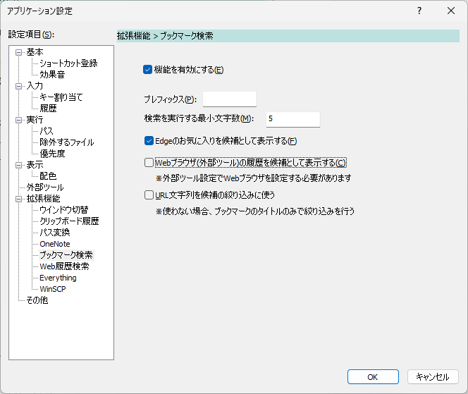

# Bookmark Search Command

Webブラウザのブックマークを検索するためのコマンド。  
ブックマーク名やフォルダ、URLなどで絞り込み、該当するブックマークを候補として表示できる。  

該当する候補を選択して実行すると、ブックマークに対応するURLをブラウザで開く。

Edge/Chrome/一部のChromiumベースのブラウザに対応している。  

なお、`javascript:`で始まるブックマーク(ブックマークレット)については候補から除外する。

## Usage

- 入力欄にキーワードを入力すると、そのキーワードを含むブックマークを表示する
- アプリケーション設定でプレフィックスが設定されている場合、そのプレフィックスを入力すると機能が発動する
  - 以下はプレフィックスを`b`としている場合の例

- アプリケーション設定で`検索を実行する最小文字数`を設定している場合、その文字数以上のキーワードを入力したときに機能が発動する

## Settings

機能は初期状態で有効になっている。
機能を使わない場合は、アプリケーション設定の `拡張機能` > `ブックマーク検索` から機能を無効化することができる。  

## Per-Key Behavior

|押下キー|動作|
|--|--|
|`Enter`|ブックマークをブラウザで開く|
|`Shift-Enter`|URLをクリップボードにコピーする|

