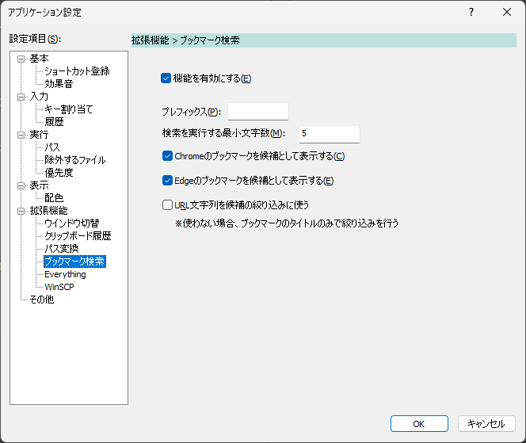

(extension-bookmarks)=
# Extension > Bookmarks

- `機能を有効にする`  
[ブックマーク検索](/adhoc-command/bookmarks)機能を有効にする。
- `プレフィックス`  
検索を開始するためのキーワードを指定する。  
空欄にすると、検索が常に有効になる。
- `検索を実行する最小文字数`  
その文字数以上のキーワードを入力したときに検索を行う。0を指定すると常に検索を行う。
- `Edgeのお気に入りを候補として表示する`  
Edgeのお気に入りを検索対象とする
- `Webブラウザ(外部ツール)のブックマークを候補として表示する`  
[外部ツール](external-tool.md#externaltool)で指定したWebブラウザのブックマークを検索対象とする
- `URL文字列を候補の絞り込みに使う`  
URL文字列(とブックマーク名)を候補の絞り込みに使う。選択しない場合はブックマーク名のみで絞り込みする
