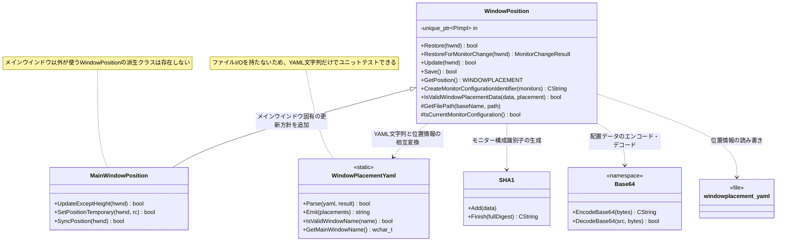
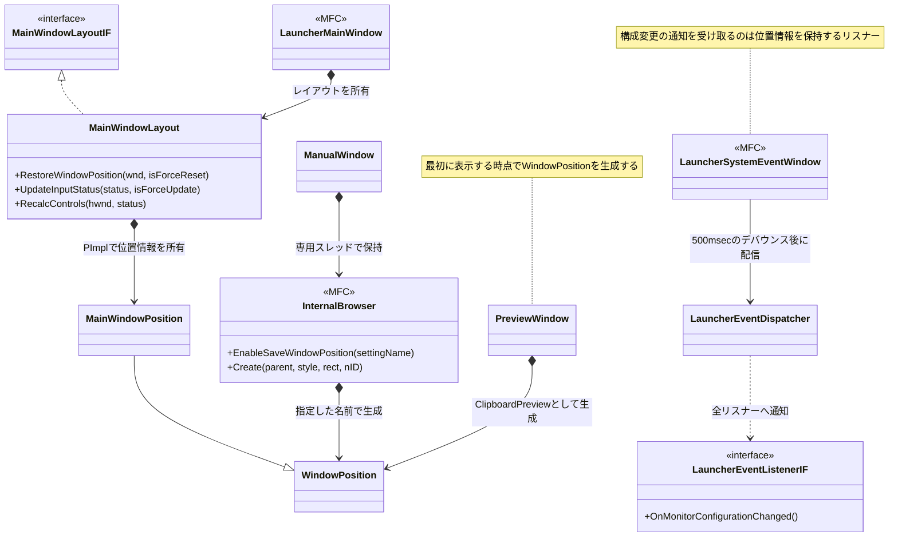

# ウインドウ位置情報の仕様

## 概要

ランチャーの各ウインドウの位置とサイズを、モニター構成ごとに記憶する。
メインウインドウのほか、マニュアルウインドウ、クリップボード履歴のプレビューウインドウも位置情報を記憶する。
ウインドウ種別ごとに独立した位置情報を持ち、以下のケースを許容する。

- プレビューウインドウを表示した直後にアプリを終了しても、次回起動時にメインウインドウの位置が上書きされない
- プレビューウインドウの位置が、メインウインドウの位置として保存されることがない

保存位置がないモニター構成へ切り替わった場合は、別構成の位置を流用せず、現在位置を維持する。

位置復元はウインドウの表示状態とは独立している。非表示中に位置を復元してもウインドウを表示せず、次回の通常の表示要求時に復元済みの位置を使用する。

## 対象ウインドウ

| ウインドウ | 名前 | 実装 |
| --- | --- | --- |
| メインウインドウ | `Window` | `MainWindowPosition` |
| マニュアルウインドウ | `ManualWindow` | `InternalBrowser` + `EnableSaveWindowPosition()` |
| クリップボード履歴のプレビューウインドウ | `ClipboardPreview` | `ClipboardPreviewWindow` |

## 主なクラスと責務

位置情報の処理に関わるクラスの責務を整理する。ファイルの一覧は「関連ファイル」を参照。

| クラス名 | 責務 |
| --- | --- |
| `WindowPosition` | ウインドウ種別ごとの位置情報を保持し、位置情報ファイルとの読み書きを行う。復元(`Restore`)、保存(`Save`)、現在位置の更新(`Update`)、構成変更時の再取得(`RestoreForMonitorChange`)、復元位置が画面外なら適用を取り消す処理、非表示状態の維持を担当する |
| `WindowPlacementYaml` | **今回追加。** YAML文字列と位置情報の相互変換のみを担当する。ファイルI/O、モニター列挙、`WINDOWPLACEMENT` の適用は持たない |
| `MainWindowPosition` | メインウインドウ固有の位置更新方針を担当する。候補欄の有無による高さの維持、一時的な縮小、表示状態との同期を提供する |
| `MainWindowLayout` | レイアウトを統括し、`MainWindowPosition` を所有する。入力状態に応じた位置復元・更新のタイミングを決める |
| `LauncherMainWindow` | メインウインドウの実体。レイアウトとウインドウ状態を束ねる |
| `InternalBrowser` | WebView2をホストするウインドウ。名前を指定して `WindowPosition` を生成・保持し、生成時に復元、破棄時に保存する |
| `ManualWindow` | マニュアルの表示を行う。`InternalBrowser` に名前 `ManualWindow` を渡して位置情報を有効化する |
| `PreviewWindow` | クリップボード履歴のプレビューを表示する。名前 `ClipboardPreview` で `WindowPosition` を保持し、表示時に復元、非表示時に更新する |
| `LauncherSystemEventWindow` | `WM_DEVICECHANGE` などを監視し、500msecのデバウンス後に構成変更通知を配信する |

### 今回追加・変更したクラスの要点

**`WindowPlacementYaml`(新規追加)**

- YAML表現のみに責務を限定し、ファイルシステムやモニター環境に依存しない形にしたことで、ファイル単位のユニットテストが可能になった
- ウインドウ種別(2階層目のキー)の分離と、旧1階層YAMLのメインウインドウ名への移行を担当する
- `default` キー、Base64として不正な値、`WINDOWPLACEMENT` とサイズが異なる値は無視する
- ASCIIのみで表現できないウインドウ名はYAMLのキーに使用できないため、そのウインドウの位置情報は保存しない

**`WindowPosition`(変更)**

- YAML変換を `WindowPlacementYaml` へ委譲し、ファイルI/Oと位置情報の保持に専念するようになった
- `Restore()` はファイル全体から自分のウインドウ名のエントリのみを抽出する
- `Save()` はファイルを書き換える直前に読み直し、自分のウインドウ名のエントリだけを差し替える。これにより、どのウインドウがどの順番で保存しても、ほかのウインドウの位置情報が失われない

## クラス図

### 位置情報の永続化



### 位置情報を利用する側



## 関連ファイル

- `src/soyokaze/control/WindowPosition.h`
- `src/soyokaze/control/WindowPosition.cpp`
- `src/soyokaze/control/WindowPlacementYaml.h`
- `src/soyokaze/control/WindowPlacementYaml.cpp`
- `src/soyokaze/features/main/layout/MainWindowPosition.h`
- `src/soyokaze/features/main/layout/MainWindowPosition.cpp`
- `src/soyokaze/features/main/layout/MainWindowLayout.h`
- `src/soyokaze/features/main/layout/MainWindowLayout.cpp`
- `src/soyokaze/app/LauncherSystemEventWindow.cpp`
- `src/soyokaze/core/LauncherEventListenerIF.h`
- `src/soyokaze/features/main/LauncherMainWindow.cpp`
- `src/soyokaze/utility/Base64.cpp`
- `src/soyokaze/utility/SHA1.cpp`
- `tests/testcode/soyokaze/mainwindow/layout/MainWindowPositionTest.cpp`
- `tests/testcode/soyokaze/control/WindowPlacementYamlTest.cpp`

## 保存先とデータ形式

位置情報ファイルはアプリケーションのプロファイルディレクトリにある `windowplacement.yaml` である。

YAMLは「ウインドウ名をキー、その下にモニター構成識別子をキーとした `WINDOWPLACEMENT` のBase64表現を持つ」2階層のマップである。
こうすることで、1つのファイルに全ウインドウの位置情報を保持しつつ、ウインドウ種別ごとに独立した領域を持てる。

```yaml
Window:
  d1c4cbd23a41e89c5f4d2e77134a5d4d7f9e5fba: "AQAAAAAAAABkAAAAZAAAAJYDAABQAgAA..."
ManualWindow:
  5a9ef1925668f83b3d0ec9cb52ab72b8a1072f17: "AQAAAAAAAACAAAAAgAAAAAQAAC0GAAAEAwAA..."
ClipboardPreview:
  d1c4cbd23a41e89c5f4d2e77134a5d4d7f9e5fba: "AQAAAAAAAABAAAAAgAAAAAQAALAGAAAAMwAA..."
```

ウインドウ名は `WindowPosition` のコンストラクタで指定する。ASCIIのみで構成できない名前は、YAMLのキーとして使用できないため、そのウインドウの位置情報は保存しない。

値は `WINDOWPLACEMENT` 構造体のバイト列をBase64エンコードしたものである。読み込み時は、デコード後のバイト列が構造体と同じサイズであること、および `length` が `sizeof(WINDOWPLACEMENT)` と一致することを検証する。YAMLの読み込みサイズ上限は1 MiBである。

この値は構造体のメモリ表現を保存する実装形式であり、フィールドごとの移植可能なテキスト形式ではない。

### 旧形式の移行

ウインドウ名を持たない旧形式のYAML(1階層のマップ)を読み込んだ場合、エントリはメインウインドウの名前 `Window` の下へ振り替える。
旧形式は複数のウインドウで同じエントリを上書きしていたため内容は信頼できないが、メインウインドウの位置は保持する。
旧形式のファイルが存在する場合は、新形式への移行は保存時に行う。

## モニター構成識別子

識別子は、`EnumDisplayMonitors()` で列挙した各モニターの矩形から生成する。モニター名や列挙順には依存しない。

1. 各矩形を `left`, `top`, `right`, `bottom` の順で比較し、座標順にソートする。
2. 各矩形を `left,top,right,bottom;` の形式で連結する。
3. 連結したASCII文字列のSHA-1フルダイジェストを小文字の16進数で表す。

識別子は40文字である。モニター名、EDID、DPI、列挙順は識別には使用しない。同じ矩形一覧なら同じ構成となり、モニターの位置または矩形サイズが変わると構成識別子も変わる。

## 起動時の復元

`MainWindowLayout::RestoreWindowPosition()` が `MainWindowPosition::Restore()` を呼び出し、現在のモニター構成に対応する位置を探す。

復元順序は以下のとおりである。

1. YAMLファイルを読み込めた場合、ウインドウ名に対応するエントリのみを採用し、その中で現在の構成識別子と一致するものを適用する。
2. YAMLが存在しない、または読み込み・解析に失敗した場合は、旧形式の `<ウインドウ名>.position`、続けて `Soyokaze.position` を試す。
3. 旧形式の位置を読み込めた場合は、現在の構成識別子のエントリとして扱い、以後の保存でYAML形式へ移行する。
4. 復元できなかった場合、呼び出し側は通常サイズ600×300のウインドウを中央に配置し、その位置を現在の構成の位置として記録する。

YAMLの解析に成功したもののウインドウ名または現在の構成に対応するエントリがない場合、旧形式ファイルへはフォールバックしない。別構成の位置を使う `default` フォールバックも行わない。
旧YAMLに残っている `default` キーは読み込み時に無視し、YAML書き出し時にも出力しない。

復元位置を適用した後、ウインドウ矩形がどのモニターとも交差しない場合は適用を失敗とし、適用前の位置へ戻す。

## 保存とサイズの扱い

`WindowPosition` の破棄時に `Save()` を呼び出し、現在の構成の位置をYAMLへ保存する。

保存時は他ウインドウの位置情報を失わないよう、ファイルに書き込む直前にファイルを読み直し、自分のウインドウ名に対応するエントリだけを差し替える。
これにより、どのウインドウがどの順番で保存しても、ほかのウインドウの位置情報は保持される。

位置情報の更新は次のように行う。

- キーワード入力中は、現在の `WINDOWPLACEMENT` を記録する。
- キーワード未入力時は、入力欄だけの表示サイズに縮めるが、記録済みの高さは維持する。
- そのため、次にキーワード入力を始めると、候補欄を含む前回の高さへ戻せる。

`MainWindowPosition::SetPositionTemporary()` による一時的な縮小は、保存済みの位置・サイズを直接書き換えない。通常のウインドウ移動やサイズ変更に伴う更新は `MainWindowLayout::RecalcControls()` から行われる。

## モニター構成変更

`LauncherSystemEventWindow` は `WM_DEVICECHANGE`、`WM_DISPLAYCHANGE`、`WM_SETTINGCHANGE` を監視する。通知が連続する場合は500msのデバウンス後に `OnMonitorConfigurationChanged()` を通知する。

位置管理の処理は次のとおりである。

1. 現在のモニター構成を再計算する。
2. 変更がなければ `MonitorChangeResult::Unchanged` を返す。
3. 変更があれば、読み込み済みの現在位置を変更前の構成に保存し、新しい構成へ切り替える。
4. 新しい構成の位置情報があれば適用し、`PlacementRestored` を返す。
5. 位置情報がなければ現在位置を維持し、現在の `WINDOWPLACEMENT` を取得して `NoSavedPlacement` を返す。
6. 構成が変わった場合は、位置情報の有無にかかわらず、実際の入力状態でレイアウトを再同期する。

`MainWindowLayout::UpdateInputStatus()` は位置・サイズの同期後に `RecalcControls()` を呼び出す。これにより、ウインドウサイズが変わらず `WM_SIZE` が発生しない場合も、キーワードの有無に応じて候補欄を表示・非表示にできる。

## 非表示状態の維持

保存済み `WINDOWPLACEMENT` には保存時の `showCmd` が含まれる。復元対象のウインドウが非表示の場合、この `showCmd` をそのまま適用すると、位置復元を契機にウインドウが表示される可能性がある。

そのため、位置適用時と `MainWindowPosition::SyncPosition()` では、実際のウインドウが非表示なら、適用する一時コピーの `showCmd` を `SW_HIDE` にする。保存済みの `mPosition` 自体は変更しないため、後の表示要求に必要な位置情報は保持される。

この処理はウインドウStateを変更しない。非表示時は `HiddenState` のままになり、次回の通常の表示要求で表示される。

## 関連テスト

`MainWindowPositionTest.SyncPosition_DoesNotShowHiddenWindow` は、非表示のウインドウに対して位置同期を行っても表示状態が変わらず、保存済みの `showCmd` も維持されることを確認する。

`WindowPlacementYamlTest` は次を確認する。

- 同じモニター構成識別子でもウインドウ種別ごとに独立した位置情報として保存・復元されること
- 複数構成および複数ウインドウ種別の往復でエントリが欠落しないこと
- 旧形式のフラットYAMLがメインウインドウ名下に取り込まれること
- `default` キー、Base64として不正な値、サイズ不一致の値が無視されること
- 破損したYAMLやトップレベルがマップでないYAMLで読み込みに失敗すること

複数ディスプレイ環境での実機確認項目は次のとおりである。

- プレビューウインドウやマニュアルウインドウを開いたままアプリを終了し、再起動後にメインウインドウの位置が保持されること
- 各ウインドウがそれぞれの位置を記憶し、互いに上書きしないこと
- モニター構成変更の通知順序や実機の着脱動作
