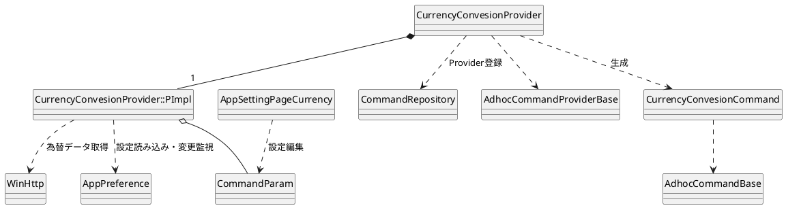
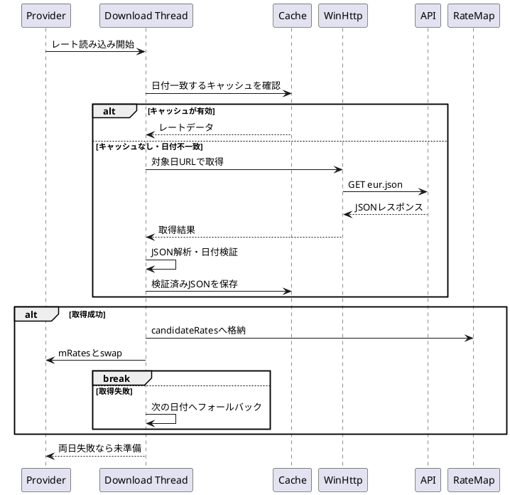
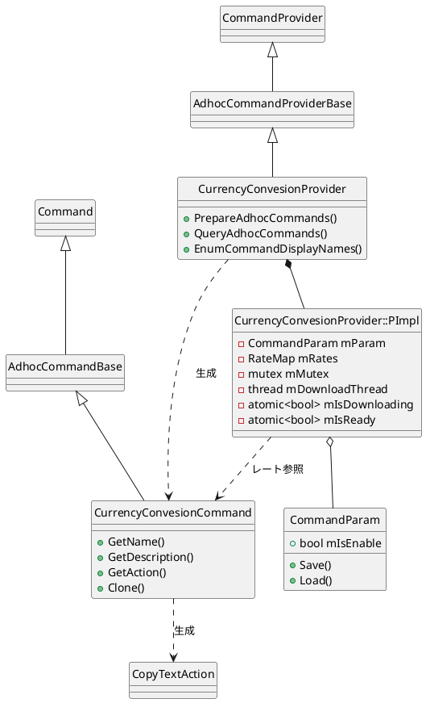

# currency

通貨単位を変換するAdhoc Commandを実装するディレクトリ。

## このコマンドがすること

入力欄に次の形式で入力すると、通貨を変換した候補を表示する。

```
数値 元の通貨 in 変換後の通貨
```

例:

```
100 usd in jpy
100 usd in yen
```

為替データはEURを基準とする外部JSON APIから取得する。候補を実行すると、変換後の数値だけをクリップボードへコピーする。

## 全体構成

`CurrencyConvesionProvider`がAdhoc Command Providerとして登録され、レートデータの準備と入力の解析を担当する。入力に合致すると、変換結果を保持した`CurrencyConvesionCommand`を生成して候補リストへ追加する。



## 仕様

### 入力

- 入力形式は`数値 通貨 in 通貨`。
- 数値は整数または小数を指定できる。符号も指定できる。
- 通貨識別子は英字で指定する。
- 入力された通貨識別子は小文字化する。
- `yen`は`jpy`へ正規化する。
- `eur`はレート`1.0`として扱い、レートマップからは検索しない。
- 元通貨または変換先通貨がレートマップに存在しない場合は候補を生成しない。

### 換算

APIから取得するデータは、1 EURあたりの各通貨レートを持つ。元通貨と変換先通貨のレートを使用して、次の式で換算する。

```
変換結果 = 入力値 * 変換先通貨レート / 元通貨レート
```

### 表示と実行

- 候補名と説明には、変換結果を小数点以下2桁で表示する。
- 表示形式は`%.2f 通貨`。
- 候補を実行すると、表示した数値部分だけをクリップボードへコピーする。
- ホットキー修飾キーが指定された場合、コピーアクションは生成しない。

### 設定

- 設定画面の「拡張機能 > 通貨変換」で有効・無効を切り替える。
- 設定キーは`Currency:IsEnable`。
- 初期値は無効(`false`)。
- 無効の場合、レート取得と候補生成を行わない。

## 為替データ

取得先URLは次の形式。

```
https://cdn.jsdelivr.net/npm/@fawazahmed0/currency-api@YYYY-MM-DD/v1/currencies/eur.json
```

`YYYY-MM-DD`には取得対象日を指定する。

### 取得順序

取得処理は`CurrencyConvesionProvider::PImpl::Load`から別スレッドで開始する。対象日は当日、前日の順である。

各対象日について、次の順に試行する。

1. キャッシュファイルを読み込む。
2. JSONの`date`が対象日と一致し、`eur`オブジェクトに数値レートがあれば使用する。
3. キャッシュが利用できなければ、対象日のAPIから取得する。
4. APIレスポンスを検証できた場合、キャッシュへ保存して使用する。

当日でキャッシュ・APIのいずれも利用できない場合は前日へ進む。前日も利用できない場合はレートを未準備とし、候補を生成しない。



### キャッシュ

- パスは`userdata/tmp/currencies/eur.json`。
- 必要な親ディレクトリは取得時に作成する。
- キャッシュは単一ファイルで、JSON内の`date`によって対象日を判定する。
- 当日取得に成功した場合は当日のJSONを保存する。
- 当日失敗後に前日取得へ成功した場合は前日のJSONを保存する。
- 次回起動時はキャッシュの日付を検証するため、古い日付のキャッシュを当日データとして誤使用しない。

## 主要クラスと役割

### `CurrencyConvesionProvider`

Adhoc Command Providerの公開クラス。Provider登録、初期化時のレート読み込み開始、入力に対する候補生成、表示名の列挙を担当する。

### `CurrencyConvesionProvider::PImpl`

Providerの実装データを保持する非公開構造体。

- `CommandParam`を読み込み、機能の有効・無効を管理する。
- `mRates`にレートマップを保持する。
- `mMutex`でレートマップへのアクセスを保護する。
- `mDownloadThread`でレート取得スレッドを保持する。
- `mIsDownloading`で重複した取得開始を防ぐ。
- `mIsReady`で候補生成可能かを示す。
- Provider破棄時には取得スレッドを`join`する。

取得スレッドでは一時的な`candidateRates`へデータを読み込み、成功後にmutexで保護された`mRates`と`swap`する。読み込み途中のレートマップを候補生成側が参照しないようにするためである。

### `CurrencyConvesionCommand`

1件の換算結果を表すAdhoc Command。

- 換算済みの値と通貨単位を保持する。
- 候補名・説明を生成する。
- 候補実行時に数値部分をクリップボードへコピーする。
- 通貨変換用のアイコンを返す。

### `CommandParam`

通貨変換機能の設定値を保持するデータクラス。現在の設定値は`mIsEnable`のみで、`Settings`への保存・読み込みを担当する。

### `AppSettingPageCurrency`

アプリ設定画面の「拡張機能 > 通貨変換」ページを登録するクラス。チェックボックスの値を`CommandParam`へ反映する。

### `ParseRates`

取得したJSONまたはキャッシュ内容を解析する内部関数。

- JSONの`date`が期待日付と一致することを確認する。
- `eur`がオブジェクトであることを確認する。
- 数値である項目を`RateMap`へ格納する。
- レートが1件もない場合は失敗とする。

### `LoadRatesWithFallback`

当日と前日のキャッシュ/API取得を順に実行する内部関数。各試行では候補用の一時レートマップを使用し、成功時だけ呼び出し元のレートマップへ反映する。

## クラス図



## 制約と注意事項

- 為替レートは外部サービスに依存するため、通信障害やサービス停止時は利用できない。
- APIのJSON形式、`date`フィールド、`eur`フィールドの構造に依存する。
- 取得対象は当日と前日の2日間だけで、それより古いデータにはフォールバックしない。
- キャッシュファイルは通貨ペアごとではなく、EUR基準の単一JSONファイルである。
- レート取得が完了するまで候補を生成できない。
- Providerの破棄時に取得スレッドを待機するため、通信処理中の破棄は完了まで待つ。
- `mRates`は取得完了後にまとめて差し替える。取得中の部分的なレートは公開しない。
- クラス名の`Convesion`は既存の公開シンボル名であるため、綴りを修正しない。
- APIから返される為替レートの正確性は保証しない。

## 関連ファイル

|ファイル|役割|
|-|-|
|`CurrencyConvesionProvider.h/.cpp`|Provider、レート取得、キャッシュ、入力解析、換算|
|`CurrencyConvesionCommand.h/.cpp`|換算結果の候補とクリップボードコピー|
|`CurrencyCommandParam.h/.cpp`|有効・無効設定の保存と読み込み|
|`AppSettingPageCurrency.h/.cpp`|アプリ設定画面|
|`../../../../tests/testcode/soyokaze/commands/currency/CommandParamTest.cpp`|設定と表示フォーマットの単体テスト|
