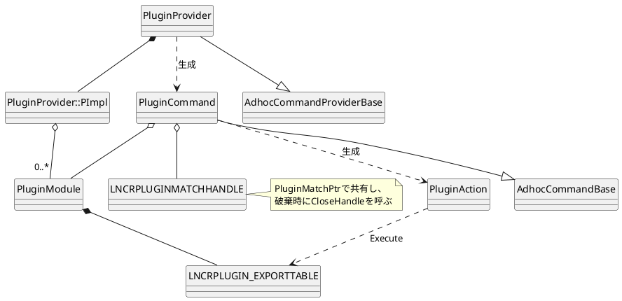
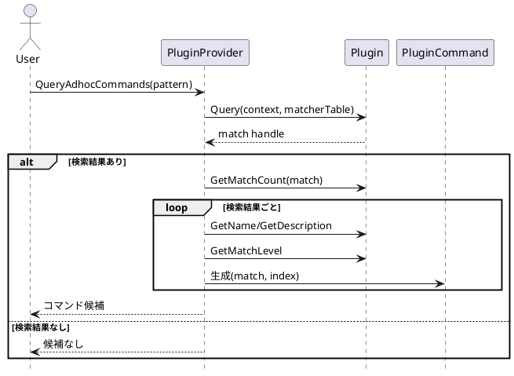
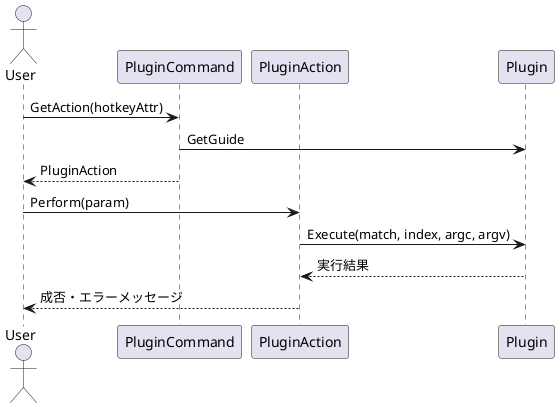

# plugin

DLLとして実装されたプラグインを、SoyokazeのAdhoc Commandとして扱うための処理を置くディレクトリ。
プラグインAPIの定義は[`PluginExportTable.h`](../../../../plugin-include/soyokaze/PluginExportTable.h)にある。

## ファイル構成

|ファイル|役割|
|-|----|
|`PluginProvider.h/.cpp`|プラグインDLLのロードと検索結果からのコマンド生成|
|`PluginCommand.h/.cpp`|プラグインの検索結果1件をSoyokazeのCommandとして扱う|
|`PluginModule.h/.cpp`|DLLハンドルとエクスポートテーブルの所有および解放|

## クラス構成

### PluginProvider

Adhoc Command Providerとして登録されるクラス。インスタンスは1つだけ作られる。
実装データは`PImpl`に隠蔽しており、主に次の処理を担当する。

- プラグインDLLをロードし、`LNCRPLUGIN_EXPORTTABLE`を取得する
- プラグインへSoyokaze側のログ・通知・ウインドウ取得関数を渡す
- 入力パターンをプラグインへ渡し、検索結果から`PluginCommand`を生成する
- アプリ終了時にプラグインを解放する

`PImpl`は`AppPreferenceListenerIF`を実装しているが、設定変更時のプラグイン再ロードは行わない。

### PluginModule

1つのプラグインDLLを表す構造体。DLLの`HMODULE`と、そのDLLから取得したエクスポートテーブルを保持する。
デストラクタでプラグインの`Finalize`を呼び出した後、`FreeLibrary`でDLLをアンロードする。

### PluginCommand

プラグインの検索結果1件に対応するAdhoc Command。プラグインモジュール、検索ハンドル、検索結果内のインデックスを保持する。
コマンドの各処理は、保持しているエクスポートテーブルの関数へ中継する。

- `GetTypeDisplayName`でプラグインからコマンド種別を取得する
- `CanExecute`でプラグイン側の実行可否と理由を取得する
- `GetAction`で内部クラスの`PluginAction`を生成する
- `GetIcon`でプラグインのアイコンを取得し、失敗時は標準アイコンを使用する

`PluginAction::Perform`では、実行時パラメータをUTF-8へ変換して`Execute`へ渡す。

## 処理概要

### プラグインのロード

`PluginProvider::PrepareAdhocCommands`からロード処理を開始する。ロードは起動後に1回だけ行う。

次の順序で`plugins`ディレクトリを検索する。

1. 実行ファイルのディレクトリにある`plugins`
2. アプリケーションデータディレクトリにある`plugins`

各`plugins`ディレクトリの直下にあるサブディレクトリを走査し、その直下にある`.dll`をロードする。
サブディレクトリより深い階層は走査しない。

DLLごとに次の検証を行う。

1. `LoadLibrary`でDLLをロードする
2. `LNCRPLUGIN_Bind`を取得する
3. `PLUGINVERSION`を指定してエクスポートテーブルを取得する
4. エクスポートテーブルの全関数が設定されていることを確認する
5. Soyokaze側の関数テーブルとプラグイン情報の格納先を渡して`Initialize`を呼び出す
6. 返されたプラグイン情報をJSONとして解析し、`pluginApiVersion`が`PLUGINVERSION`と一致することを確認する
7. 初期化とプラグイン情報の検証に成功したDLLだけを`PluginModule`として保持する

いずれかの処理に失敗した場合、そのDLLは保持せずにアンロードする。

`Initialize`の第2引数で渡されるプラグイン情報の文字列はプラグイン側が所有する。本体は文字列を解放せず、JSONをコピーして`PluginModule`ごとに保持する。

### コマンド検索

`PluginProvider::QueryAdhocCommands`は、Soyokazeの`Pattern`を`MatcherContext`に格納してプラグインへ渡す。
プラグインは`MATCHER_FUNCTION_TABLE`の関数を通じて、入力文字列の比較や単語情報の取得を行う。

プラグインが返した検索ハンドルは、複数の`PluginCommand`で共有できるように`PluginMatchPtr`で管理する。
最後の`PluginCommand`がハンドルを解放するとき、カスタムデリータからプラグインの`CloseHandle`を呼び出す。

### コマンド実行

`Execute`に渡す`argv`にはコマンド名を含めず、実行時引数だけを含める。
引数がない場合は`argc`が0となり、`argv`には終端の`nullptr`だけを持つ配列を渡す。

本体側の文字列はUTF-16、プラグインAPIの文字列はUTF-8を前提としているため、API呼び出しの境界で相互変換する。

### プラグインの解放

アプリ終了時に`PImpl::OnAppExit`から保持している`PluginModule`を削除する。
`PluginModule`のデストラクタが、次の順序でプラグインを解放する。

1. `LNCRPLUGIN_EXPORTTABLE::Finalize`を呼び出す
2. `FreeLibrary`でDLLをアンロードする

DLLはアプリ実行中に再ロード・再アンロードせず、検索ハンドルは`PluginMatchPtr`の寿命に従って解放する。

## 関連ドキュメント

- [`doc/memo/plugin-spec.md`](../../../../doc/memo/plugin-spec.md): プラグイン機能の仕様と設計メモ
- [`PluginExportTable.h`](../../../../plugin-include/soyokaze/PluginExportTable.h): プラグインと本体間の公開API
- [`plugins/workspace-plugin/README.md`](../../../../plugins/workspace-plugin/README.md): プラグイン実装例
